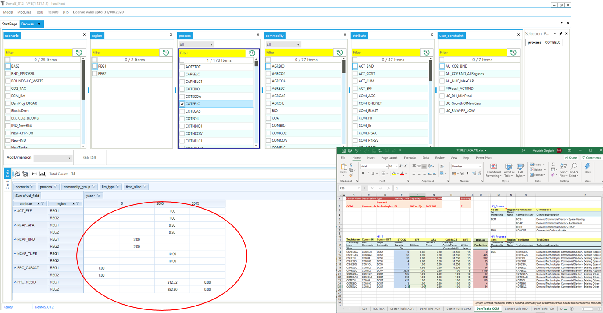

=======================
Browse
=======================

Demo:

.. raw:: html

        <iframe width="560" height="315" src="https://www.youtube.com/embed/sRMCd2wVqGY" frameborder="0" allow="accelerometer; autoplay; clipboard-write; encrypted-media; gyroscope; picture-in-picture" allowfullscreen></iframe>

* Browse both presents the actual model data and provides direct access to the input data.

* Clicking any input cell in the data cube (red circle) provides direct access to specific cells in the excel templates for editing.

The Browser thereby enables the user to view subsets of the assembled data in a cube by selecting the scenario(s), region(s), process(es), commodity(ies), and/or the attribute(s) of interest.
It is possible to rearrange the layout of the cube by adding/removing dimensions (columns and rows) to/from the table.