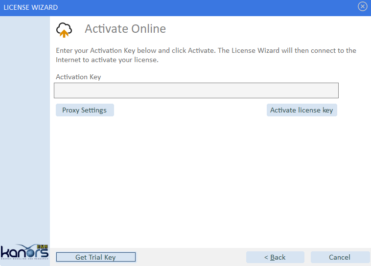

################
Getting started
################

Hardware/software requirement
=============================

Veda2.0 works on Windows portables, desktops, servers, and VMs, with Windows 8/Windows server 2012 or above. Microsoft Excel is a prerequisite.
Hardware needed depends on the size and complexity of models, but here is a configuration suitable for typical TIMES models under Veda2.0:

    * CPU: Minimum 4 cores are recommended for STANDARD and ADVANCED licenses. 8 - 16 would be desirable for larger models
    * RAM: 4-8 GB is enough for Veda, but GAMS needs more RAM for larger models. 32 GB would accomodate most models
    * HDD: 500GB - 1TB free space for Veda and GAMS files

Veda accesses Internet for the following functions:
    * Licensing
        * Source: provided on request
    * Displaying announcements on the Start page
        * Source: https://veda-news.readthedocs.io/
    * Updating TIMES source code from Github
        * Source: https://api.github.com/repos/etsap-TIMES/TIMES_model/releases/latest

Installation
============

* It is recommended that the new user first takes a look at the video:
    .. raw:: html

        <iframe width="560" height="315" src="https://www.youtube.com/embed/QQzZi2_vWBs" frameborder="0" allow="accelerometer; autoplay; clipboard-write; encrypted-media; gyroscope; picture-in-picture" allowfullscreen></iframe>

* There are two ways to go about it:
    * Localhost: This just needs to be extracted
        * .. raw:: html

             <a href="https://github.com/kanors-emr/Veda2.0-Installation/tree/master/Localhost%20Version%20Prerequisites" target="_blank">Download and install prerequisites</a>

        * .. raw:: html

             <a href="https://github.com/kanors-emr/Veda2.0-Installation/tree/master/Localhost%20Version" target="_blank">Download localhost</a>

        * Give full read and write permissions to the folder where it is extracted
        * Port 65001 should be accessible to PostgreSQL

    * Installer: This is a setup executable
        * .. raw:: html

                     <a href="https://github.com/kanors-emr/Veda2.0-Installation/tree/master/Installer%20Version" target="_blank">Download installer</a>

        * Create a folder where you wish to install and give it full read and write permissions
        * Port 65000 should be accessible to PostgreSQL

License activation
===================
Once setup, to start using VEDA2.0, the user is required to get licence. Launching Veda will present an Activation screen:

Trial license
^^^^^^^^^^^^^^

If you have registered an evaluation version request on the ETSAP website, then you would already have a Trial license key. If not, you can get one as shown here.

Demo video:

    .. raw:: html

        <iframe width="560" height="315" src="https://www.youtube.com/embed/6FFAw-rXD8A" frameborder="0" allow="accelerometer; autoplay; clipboard-write; encrypted-media; gyroscope; picture-in-picture" allowfullscreen></iframe>

If you don't have the Trial key:
    *	On Activation form, click 'Get Trial Key'
    *	Complete the Registration form to get Trial key by email

Paste it into the Activation form, and request Activation. This will then bring you to the VEDA2.0 Start Page, if activated successfully.

Permanent license
^^^^^^^^^^^^^^^^^^
.. note::
        If you are already using a trial license, you need to deactivate it before you can activate the permanent license.

Demo video:

    .. raw:: html

        <iframe width="560" height="315" src="https://www.youtube.com/embed/FXjgTIz0JrY" title="YouTube video player" frameborder="0" allow="accelerometer; autoplay; clipboard-write; encrypted-media; gyroscope; picture-in-picture" allowfullscreen></iframe>

Offline activation
^^^^^^^^^^^^^^^^^^^
* Step 1: Click on **Activate your license**

    .. image:: images/GettingStarted/offline_act_step1.png
            :width: 400

* Step 2: Click on **Activate Offline**

    .. image:: images/GettingStarted/offline_act_step2.png
            :width: 400

* Step 3: Fill your **Activation Key**

    .. image:: images/GettingStarted/offline_act_step3.png
            :width: 400

* Step 4: Click on **Scan QR Code** and scan it from your mobile (with Internet)

    .. image:: images/GettingStarted/offline_act_step4.png
            :width: 400
            
* Step 5: You will get the computer key from the above step. Now fill it in **Computer Key** and press **Activate** button

    .. image:: images/GettingStarted/offline_act_step5.png
            :width: 400

* Step 6: Click on **Finish** button

    .. image:: images/GettingStarted/offline_act_step6.png
            :width: 400

License deactivation
====================
Please follow these steps to deactivate the license from user machine.

    * Open the Veda2.0 application
    * Select the **License Information** option under **Help** menu

        .. image:: images/GettingStarted/lic_deactivate_step1_.png
                :width: 200

            .. note::
                    For version < 1.240.1.1 **License Information** option can be found under **Tools** menu.

    * Click on **Deactivate your license** from the License Wizard window

        .. image:: images/GettingStarted/lic_deactivate_step2.png
                :width: 400

    * Click on **Deactivate license key** (*You will find your license key in the Activation Key box*)

        .. image:: images/GettingStarted/lic_deactivate_step3.png
                :width: 400

    * After that, you will get a confirmatory deactivation message as shown below

        .. image:: images/GettingStarted/lic_deactivate_step4.png
                :width: 400

    * Click on **Finish** button to close the application.

If you still require any assistance regarding license activation/deactivation :ref:`Contact Us`.

Setting up GAMS
================

As part of registering VEDA2.0 a request is sent to the ETSAP Liaison Officer who will arrange for an evaluation GAMS license file to be created, sending it to the new user along with the download and install procedures here:

1.	Copy the GAMSLICE someplace on your computer
2.	Head to http://www.gams.com/download/ and select the Windows download option for either Win-64/32, as appropriate
3.	Run Setup by clicking on it in Windows Explorer

    a)	Check “Use advanced installation mode” at the bottom of the GAMS Setup form
    b)	Let GAMS get installed into the default folder (\GAMS\<Win#>\<ver>
    c)	Check the Add GAMS directory to PATH environment variable
    d)	Have the GAMSLICE.TXT copied from wherever it currently resides

You may need to restart your computer to have the GAMS Path activated.

Once you have VEDA installed you can try a TIMES model run.

Uninstallation
===============

* Installer version:

    If you installed Veda 2.0 using installer, the process of uninstalling is very straight forward.

    Steps:
        * Go to Control panel
        * Select Veda 2.0 and click uninstall

        .. image:: images/uninstall.PNG
            :width: 400

        * Make sure that Postgres has also been removed. Usually the process of uninstallation also removes Postgres from the computer
        * Sometimes uninstallation ends prematurely (image below) and Postgres is not removed. In such case, please go to :ref:`Uninstalling Postgres` for further instructions

        .. image:: images/Veda_Premature_Error.PNG
            :width: 400

* Localhost version:

    * Launch the Veda2.0 version you are using
    * In the main menu -> Model –> Stop server and exit

    .. image:: images/stop_server.PNG

    * Now you can go ahead and delete the localhost directory

Backup and Restore
==================
The Backup and Restore feature makes upgrading Veda much easier. You can back up the "state", meaning, all models that are synchronized, and all Cases that are imported in Veda.
This is available starting version 230.

Steps:

    * **Backup**

            * Go to Model > Backup state
                .. image:: images/backup_state_menu.PNG
            * Save the backup file in a directory of your choice
                .. image:: images/save_backup_form.PNG
                    :width: 400
            * Go to Model > Stop server and exit (Terminate Veda)

    * **Restore**

        * Launch the new version of Veda
        * Go to Model > Restore state, to restore your models and cases
        * Select the saved backup file
        * Once the file is loaded, you can select the models/cases that you want to get restored
            .. image:: images/restore_form.PNG
                :width: 400
        * Click "Restore" to synchronize all selected models and import all selected cases

Updating
=========
The process of updating requires the user to uninstall the old version
and install the new version of Veda2.0 manually.

Refer the following links for help:
    * :ref:`Backup and Restore`
    * :ref:`Uninstallation`
    * :ref:`Installation`

