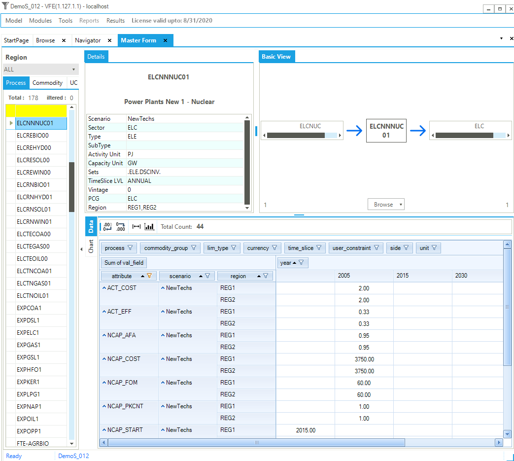
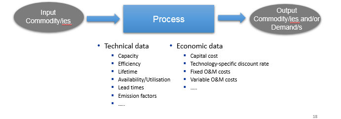

============
Items detail
============

You can examine the declaration, connectivity and data details for a Process, Commodity, User constraint (UC)
and Commodity Group (CommGrp)

Basic Description of a TIMES Process
#####################################

* A process converts input commodity(ies) to output commodity(ies)
* Each process is linear (e.g. output proportional to input, investment and fixed O&M costs scale with capacity / variable O&M scale with activity)
    * A power plant converts input fuel (e.g., coal/oil/gas/nuclear/renewable source) in electricity
    * A plug-in diesel hybrid car can be modelled as a process that converts electricity and/or diesel to passenger-miles
* A typical national model may have ~1000 processes

