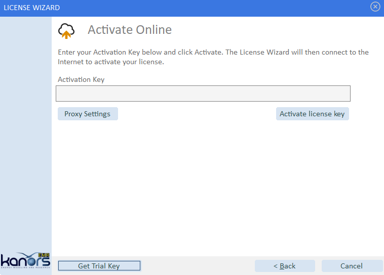

##################
License operations
##################

Activate/Deactivate License
============================

You can locate the Activate/Deactivate License option under the Help menu by navigating to License operations.

License activation
*******************
Once setup, to start using VEDA2.0, the user is required to get licence. Launching Veda will present an Activation screen:

Trial license
^^^^^^^^^^^^^^

If you have registered an evaluation version request on the ETSAP website, then you would already have a **Trial license key**. If not, you can get one as shown here.

Demo video:

    .. raw:: html

        <iframe width="560" height="315" src="https://www.youtube.com/embed/6FFAw-rXD8A" frameborder="0" allow="accelerometer; autoplay; clipboard-write; encrypted-media; gyroscope; picture-in-picture" allowfullscreen></iframe>

If you don't have the Trial key:
    *	On Activation form, click 'Get Trial Key'
    *	Complete the Registration form to get Trial key by email

Paste it into the Activation form, and request Activation. This will then bring you to the VEDA2.0 Start Page, if activated successfully.

Permanent license
^^^^^^^^^^^^^^^^^^
.. note::
        If you are already using a trial license, you need to deactivate it before you can activate the permanent license.

Demo video:

    .. raw:: html

        <iframe width="560" height="315" src="https://www.youtube.com/embed/FXjgTIz0JrY" title="YouTube video player" frameborder="0" allow="accelerometer; autoplay; clipboard-write; encrypted-media; gyroscope; picture-in-picture" allowfullscreen></iframe>

Offline activation
^^^^^^^^^^^^^^^^^^^
* Step 1: Click on **Activate your license**

    .. image:: images/GettingStarted/offline_act_step1.png
            :width: 400

* Step 2: Click on **Activate Offline**

    .. image:: images/GettingStarted/offline_act_step2.png
            :width: 400

* Step 3: Fill your **Activation Key**

    .. image:: images/GettingStarted/offline_act_step3.png
            :width: 400

* Step 4: Click on **Scan QR Code** and scan it from your mobile (with Internet)

    .. image:: images/GettingStarted/offline_act_step4.png
            :width: 400
            
* Step 5: You will get the computer key from the above step. Now fill it in **Computer Key** and press **Activate** button

    .. image:: images/GettingStarted/offline_act_step5.png
            :width: 400

* Step 6: Click on **Finish** button

    .. image:: images/GettingStarted/offline_act_step6.png
            :width: 400

License deactivation
*********************
Please follow these steps to deactivate the license from user machine.

    * Open the Veda2.0 application
    * Select the **Activate/Deactivate License** option under **Help** menu by navigating to **License operations**

        .. image:: images/Activate_Deactivate_License.png
                :width: 401

    .. tip::
            In previous editions of the Veda2.0 application, you can locate the **License Information** option either under the **Tools** or **Help** menu.

    * Click on **Deactivate your license** from the License Wizard window

        .. image:: images/GettingStarted/lic_deactivate_step2.png
                :width: 400

    * Click on **Deactivate license key** (*You will find your license key in the Activation Key box*)

        .. image:: images/GettingStarted/lic_deactivate_step3.png
                :width: 400

    * After that, you will get a confirmatory deactivation message as shown below

        .. image:: images/GettingStarted/lic_deactivate_step4.png
                :width: 400

    * Click on **Finish** button to close the application.
    
    .. raw:: html

        If you still require any assistance regarding license activation/deactivation <a href="mailto:support@kanors.com">Contact Us</a>.

Show License Usage
===================

Here you can verify both your license key and the number of activations linked to it by using 
the **Show License Usage** option found under the License operations within the Help menu.

.. note::
    .. raw:: html

        If the feature mentioned above is unavailable due to the user's machine lacking internet connectivity, 
        please use this  <a href="https://lastmileanalytics.guru/vedalicense/SearchYourLicenseKeyInformation.aspx" target="blank">designated page</a>. 
        Enter your license key into the search box and press 'enter' to see 
        the count of activated machines linked to your license key.