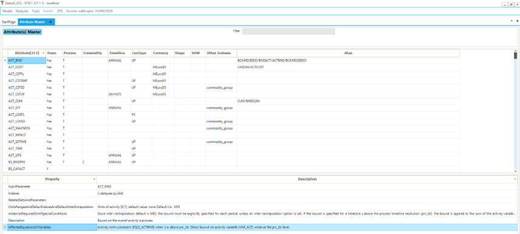

==========
Model Info
==========

Model information section of the main menu contains quick reference for TIMES parameters and Veda tags. It also has information about the current model.

TIMES Attributes
################

* This is a comprehensive list of all TIMES parameters that can be used in Veda.
* For each index, like Timeslice and Currency, it shows the default values that are used for each parameter.
* For the selected attribute, the description from the TIMES manual is displayed at the bottom.

Veda Tags
#########
This is the key resource for Veda syntax. For all supported tags, it shows the column names that are supported, their alternate names, and the files they are supported in.
It also shows the character that can be used in each of these columns to ignore rows.

Model
#####

Sync log:
=========

NSV candidates:
===============

UD sets usage:
==============

Tag details:
============

Manage duplicates:
==================