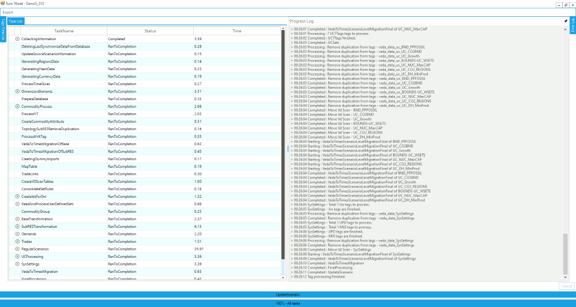

=======================
Navigator
=======================

Demo:

.. raw:: html

    <iframe width="560" height="315" src="https://www.youtube.com/embed/vxUzJNxfIqw" frameborder="0" allow="accelerometer; autoplay; clipboard-write; encrypted-media; gyroscope; picture-in-picture" allowfullscreen></iframe>

* The Navigator provides a comprehensive view of all the templates in the various folders managed by VEDA-FE for the current model (youtube video).
* The Navigator is the main vehicle for accessing, importing, and coordinating the various templates that make up a model.
* Its main screen is divided into sub-windows according to the various types of templates managed by VEDA-FE.

.. image:: images/navigator.png
   :width: 600

Quadrants
###################################

Template containing comprehensive information about the model’s basic structure (regions, sub-regions, time-periods, time-slices, …)
**SysSetting**

Calibration templates for Base Year
**Base scenario** [BS] – current technology mix
**BaseTrans** – operations on the BS templates

Repository for the depiction of future technologies
**SubRES** [SR]

Three groups of flexible, “rule-based”, scenarios files:
**Regular Scenarios** [RS] - files for data addition and updates
**Demand Scenarios** [DS] - projection module tied to economic indicators, fine-tuned with analyst insight
**Parametric Scenarios** [PS] - functionality designed to handle easily multiple runs and parametric analysis

Two new components are presented:

* Parametric scenarios – “programmed” multi-value suite of scenarios
* No Seed Values – the files that are not dependant on any other template

Functionality
###############

* Navigator enables easy access to any of the Excel templates constituting the currently open model
* Double-clicking directly on any file name (or click the Excel icon next to it, in the case of the BY_Trans and SysSettings files) will open that file in Excel
* Clicking on the folder button above each section of the Navigator will open the associated folder in Windows Explorer
* Provides feedback as to the status of the various files and the integrated database managed by VEDA-FE according to colour legend at the bottom of form
    * Not imported – not yet brought into VEDA-FE
    * Imported – selected for importing with next SYNC
    * Consistent – template and database aligned
    * InConsistent – template date stamp more recent that last import
    * ToRemove – missing template imported previously now flagged for removal from the database
    * FileMissing – previously imported template no longer found
    * FileOpen – a template currently open, so can not be processed/imported
    * Error – if a file error happens

.. image:: images/nav_files_status_legend.png
   :width: 600

* The SYNCHRONIZE button will process all templates in the application folder marked as ToImport (orange)

SYNC Operation
###################################

Synchronize imports all selected Excel workbooks into the VEDA-FE database

Right form traces the SYNC operation and the left reports the time needed for each step

After synchronizing a model you can return to the Navigator.

