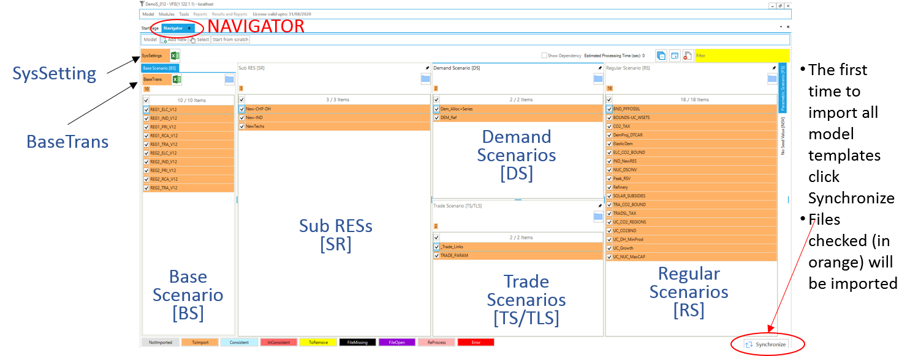

#########
Navigator
#########

Demo:

.. raw:: html

    <iframe width="560" height="315" src="https://www.youtube.com/embed/vxUzJNxfIqw" frameborder="0" allow="accelerometer; autoplay; clipboard-write; encrypted-media; gyroscope; picture-in-picture" allowfullscreen></iframe>

* The Navigator provides a comprehensive view of all the templates in the various folders managed by Veda for the current model (youtube video).
* The Navigator is the main vehicle for accessing, importing, and coordinating the various templates that make up a model.
* Its main screen is divided into sub-windows according to the various types of templates managed by Veda.

Scenario Sections
=================
**Base Scenario [BS]**
Templates used to set up the base-year (B-Y) structure of the model (existing commodities and current processes stock, and the base-year end-use demand levels), according to the energy flows reflect the overall energy balance. Thus the start year of the model can be calibrated to the energy balance according the B-Y Templates. The B-Y templates are named as VT_<workbook name>_<sector>_<Version> (e.g. VT_REG_PRI_V1, as seen in Figure 2). The number of B-Y templates and their names depend on both the model structure (e.g., the number of regions and sectors) and the organisation of the input data (e.g., how many regions and sectors in each file). The B-Y templates are introduced in DemoS_001. (Section 3.1) and are modified throughout the evolution of the 12 DemoS steps.
    o BY_Trans: are transformation files used to update the information included in the B-Y templates (update existing values for existing attributes) and/or to insert new information (insert new attributes for existing processes) in the B-Y templates. They work like a scenario file (described below), but the rule-based filters and the update/insert changes apply only to those processes and commodities already existing in the B-Y templates. The BY_Trans file is introduced in DemoS_009. 

**SysSettings** is used to declare the very basic structure of the model including regions, time slices, start year, etc. It also contains some settings for the synchronization process and can include some additional information. There is only one such file; it has a fixed name that stands for System Settings.

**SubRES [SR]** SubRES files are used to introduce new commodities and processes in the RES that are not part of the B-Y templates. However, while the B-Y templates are region-specific, the SubRES are region independent. For each SubRES file there is a corresponding transformation (Trans) file allowing the introduction of region-specific process attributes, including the availability (or not) of processes in each region. To make changes to the SubRES_Trans-_<sector> files use the Navigator to open the associated model subfolder and access the file via Window Explorer. The naming conventions are: SubRES_<name> and SubRES_<name>_Trans. 

**Regular Scenario [RS}** Scenario files are used to update existing information and/or to insert new information in any part of the RES, including B-Y templates, SubRES files, and Trade files (see below). They are also used to include any additional user constraints in the model. The naming convention is: Scen_<scenario name>. These files can only manipulate (insert or update) information associated with previously declared RES components. New commodities and processes may not be added via Scenario files, only new attributes. Scenario files are introduced in DemoS_004 (Section 3.4.3). Several different applications of scenario files are illustrated through the remainder of the DemoS. 

**Demand Scenario [DS]** Demand Templates Include all the information necessary to project end-use demands for energy services in each region, such as macroeconomic drivers and sensitivity series. Multiple demand files may be used, to model different demand growth scenarios for instance. The naming convention is: ScenDem_<scenario name>. This section of the Navigator also contains a single file permitting assignment of a demand driver as well as a sensitivity (or elasticity) series each end-use demand to its driver in each region: Dem_Alloc+Series. Demand files and tables are described in DemoS_010.

**Trade Scenario [TS]** This section of the Navigator contains a file in which all unilateral and/or bilateral trade links between regions are declared: ScenTrade__Trade_Links, and associate data provided when appropriate. The latter contains all of the attribute specifications for the trade processes.  Multiple trade files may be used, to model different trade scenarios or for different commodities. The naming convention is: ScenTrade_<scenario name>. Trade files are introduced in DemoS_005.

Quadrants
=========

Template containing comprehensive information about the model’s basic structure (regions, sub-regions, time-periods, time-slices, …)
**SysSetting**

Calibration templates for Base Year
**Base scenario** [BS] – current technology mix
**BaseTrans** – operations on the BS templates

Repository for the depiction of future technologies
**SubRES** [SR]

Three groups of flexible, “rule-based”, scenarios files:
**Regular Scenarios** [RS] - files for data addition and updates
**Demand Scenarios** [DS] - projection module tied to economic indicators, fine-tuned with analyst insight
**Parametric Scenarios** [PS] - functionality designed to handle easily multiple runs and parametric analysis

Two new components are presented:

* Parametric scenarios – “programmed” multi-value suite of scenarios
* No Seed Values – the files that do not provide seed values to any other scenario. These are processed in parallel.

Functionality
=============

* Navigator enables easy access to any of the Excel templates constituting the currently open model
* Double-clicking directly on any file name (or click the Excel icon next to it, in the case of the BY_Trans and SysSettings files) will open that file in Excel
* Clicking on the folder button above each section of the Navigator will open the associated folder in Windows Explorer
* Provides feedback as to the status of the various files and the integrated database managed by Veda according to colour legend at the bottom of form
    * Not imported – not yet read into the database
    * Imported – selected for importing with next SYNC
    * Consistent – templates that are in sync with the database
    * InConsistent – file has been modified after the last SYNC operation
    * ToRemove – missing template imported previously now flagged for removal from the database
    * FileMissing – previously imported template that no longer exists in the template folder
    * FileOpen – a template currently open, so can not be processed/imported
    * Error – if a file has thrown an error

.. image:: images/nav_files_status_legend.png
   :width: 600

* The SYNCHRONIZE button will process all templates in the application folder marked as ToImport (orange)

SYNC Operation
===============

Synchronize imports all selected Excel workbooks into the Veda database

Right form traces the SYNC operation and the left reports the time needed for each step

After synchronizing a model you can return to the Navigator.

