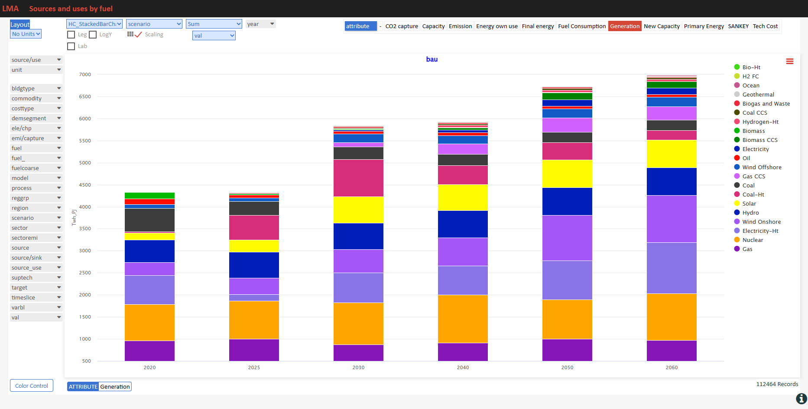

#######
Reports
#######

The Advanced license of Veda2.0 offers a very powerful and efficient functionality to create reports. VEDA_BE and the Results functionality in Veda2.0 work
well for interactive and even production reporting. But there are two limitations, which are removed in the Reports feature.
First, the reporting variables are trapped in tables – we don’t have direct control over them. Second, we cannot add dimensions to the output views –
we are limited to process and commodity sets in terms of segmenting the output beyond the native indexes like attribute, region and time.
Let’s take transportation final energy (in a rich model like the JRC_EU-TIMES) as an example: one may want to see energy consumption by scenario, region, fuel,
mode, size, and technology. Scenario and region are separate indexes, and fuel can be managed with commodity sets. But we have only process sets to deal with mode,
size and technology. The only way is to create three sets of process sets, which have to be viewed separately.
The entirely new approach of Reports uses an Excel template to define reporting variables in a very efficient manner, and freely add dimensions
based process/commodity names, regions and scenarios. Further, it is possible to include exogenous data in this process, which can be used to include historical
energy balances to show historical trends in summary views, and to set up calibration checking views. Population and GDP can be introduced to look at key output
per-capita or per unit of GDP.

.. note::
    * Examples in this section are based on the `JRC_EU-TIMES model <https://github.com/KanORS-E4SMA/EU_TIMES_Veda2.0>`_. Readers can find more examples in the file LMADefs-EU_TIMES.xlsm.
    * Reports feature is active in Trial licenses.
        * This feature has been activated in all licenses starting version 1.239.1.1 **till 31 Dec 2021**, so that all users can test this feature.

Core mechanics of Report creation
=================================
* The Reports menu can be used to select scenarios, across models and users
* Reports are defined in an Excel file (like the Set definitions file)
* There are two basic types of instructions:
    * Creating variables via combination of attribute, process, commodity, timeslice, and user constraint.
    * Creating aggregations based on variable, process, commodity and region.

Variables can be created based on process/commodity sets
^^^^^^^^^^^^^^^^^^^^^^^^^^^^^^^^^^^^^^^^^^^^^^^^^^^^^^^^
Tag **~TS_Defs** is used to create variables, listed under the column "Name" below. This supports the standard process/commodity filter columns of Veda, along with Attribute,
TS (Timeslice) and UC_N. "<Pset>" embedded in the variable name creates a separate variable for each set listed in the PSET_SET column. This works for "<Cset>" and "<CName>" as well.

.. image:: images/Reports/varbls_on_com_sets.PNG
    :width: 600

To be embedded in a variable name, the process set should appear in a table **~PSet_Map**. This has PSet | Desc | LDesc as columns. Text in the Desc column replaces
<PSet> in the variable name. For example, EProd_<PSet> with PSet=ELECOA and Desc=Coal will translate into a variable EProd_Coal. LDesc column is not in use at this time.

Aggregations based on Varbl and Process names
^^^^^^^^^^^^^^^^^^^^^^^^^^^^^^^^^^^^^^^^^^^^^
Now we have variables by generation technology, but the technology name is embedded in the variable name, which also has identfiers for the attribute. It would be better
to have the technology name in a separate column. Further, one may want to split these variables by ELE/CHP, which could be identified from the process name. Tags
**~Varbl_map** and **~Process_map** make this possible, as shown below.

.. image:: images/Reports/agg_on_varbls-process.PNG
    :width: 600

Aggregations based on Varbl and Region names
^^^^^^^^^^^^^^^^^^^^^^^^^^^^^^^^^^^^^^^^^^^^
Region groupings can be created using the **~Region_map** tag.

Coarser Variables can be created too
^^^^^^^^^^^^^^^^^^^^^^^^^^^^^^^^^^^^
In the first example for creating variables, the technology information was embedded in the variable name (via process set). One can create coarser variables if the naming conventions allow extracting this information
directly from process names. We look at the transport sector reporting for this.

Aggregations based on Commodity names
^^^^^^^^^^^^^^^^^^^^^^^^^^^^^^^^^^^^^
**~Commodity_map** tag can be used to create commodity aggregations.

.. tip::
    Like in INS tables of Veda, subsequent declarations override the previous ones. For example, one may have several different types of oil, named OILxyz. If one wants to track only Oil other, Diesel and Gasoline, then write OIL* | Oil other; OILDST | Diesel; OILGSL | Gasoline, one below the other.

Aggregations based on Process names
^^^^^^^^^^^^^^^^^^^^^^^^^^^^^^^^^^^
Multiple dimensions can be extracted from process names.

.. image:: images/Reports/agg_on_process.PNG
    :width: 600

Viewing Reports
===============
Veda2.0 has a basic report viewer, which is sufficient to validate the set up of reports and for simple visualizations. Excel export and CSV dumps are possible, like in Results.

.. image:: images/Reports/Veda_reports_viewer.PNG
    :width: 600

CSV output
^^^^^^^^^^
It can be consumed in applications like Tableau, Power BI, or LMA

.. image:: images/Reports/csv_output_reports.PNG
    :width: 600

Advanced features
==================
* By default process, commodity, and timeslice dimensions are aggregated while generating variables. TS_Defs supports a column "show_me", where one can indicate dimensions **not** to be aggregated. Dimensions are indicated by their first characters. "pct" in this column will make process, commodity, and timeslice dimensions survive.
* Unit conversion: **~UnitConv** tag can be used to convert units. For example, EProd variables can have **PJe** as the unit, which can be converted to **Twh** in the report.

Sankey Diagram Creation
=======================

The Reports functionality provides sophisticated capabilities for creating Sankey diagrams that visualize energy and material flows through the modeled system. Sankey diagrams are automatically generated from TIMES model results by defining source-commodity-sink relationships that VEDA processes into connected flow visualizations.

Conceptual Approach
^^^^^^^^^^^^^^^^^^^

The key to successful Sankey creation is thinking in terms of **source-commodity-sink triplets**. Each energy or material flow can be conceptualized as:

**Source → Commodity → Sink**

Examples:
- Coal Mining → Coal → Power Plant
- Power Plant → Electricity → Industrial Demand  
- Solar Farm → Electricity → Battery Storage
- Battery Storage → Electricity → Residential Demand

VEDA automatically chains these triplets together when the sink of one layer becomes the source of the next layer, creating seamless flow visualizations.

Three Types of Sankey Creation
^^^^^^^^^^^^^^^^^^^^^^^^^^^^^^

**1. Set-Based Sankey Diagrams**

Set-based Sankey diagrams aggregate flows using process and commodity sets, creating clean high-level visualizations with semantic naming.

**Pattern**: ``<cset description>_src/snk_<pset description>``

**Configuration Example**:

**~TS_Defs: Snk_attr=SANKEY_energy_overview**

.. list-table::
   :header-rows: 1
   :widths: 10 15 10 10 10 10 20 10 10 8 5 8 25

   * - **Attribute**
     - **PSET_Set**
     - **PSET_PN**
     - **PSET_PD**
     - **PSET_CI**
     - **PSET_CO**
     - **CSET_Set**
     - **CSET_CN**
     - **CSET_CD**
     - **Unit**
     - **TS**
     - **UC_N**
     - **Name**
   * - VAR_FIN
     - "ELE,CHP"
     - 
     - 
     - 
     - 
     - "ALLSOL,ALLWIN,ALLHYD"
     - 
     - 
     - PJ
     - 
     - 
     - <cset>_src_<pset>
   * - VAR_FOUT
     - "DMD_IND,DMD_RES,DMD_COM"
     - 
     - 
     - 
     - 
     - "ALLELC"
     - 
     - 
     - PJ
     - 
     - 
     - <cset>_snk_<pset>

**Process**:
1. Uses ``PSET_Set`` and ``CSET_Set`` columns to specify process/commodity sets
2. Descriptions come from separate ``~PSet_Map`` and ``~CSet_Map`` tables
3. Creates flows between all commodity sets × process sets combinations

**Generated Variables**:
- ``Electricity_src_Renewable_Generation`` (from ALLSOL,ALLWIN,ALLHYD to ELE,CHP)
- ``Electricity_snk_Industrial_Demand`` (from ALLELC to DMD_IND)
- ``Electricity_snk_Residential_Demand`` (from ALLELC to DMD_RES)

**Use Cases**: Sector-level energy flow analysis

**Set-Based Sankey Example: Whole Energy System Overview**

This diagram illustrates a comprehensive energy system view using set-based aggregation, showing flows from primary energy sources through conversion technologies to end-use sectors, with clean semantic naming for intuitive understanding.

**2. Region-Based Sankey Diagrams**

Region-based Sankey diagrams focus on inter-regional trade flows, particularly useful for gas pipelines, electricity transmission, and energy security analysis.

**Pattern**: ``<commodity>-<region>_Src/Snk_<process description>``

**Configuration Example**:

**~TS_Defs: Snk_attr=SANKEY_gas_trade**

.. list-table::
   :header-rows: 1
   :widths: 10 12 12 10 10 10 12 10 10 8 5 8 30

   * - **Attribute**
     - **PSET_Set**
     - **PSET_PN**
     - **PSET_PD**
     - **PSET_CI**
     - **PSET_CO**
     - **CSET_Set**
     - **CSET_CN**
     - **CSET_CD**
     - **Unit**
     - **TS**
     - **UC_N**
     - **Name**
   * - VAR_FIN
     - IRE
     - \*gaspip\*
     - 
     - 
     - 
     - 
     - GASNGA
     - 
     - Pjneg
     - 
     - 
     - Nat Gas-<region>_Snk_<gen_pname>
   * - VAR_FOUT
     - IRE
     - \*gaspip\*
     - 
     - 
     - 
     - 
     - GASNGA
     - 
     - PJ
     - 
     - 
     - Nat Gas-<region>_Src_<gen_pname>
   * - VAR_FIN
     - PRE
     - 
     - 
     - 
     - GASLNG
     - 
     - GASNGA
     - 
     - Pjneg
     - 
     - 
     - Nat Gas-<region>_Snk_<gen_pname>
   * - VAR_FOUT
     - PRE
     - 
     - 
     - GASLNG
     - 
     - 
     - GASNGA
     - 
     - PJ
     - 
     - 
     - Nat Gas-<region>_Src_<gen_pname>

**Process**:
1. ``<region>`` placeholder gets replaced with actual region names
2. ``<gen_pname>`` generates descriptive process names
3. Pattern matching (``*gaspip*``) identifies relevant processes

**Generated Variables**:
- ``Nat Gas-USA_Snk_Pipeline-to-Canada`` (US gas export to Canada)
- ``Nat Gas-Russia_Src_Pipeline-to-Europe`` (Russian gas export to Europe)  
- ``Nat Gas-Germany_Snk_LNG-Terminal`` (German LNG imports)

**Use Cases**: Gas pipeline networks, LNG trade flows, regional energy security, cross-border electricity trade

**Region-Based Sankey Example: Natural Gas Trade Networks**

This diagram demonstrates inter-regional natural gas trade flows, showing pipeline connections and LNG terminals with region-specific naming that enables energy security and infrastructure analysis across multiple countries.

**3. Granular Sankey Diagrams**

Granular Sankey diagrams preserve full model detail, showing individual processes and commodities without aggregation.

**Pattern**: ``<gen_cname>_Snk/Src_<gen_pname>``

**Configuration Example**:

**~TS_Defs: Snk_attr=SANKEY_steel_detailed**

.. list-table::
   :header-rows: 1
   :widths: 10 15 10 10 10 10 12 15 10 8 5 8 25

   * - **Attribute**
     - **PSET_Set**
     - **PSET_PN**
     - **PSET_PD**
     - **PSET_CI**
     - **PSET_CO**
     - **CSET_Set**
     - **CSET_CN**
     - **CSET_CD**
     - **Unit**
     - **TS**
     - **UC_N**
     - **Name**
   * - VAR_FIN
     - "PRE,DMD"
     - 
     - 
     - 
     - 
     - MAT
     - "im_\*,ind[_]\*"
     - 
     - Mtneg
     - 
     - 
     - <gen_cname>_Snk_<gen_pname>
   * - VAR_FOUT
     - "PRE,DMD"
     - 
     - 
     - 
     - 
     - MAT
     - "im_\*,ind[_]\*"
     - 
     - Mt
     - 
     - 
     - <gen_cname>_Src_<gen_pname>
   * - VAR_FIN
     - IRE
     - 
     - 
     - 
     - 
     - MAT
     - "im_\*,ind[_]\*"
     - 
     - Mtneg
     - 
     - 
     - <gen_cname>_Snk_Export
   * - VAR_FOUT
     - IRE
     - 
     - 
     - 
     - 
     - MAT
     - "im_\*,ind[_]\*"
     - 
     - Mt
     - 
     - 
     - <gen_cname>_Src_Import

**Process**:
1. Each commodity and process gets its own flow variable
2. Uses ``PSET_PN`` and ``CSET_CN`` for pattern-based selection
3. ``<gen_cname>`` and ``<gen_pname>`` use actual model names

**Generated Variables**:
- ``Iron_Ore_Snk_Blast_Furnace_Plant_01`` (specific iron ore to specific plant)
- ``Steel_Src_Electric_Arc_Furnace_02`` (specific steel from specific EAF)
- ``Crude_Oil_Snk_Refinery_Houston`` (specific crude to specific refinery)

**Use Cases**: Detailed industrial analysis, plant-level material flows, supply chain traceability, bottleneck identification

**Granular Sankey Example: Industrial Material Flows**

This diagram shows detailed iron and steel production flows in the Middle East region for 2025, demonstrating how granular Sankey diagrams can trace individual material streams through specific industrial processes.

Advanced Sankey Features
^^^^^^^^^^^^^^^^^^^^^^^^

**Flow Direction and Units**

VEDA uses variable types and units to determine flow directions:
- **VAR_FIN** with negative units (``Pjneg``, ``ktneg``) = Consumption/Sink flows
- **VAR_FOUT** with positive units (``PJ``, ``kT``) = Production/Source flows

**Pattern Matching and Exclusions**

Sophisticated filtering using wildcards and exclusions:

.. list-table::
   :header-rows: 1
   :widths: 20 30 50

   * - **Filter Type**
     - **Pattern**
     - **Description**
   * - PSET_PN
     - "\*gaspip\*"
     - Matches all gas pipeline processes
   * - PSET_PN
     - "MinBio\*"
     - Matches biomass mining processes
   * - PSET_PN
     - "-EA_HH2\*"
     - Excludes hydrogen heating processes
   * - CSET_CN
     - "-SUP\*,-COAOVC"
     - Excludes supply and coal processes

**Dynamic Naming with Placeholders**

Flexible variable naming using placeholders:
- ``<cset>`` - Replaced with commodity set description
- ``<pset>`` - Replaced with process set description
- ``<region>`` - Replaced with region name
- ``<gen_pname>`` - Generated process name
- ``<gen_cname>`` - Generated commodity name

**Automatic Flow Chaining**

VEDA automatically connects flows when naming patterns match:
- ``Coal_snk_Power_Plant`` ←→ ``Electricity_src_Power_Plant``
- ``Electricity_snk_Battery`` ←→ ``Electricity_src_Battery``

This intelligence allows complex multi-layer Sankey diagrams to be created with minimal configuration.

Sankey Configuration Strategy
^^^^^^^^^^^^^^^^^^^^^^^^^^^^^

**Choose Set-Based When**:
- Creating executive dashboards for policy makers
- Showing technology competition (renewables vs. fossils)
- Sector-level energy flow analysis
- Clean, interpretable visualizations needed

**Choose Region-Based When**:
- Analyzing energy security and trade dependencies
- Visualizing cross-border infrastructure
- Geographic context is primary concern
- Regional integration analysis

**Choose Granular When**:
- Engineering analysis of specific facilities
- Supply chain optimization and bottleneck analysis
- Detailed validation against real-world data
- Asset-level investment decisions

**Practical Design Workflow**:
1. Sketch the physical system on paper
2. Identify major transformation/aggregation points  
3. Define commodity flows between each point
4. Write source-commodity-sink triplets for each flow
5. Configure VEDA filters to capture these triplets
6. Let VEDA automatically chain and visualize

This approach puts energy system understanding in the user's hands while leveraging VEDA's automation for technical implementation.

.. seealso::

   These Sankey capabilities have been used extensively in KiNESYS applications — see the Argonne NetZero World example 
   (EU-Ukraine trade corridors) and KAPSARC OPEC oil & gas systems in the `KiNESYS Applications and Impact <https://kinesys-documentation.readthedocs.io/en/latest/pages/Applications_and_Impact.html>`_ documentation.

* Including exogenous data
    * Historical trends/calibration check
    * Producing per/capita and per/GDP metrics
* Special attributes: some ratios are computed based on naming conventions of variables. These are dynamic weighted averages.
    * Utilization factors
    * Efficiency (by DEM)
    * CO2 intensity (by DEM)

.. tip::
    It is recommended that one uses "pc" in the "show_me" column when creating new variables, to check the validity of variables and aggregations. Aggregating them makes the reports lighter, so it should be done when possible.

VO gets a lot more out of Reports
==================================

VO (`Veda Online <https://vedaonline.cloud/>`_) offers the core Veda-TIMES functionality via Internet browsers. Veda model folders need to reside on GitHub to be used under VO.
Registered users can submit their GitHub credentials to see a list of all model folders, along with the branches, under their account.
Any folder/branch can be selected to create a model. Supported functionality: Synchronize, Browse, Items view, Run manager, Results, and Reports.

.. seealso::

   The ``_map`` table capabilities and Sankey diagram creation documented above have been extensively used in real-world applications 
   including World Bank CCDRs, corporate transition planning, and multi-model research. For concrete examples of how these features 
   enable interactive exploration across scenarios and regions, see the `KiNESYS Applications and Impact <https://kinesys-documentation.readthedocs.io/en/latest/pages/Applications_and_Impact.html>`_ documentation.

Here are some sample visualizations on the same platform that drives VO reports.

Sources and uses of main energy forms
^^^^^^^^^^^^^^^^^^^^^^^^^^^^^^^^^^^^^

* .. raw:: html

    <a href="https://lma.vedaviz.com/Presenter/Predex.aspx?pkp=1041&pkv=252583" target="_blank"><b>See it online </a> <i>select energy form</i></b>

Road transport vehicles
^^^^^^^^^^^^^^^^^^^^^^^^

* .. raw:: html

    <a href="https://lma.vedaviz.com/Presenter/Predex.aspx?pkp=1041&pkv=252590" target="_blank"><b>See it online </a> <i>select region</i></b>

Power generation
^^^^^^^^^^^^^^^^^

* .. raw:: html

    <a href="https://lma.vedaviz.com/Presenter/Predex.aspx?pkp=1041&pkv=252586" target="_blank"><b>See it online </a> <i>select electricity/hydrogen/heat, and region</i></b>

Power generation – alternate view
^^^^^^^^^^^^^^^^^^^^^^^^^^^^^^^^^

* .. raw:: html

    <a href="https://lma.vedaviz.com/Presenter/Predex.aspx?pkp=1041&pkv=252588" target="_blank"><b>See it online </a></b>

Power generation – alternate view 2
^^^^^^^^^^^^^^^^^^^^^^^^^^^^^^^^^^^

* .. raw:: html

    <a href="https://lma.vedaviz.com/Presenter/Predex.aspx?pkp=1041&pkv=252589" target="_blank"><b>See it online </a></b>

