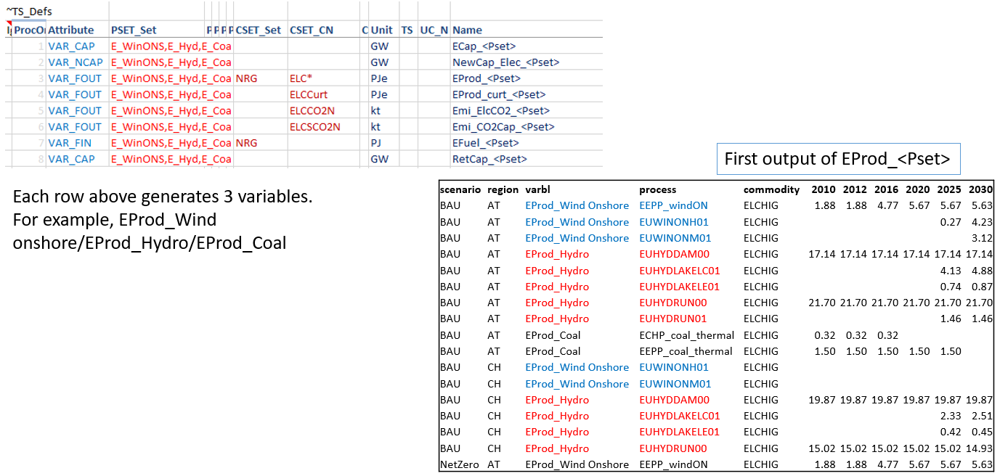
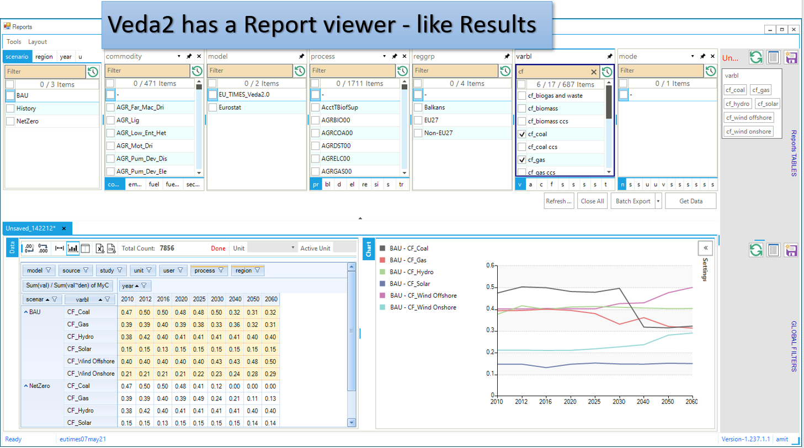

#########
Reports
#########
Creating Reports with Veda2.0

Core mechanics of Report creation
==================================
* The Reports menu can be used to select scenarios, across models and users
* Reports are defined in an Excel file (like the Set definitions file)
* There are two basic types of instructions:
    * Creating variables via combination of attribute, process, commodity
    * Creating aggregations based on variable, process, commodity and region

Variables can be created based on process/commodity sets
^^^^^^^^^^^^^^^^^^^^^^^^^^^^^^^^^^^^^^^^^^^^^^^^^^^^^^^^^

Aggregations based on Varbl and Process names
^^^^^^^^^^^^^^^^^^^^^^^^^^^^^^^^^^^^^^^^^^^^^^

.. image:: images/Reports/agg_on_varbls-process.PNG
    :width: 600

Aggregations based on Varbl and Region names
^^^^^^^^^^^^^^^^^^^^^^^^^^^^^^^^^^^^^^^^^^^^^^

.. image:: images/Reports/agg_on_varbls-region.PNG
    :width: 600

Coarser Variables can be created too
^^^^^^^^^^^^^^^^^^^^^^^^^^^^^^^^^^^^^^

.. image:: images/Reports/coarser_varbls.PNG
    :width: 600

Aggregations based on Commodity names
^^^^^^^^^^^^^^^^^^^^^^^^^^^^^^^^^^^^^^

.. image:: images/Reports/agg_on_comm_grps.PNG
    :width: 600

Aggregations based on Process names
^^^^^^^^^^^^^^^^^^^^^^^^^^^^^^^^^^^^^^

.. image:: images/Reports/agg_on_process.PNG
    :width: 600

CSV output
^^^^^^^^^^
It can be consumed in applications like Tableau, Power BI, or LMA

.. image:: images/Reports/csv_output_reports.PNG
    :width: 600

Advanced features
==================
* Sankey diagrams
* Unit conversion
* Including exogenous data
    * Historical trends/calibration check
    * Producing per/capita and per/GDP metrics
* Special attributes
    * Utilization factors
    * Efficiency (by DEM)
    * CO2 intensity (by DEM)

LMA gets a lot more out of Reports
===================================

Sources and uses of main energy forms
^^^^^^^^^^^^^^^^^^^^^^^^^^^^^^^^^^^^^^

.. raw:: html

    <a href="https://lma.vedaviz.com/Presenter/Predex.aspx?pkp=1041&pkv=252583" target="_blank">See it online </a> select energy form

.. image:: images/Reports/main_energy_forms.PNG
    :width: 600

Road transport vehicles
^^^^^^^^^^^^^^^^^^^^^^^^

.. raw:: html

    <a href="https://lma.vedaviz.com/Presenter/Predex.aspx?pkp=1041&pkv=252590" target="_blank">See it online </a> select region

.. image:: images/Reports/lma_road_transport.PNG
    :width: 600

Power generation
^^^^^^^^^^^^^^^^^

.. raw:: html

    <a href="https://lma.vedaviz.com/Presenter/Predex.aspx?pkp=1041&pkv=252586" target="_blank">See it online </a> select electricity/hydrogen/heat, and region

.. image:: images/Reports/lma_power_gen.PNG
    :width: 600

Power generation – alternate view
^^^^^^^^^^^^^^^^^^^^^^^^^^^^^^^^^

.. raw:: html

    <a href="https://lma.vedaviz.com/Presenter/Predex.aspx?pkp=1041&pkv=252588" target="_blank">See it online </a>

Power generation – alternate view 2
^^^^^^^^^^^^^^^^^^^^^^^^^^^^^^^^^^^

.. raw:: html

    <a href="https://lma.vedaviz.com/Presenter/Predex.aspx?pkp=1041&pkv=252589" target="_blank">See it online </a>

