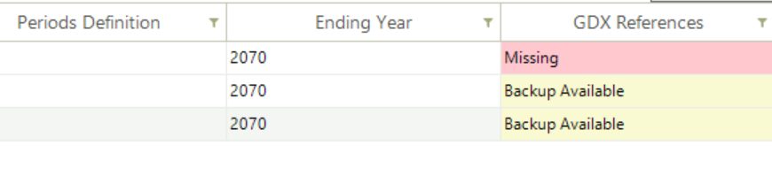

###########
Run Manager
###########

Overview
=========

* The Run Manager is used to compose and submit model runs (`YouTube video <https://youtu.be/3EkFqLyl5ZE>`_)
* Each model run is based on a Case definition comprising:
    * Scenarios
    * Regions
    * Settings
    * Properties

.. image:: images/run_manager_1.PNG
    :width: 600

Sections
=================

+++++++++++++++
Scenario Group
+++++++++++++++
Check BASE/SysSettings and the list of scenario to be included in a “cluster” that is then given a name for inclusion later in a Case Definition for a model run.

+++++++++
Settings
+++++++++
To designate where the GAMS and TIMES files reside, in what folder the model is to be run, the Maximum number of runs that are to be submitted in parallel, 
the Solver to be used and the Solver Options file to be employed.

+++++++++++++
Region Group
+++++++++++++
Designation of the regions to be included in the Group definition.

+++++++++++
Properties
+++++++++++
Which GAMS switches are to be employed for the run.

++++++
Cases
++++++
List of Cases prepared identifying the Run name/Description, Scenario Group, list of regions, the Property specification to be used, 
period definition and ending year, and date information.

DD and script files
===================

* There are three different possible structures of the GAMS_Wrk.. folder and sub-folders based on the following inputs:
    * Max Runs =1
    * Max Runs >1
    * Parametric scenario case (irrespective of Max Runs)

.. image:: images/dd_files.PNG
    :width: 600

Modifying RUN files
===================

There are new attributes to write TIMES switches or GAMS code at five different locations in the RUN file. Further, these declarations can also be made
at the top or bottom of scenario DD files (last two attributes in the table below). The attributes are supported by regular INS/DINS tables, in any scenario file or in SysSettings.

.. csv-table::
        :file: tables/times_switches/Times_switches_attr_loc.csv
        :widths: 1,1,1
        :header-rows: 1

There is no need to modify the RUN file template manually.

Commands will be ordered by Value column; only rows with value>0 will be considered.
If multiple scenarios send commands to the RUN file,
the blocks will be ordered as per the order of scenarios in the case definition.

.. tip::
    This also opens up some new possibilities. For example, you can run parametric scenarios where base prices for elastic demands are picked up from different Reference cases.

These examples are available in the `Advanced Demo <https://github.com/kanors-emr/Model_Demo_Adv_Veda.git>`_ model.

.. csv-table:: Example 1
        :file: tables/times_switches/Example1.csv
        :widths: 20,35,15,5,50
        :header-rows: 2

If you want to use single quotes <'> or commas <,> in your instructions, then it is necessary to use a DINS table, as shown below. DINS tables need process or commodity specification. You can use any valid
process instead of IMPNRGZ; it will have no impact on the outcome.

.. csv-table:: Example 2
        :file: tables/times_switches/Example2.csv
        :widths: 20,50,30
        :header-rows: 2

Case definition
================
.. image:: images/case_definition.png
    :width: 400

* Create a New Case by providing the core information for the case definition (or copy an existing Case to create a starting point)
    * Case Name - name of the case
    * Description - description of the case
    * Scenario Group - scenarios to be included in this run
    * Region Group - regions to be included in this run
    * Properties Group - what GAMS options/switch are to be employed
    * Periods Definition - period definition for the run
    * Last Period - last period for the run
    * Source TIMES - where does the TIMES code reside
    * Solver - which solver is to be used
    * Solver Options - which solver options to use
    * Optional
        * Parametric Group - Parametric scenario file to create suites of runs
        * GDX References - GDX files to be used for freezing periods, elastic demand base prices or IRE bounds/prices

++++++++++++++
GDX References
++++++++++++++
Options "Save solution information" and "Write B Price for Elastic Demands" create casename_P and casename_DP GDX files, which are automatically copied to the appdata folder so that they are available for being included in subsequent runs.
The recommended way is to create a property group, "save sol info", for example, with these options selected (in addition to the other options you are using), and use this group for Ref runs. The casename.GDX file can also be used to freeze
the solution up to a certain period.

Managing GDX files
------------------
**In version 3.1.1.0**, we have made a major change in GDX file management. By default GDX Reference form now loads the current WrkTimes folder, so you can link your files directly from there. In order to give flexibility to link GDX files from anywhere in the system, **Select Folder** button has been provided to browse the source folder. AppData/GAMSSAVE has now been reduced to just a backup folder to your linked gdx files.

Three new utilities has also been introduced in the Cases grid: Resolve, Backup, and Remove under **Options** menu. These utilities aim to enhance your experience and streamline your workflow by providing more control and flexibility over your GDX file management.

* **Resolve**
    Resolve is designed to simplify the process of managing GDX file references within your cases. It replaces existing links from current GDX files to files present within the designated backup directory (`AppData/GAMSSAVE`). Upon detecting files with the same name, Resolve automatically updates the references.
    Resolve can handle even valid GDX references by linking files from the backup, making it even more versatile and efficient.

* **Backup**:
    In previous versions of Veda, GDX files were copied to their respective model's `AppData/GAMSSAVE` folder after each solve operation. Now this directory is only meant to serve as a backup GDX files container. GDX files will only be copied to the `AppData` folder when they are linked to a case for the first time.
    This can result in outdated files in the `AppData/GAMSSAVE` directory. The Backup button gives users full control over this process. By selecting one or more cases, users can ensure that the GDX files linked to those cases are copied to the `AppData` folder, refreshing the files in the `AppData/GAMSSAVE` directory from work times.

    We would suggest users backup their cases' linked GDX files every time they decide to move or create a new instance of the model.

* **Remove**
    The Remove utility simplifies the task of managing GDX file links within your cases. By selecting one or more cases, users can effortlessly remove all GDX file links associated with those cases. This feature provides a quick and convenient way to clean up unnecessary references and streamline your cases.

(**GDX Link Status Indicators**) In addition to the new utilities, we have improved the GDX link status indicators in the grid to provide better visibility and understanding of your file links:

- **Missing:** Indicates that the linked GDX file is not available, not even in the backup folder.
- **Backup Available:** Indicates that the linked file is not available, but a file with the same name is present in the backup (`AppData/GAMSSAVE`) folder, which can be used.

Model run submission
=====================

.. image:: images/cases_grid.png
    :height: 150

* Select one (or more) of the cases in the Managed Save Cases section and click SOLVE

* Solving a model opens a CMD window showing the GAMS solution log

.. image:: images/solve_cmd.png

Managing output files
=====================

Output files of large models can be as large as 1 GB per case. All the information is contained in <casename>.GDX file, and txt files are created for transferring data to Veda databases,
which are almost 3 times the size of the GDX files. Starting in version 2.4.1.1, Veda offers efficient management of these files. Veda can create a zip archive with key files like <casename>.GDX,
<casename>~data_<datetime>.GDX, LST, QA_Check, and the TIME2Veda.VDD file from the active GAMS_Src folder. These archives can be stored in a central location (across users and models) that is under
user control. Import VD file feature now creates temporary copies of VD files when these archives are selected for import.

Import runs from Veda online
============================

To import the zip files in Veda2.0, follow these steps:
    * Create a folder named "Veda_case_zip_files" within the Zip Files Location folder. However, if the folder already exists, you can skip this step) (see attached image).

    .. image:: images/Zip_files_location_RunManager.png
        :width: 500

    * Inside the "Veda_case_zip_files" folder, create subfolders for your username, model name, and study name {username\\model name\\study name}. Place your zip files into study name subfolder.
    * The final path will depend on your username, model name, and study name. For instance, if your username is "rohit", model name is "DemoS_012", and study name is "Base" the path will be: Veda_case_zip_files\\rohit\\DemoS_012\\Base\\model_results_Case-demos_012_Solver-CPLEX.zip. (See attached image)

    .. image:: images/Import_runs_name_description_of_RunManager.png
        :width: 600

.. _Gams Engine Settings:

GAMS Engine Settings
============================

Imagine a user in the VEDA2.0 application attempting to run a case, such as **DemoS_001**, using the GAMS Engine. 
To do this, the user selects the 'GAMS Engine' option under 'Settings' in the Run Manager Module, and then clicks on the 'GAMS Engine Settings' button to enter their GAMS Engine credentials.
    
    .. image:: images/gams_engine_credentials.png
        :width: 500

Users must enter their User Name and Password as provided by 'GAMS.' For the Namespace and Model name, follow these steps:

    * Launch the GAMS Engine UI.
    * Navigate to the Namespaces tab.
    * Review the listed Namespaces and Models to find yours.
    * Ensure that your namespace and model name are correct.
    * If your model's name isn't registered, you will need to register it on this platform.

        .. image:: images/gams_engineui_modelname_registration.png
            :width: 500            

        In the form shown above, users need to fill in the following fields:

        * **Drop model files here** - Upload the TIMES model source code zip file along with the **`times.gms`** file.

            For reference, use the sample zip file **`times473.zip`**, which contains the TIMES model source code version 4.7.3 along with the **`times.gms`** file. 
            You can download it from `here <https://www.dropbox.com/scl/fi/ph1g8r43og3ugaxdlyxu8/times473.zip?rlkey=9z11wf9e2pz47fhvx3ezstrvy&dl=0>`_.
            
            .. note:: **DemoS_001** is a Veda model. You need to add TIMES model source instead of Veda model. You can download the latest TIMES model code from `here <https://github.com/etsap-TIMES/TIMES_model/releases>`_. 
            
            After downloading, replace the source folder files with the new files. Do not change or remove the **`times.gms`** file.

        * **Identifier for the model** - Enter `latest`
        * **Name of the main file** – Enter `times.gms`
        * **Command line arguments** – Enter `idir1=source,idir2=model,fileCase=2`        
        
        .. image:: images/gams_engineui_modelname_registration_filled.png
            :width: 500

For more detailed guidance and an illustrative image, please refer to the provided `link <https://www.gams.com/engine/administration.html>`_.