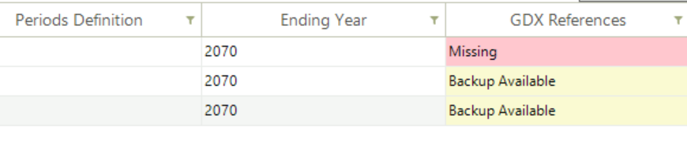

###########
Run Manager
###########

Overview
=========

* The Run Manager is used to compose and submit model runs (`YouTube video <https://youtu.be/3EkFqLyl5ZE>`_)
* Each model run is based on a Case definition comprising:
    * Scenarios
    * Regions
    * Settings
    * Properties

.. image:: images/run_manager_1.PNG
    :width: 600

Sections
=================

+++++++++++++++
Scenario Group
+++++++++++++++
Check BASE/SysSettings and the list of scenario to be included in a “cluster” that is then given a name for inclusion later in a Case Definition for a model run.

+++++++++
Settings
+++++++++
To designate where the GAMS and TIMES files reside, in what folder the model is to be run, the Maximum number of runs that are to be submitted in parallel, 
the Solver to be used and the Solver Options file to be employed.

+++++++++++++
Region Group
+++++++++++++
Designation of the regions to be included in the Group definition.

+++++++++++
Properties
+++++++++++
Which GAMS switches are to be employed for the run.

++++++
Cases
++++++
List of Cases prepared identifying the Run name/Description, Scenario Group, list of regions, the Property specification to be used, 
period definition and ending year, and date information.

Understanding Case Composition
-------------------------------

VEDA uses a **dimensional group composition** approach for defining model runs. This allows you to create reusable groups in each dimension and then compose cases by selecting one group from each dimension.

Each case is composed by selecting **one group from each of five dimensions**:

.. list-table:: Case Composition Dimensions
   :header-rows: 1
   :widths: 20 40 40

   * - Dimension
     - Purpose
     - Example Groups
   * - Scenario Group
     - Which data files/scenarios to include
     - "Ref", "HighRE", "CarbonPolicy"
   * - Region Group
     - Which geographic regions to model
     - "AllRegion", "ERCOT_only", "Western_US"
   * - Properties Group
     - TIMES switches and GAMS options
     - "DefaultProperties", "Myopic_20yr", "Stochastic"
   * - Parametric Group
     - Parametric variations (optional)
     - CO2 tax levels, demand sensitivities
   * - Settings
     - Solver, paths, execution settings
     - CPLEX solver, max runs=2

**Benefits of this approach:**

- **Reusability**: Define "Myopic_20yr" properties once, use with any scenario
- **Consistency**: Same properties guaranteed across multiple cases
- **Flexibility**: Quick scenario testing by swapping groups
- **Organization**: Clear separation of modeling dimensions

Properties Groups: Two Configuration Methods
---------------------------------------------

VEDA provides two complementary ways to configure TIMES switches and modeling options:

**GUI Properties Window**

The Properties window provides graphical controls for the most frequently used TIMES switches (~15 options):

- Time-Stepped Solution (myopic/limited foresight)
- TIMES Extensions (Climate Module, Discrete Investment, etc.)
- General Equilibrium (MACRO variants)
- Objective Function options (OBLONG, Mid-Year Discounting)
- General Options (QA checks, solution saving, etc.)

**When to use**: Common workflows, interactive testing, user-friendly configuration

**Declarative Parameter System**

For advanced switches not available in the GUI (~50+ additional switches), use the declarative parameter system with RFCmd, SFCmd, and CmdF attributes.

**When to use**: Advanced TIMES switches (STAGES, SPINES, REDUCE, etc.), project-specific configurations, version-controlled settings

See the "Modifying RUN files" section below for complete documentation of the declarative system.

Properties Window Reference
----------------------------

This section documents the GUI options available in the Properties window.

.. image:: images/run_manager_properties_1.png
   :width: 450px
   :align: center

.. image:: images/run_manager_properties_2.png
   :width: 450px
   :align: center

**Time-Stepped Solution**

**Purpose**: Configure sequential solving with limited foresight (myopic mode) instead of perfect foresight.

**Setting**: Run In Steps Of

- **0** (default) - Perfect foresight: optimizes entire horizon in one solve with complete future knowledge
- **10-30** - Myopic/limited foresight: optimizes in sequential steps of specified years with no knowledge beyond each step

**How it works:**

The model solves in sequential steps, each optimizing a limited horizon. After each step, previous decisions are fixed and the optimization window advances forward. Successive steps overlap by default (half the step length) to ensure continuity.

**Use cases:**

- **Realistic decision-making**: Simulate planning without perfect future knowledge
- **Uncertainty analysis**: Test robustness of strategies under limited foresight
- **Policy analysis**: Understand near-term vs long-term decision trade-offs
- **Large models**: Faster solving due to smaller problem size per step

**Example configurations:**

.. list-table::
   :header-rows: 1
   
   * - Run In Steps Of
     - Mode
     - Description
   * - 0
     - Perfect Foresight
     - Optimize 2020-2100 in one solve (default)
   * - 20
     - Limited Foresight
     - Sequential 20-year optimization windows
   * - 10
     - Short Horizon
     - Sequential 10-year windows for more myopic behavior

**See also**: TIMES Documentation Part I, Section 9 "Using TIMES with limited foresight"

**TIMES Extensions**

**Climate Module**

Enable the TIMES climate module to estimate atmospheric CO₂ concentrations, radiative forcing, and temperature changes.

- **Checkbox**: Enabled/Disabled
- **See**: TIMES Documentation on Climate Module

**Discrete Investment**

Enable lumpy (discrete/integer) investment decisions instead of continuous investments.

- **Setting**: Auto (default) / Enabled / Disabled
- **Note**: Creates Mixed-Integer Programming (MIP) problem
- **See**: TIMES Documentation Part I, Chapter 10 "The lumpy investment extension"

**Discrete Unit Commitment**

Enable discrete unit commitment formulation for detailed operational modeling.

- **Checkbox**: Enabled/Disabled
- **See**: TIMES Documentation on unit commitment features

**Endogenous Technology Learning**

Enable endogenous technology learning based on cumulative capacity (learning-by-doing).

- **Checkbox**: Enabled/Disabled
- **Note**: Creates Mixed-Integer Programming (MIP) problem
- **See**: TIMES Documentation Part I-II on Endogenous Technology Learning

**OBJ Function Variant**

*Mid Year Discounting*

Use mid-year discounting for cost accounting instead of beginning-of-year discounting.

- **Checkbox**: Enabled (recommended) / Disabled
- **Purpose**: More accurate cost representation

*OBJ Function Variant*

Select objective function formulation:

- **Auto** (default) - TIMES selects appropriate formulation
- **STD** - Standard formulation
- **MOD** - Modified formulation with flexible period boundaries
- **ALT** - Alternative with improved capacity transfer coefficients
- **LIN** - Linear flow/activity evolution between milestone years

*OBLONG*

Synchronize capacity-related costs with process activities for improved cost accounting.

- **Checkbox**: Enabled (recommended) / Disabled
- **Purpose**: Eliminates distortions in cost accounting and salvaging
- **Note**: Automatically enabled when using MOD objective function

*Shift Discounting By*

Shift the time-of-year for discounting continuous payment streams (in years).

- **Default**: 0
- **0.5**: Equivalent to Mid Year Discounting
- **1.0**: End-of-year discounting

**General Equilibrium**

Select general equilibrium mode:

- **None** (default) - Partial equilibrium (TIMES standalone)
- **MACRO variants** - Full general equilibrium with macroeconomic feedback

  - **YES** - Standard MACRO formulation
  - **MSA** - MACRO decomposition algorithm
  - **CSA** - Calibration for MSA
  - **MLF** - Linearized MACRO-MLF formulation

**See**: TIMES-MACRO Documentation

**General Options**

*CO2 Calibration at BOH*

Calibrate CO₂ to base year observations.

*Do Extended QA Checks*

Enable extended quality assurance checks during model generation.

*P/w Linear VarCost*

Use piecewise linear interpolation for variable costs (memory efficient for large models).

*Retire*

Enable early retirement of process capacities:

- **LP** - Continuous early retirements
- **MIP** - Lumpy early retirements

*Save Solution Information*

Save solution to GDX file (\*_P.GDX) for use in subsequent runs (warm start, fixing periods, etc.).

*Use Last Run As Starting Point*

Use previous solution as starting point for faster solve (warm start).

*Use Slack Variables in UC*

Enable explicit slack variables in user constraints (required for stochastic/sensitivity modes).

*Write B Price for Elast Dem*

Write base prices for elastic demand to GDX file (\*_DP.GDX) for use in policy scenarios.

**Levelized Costs**

Select cost reporting method:

- **None** - Standard annual costs at milestone year
- **LEV** - Levelized costs over process lifetimes/periods

**Damage**

Include damage costs in objective function:

- **NO** - Damage costs not included
- **LP** - Linearized damage costs (default if damage costs defined)
- **NLP** - Non-linear damage costs

**See**: TIMES Documentation Part II, Appendix B on damage cost functions

**Trade Off**

*Activate Sensitivity Analysis*

Enable sensitivity and trade-off analysis features with automatic warm start.

*GAMS Option Bratio*

Set GAMS BRATIO option for basis retention in successive solves.

**TS For Flow Reporting Types**

Control timeslices used for reporting flow variables:

- **Flow Variable** - Use original flow variable timeslices
- **COM** - Report at commodity timeslices
- **ANNUAL** - Report at annual level only (memory efficient for large models)

**Uncertainty**

Configure stochastic programming mode:

- **PF** (default) - Perfect foresight (deterministic)
- **Stochastic modes** - Must be configured via declarative parameters (RFCmd_FLAGS)

**For stochastic programming**, use the declarative system:

.. code-block::

   Attribute: RFCmd_FLAGS
   Value: 1
   Text: $SET STAGES YES

**For recurring uncertainties (SPINES)**:

.. code-block::

   Attribute: RFCmd_FLAGS
   Value: 1
   Text: $SET SPINES YES

**See**: TIMES Documentation on Stochastic Programming

Advanced TIMES Switches via Declarative Parameters
---------------------------------------------------

Many advanced TIMES switches are not available in the GUI and must be configured using the declarative parameter system. Common examples include:

.. list-table:: Common Advanced Switches
   :header-rows: 1
   :widths: 25 50 25

   * - Switch
     - Purpose
     - Parameter to Use
   * - STAGES
     - Multi-stage stochastic programming
     - RFCmd_FLAGS
   * - SPINES
     - Recurring uncertainties hedging
     - RFCmd_FLAGS
   * - REDUCE
     - Model reduction algorithm
     - RFCmd_FLAGS
   * - FIXBOH
     - Fix beginning-of-horizon periods
     - RFCmd_FLAGS
   * - TIMESED
     - Elastic demand control
     - RFCmd_FLAGS
   * - DEBUG
     - Extended debugging output
     - RFCmd_FLAGS
   * - ANNCOST
     - Annualized cost reporting
     - RFCmd_FLAGS
   * - RPT_OPT
     - Reporting options
     - RFCmd_GLOBAL

**See the "Modifying RUN files" section below for complete documentation of the declarative parameter system.**

For complete reference of all TIMES switches, see: `TIMES Documentation Part III: Execution Control Switches <https://iea-etsap.org/index.php/documentation>`_

DD and script files
===================

* There are three different possible structures of the GAMS_Wrk.. folder and sub-folders based on the following inputs:
    * Max Runs =1
    * Max Runs >1
    * Parametric scenario case (irrespective of Max Runs)

.. image:: images/dd_files.PNG
    :width: 600

Modifying RUN files
===================

There are new attributes to write TIMES switches or GAMS code at five different locations in the RUN file. Further, these declarations can also be made
at the top or bottom of scenario DD files (last two attributes in the table below). The attributes are supported by regular INS/DINS tables, in any scenario file or in SysSettings.

.. csv-table::
        :file: tables/times_switches/Times_switches_attr_loc.csv
        :widths: 1,1,1
        :header-rows: 1

There is no need to modify the RUN file template manually.

Commands will be ordered by Value column; only rows with value>0 will be considered.
If multiple scenarios send commands to the RUN file,
the blocks will be ordered as per the order of scenarios in the case definition.

.. tip::
    This also opens up some new possibilities. For example, you can run parametric scenarios where base prices for elastic demands are picked up from different Reference cases.

These examples are available in the `Advanced Demo <https://github.com/kanors-emr/Model_Demo_Adv_Veda.git>`_ model.

.. csv-table:: Example 1
        :file: tables/times_switches/Example1.csv
        :widths: 20,35,15,5,50
        :header-rows: 2

If you want to use single quotes <'> or commas <,> in your instructions, then it is necessary to use a DINS table, as shown below. DINS tables need process or commodity specification. You can use any valid
process instead of IMPNRGZ; it will have no impact on the outcome.

.. csv-table:: Example 2
        :file: tables/times_switches/Example2.csv
        :widths: 20,50,30
        :header-rows: 2

Case definition
================
.. image:: images/case_definition.png
    :width: 400

* Create a New Case by providing the core information for the case definition (or copy an existing Case to create a starting point)
    * Case Name - name of the case
    * Description - description of the case
    * Scenario Group - scenarios to be included in this run
    * Region Group - regions to be included in this run
    * Properties Group - what GAMS options/switch are to be employed
    * Periods Definition - period definition for the run
    * Last Period - last period for the run
    * Source TIMES - where does the TIMES code reside
    * Solver - which solver is to be used
    * Solver Options - which solver options to use
    * Optional
        * Parametric Group - Parametric scenario file to create suites of runs
        * GDX References - GDX files to be used for freezing periods, elastic demand base prices or IRE bounds/prices

++++++++++++++
GDX References
++++++++++++++
Options "Save solution information" and "Write B Price for Elastic Demands" create casename_P and casename_DP GDX files, which are automatically copied to the appdata folder so that they are available for being included in subsequent runs.
The recommended way is to create a property group, "save sol info", for example, with these options selected (in addition to the other options you are using), and use this group for Ref runs. The casename.GDX file can also be used to freeze
the solution up to a certain period.

Managing GDX files
------------------
**In version 3.1.1.0**, we have made a major change in GDX file management. By default GDX Reference form now loads the current WrkTimes folder, so you can link your files directly from there. In order to give flexibility to link GDX files from anywhere in the system, **Select Folder** button has been provided to browse the source folder. AppData/GAMSSAVE has now been reduced to just a backup folder to your linked gdx files.

Three new utilities has also been introduced in the Cases grid: Resolve, Backup, and Remove under **Options** menu. These utilities aim to enhance your experience and streamline your workflow by providing more control and flexibility over your GDX file management.

* **Resolve**
    Resolve is designed to simplify the process of managing GDX file references within your cases. It replaces existing links from current GDX files to files present within the designated backup directory (`AppData/GAMSSAVE`). Upon detecting files with the same name, Resolve automatically updates the references.
    Resolve can handle even valid GDX references by linking files from the backup, making it even more versatile and efficient.

* **Backup**:
    In previous versions of Veda, GDX files were copied to their respective model's `AppData/GAMSSAVE` folder after each solve operation. Now this directory is only meant to serve as a backup GDX files container. GDX files will only be copied to the `AppData` folder when they are linked to a case for the first time.
    This can result in outdated files in the `AppData/GAMSSAVE` directory. The Backup button gives users full control over this process. By selecting one or more cases, users can ensure that the GDX files linked to those cases are copied to the `AppData` folder, refreshing the files in the `AppData/GAMSSAVE` directory from work times.

    We would suggest users backup their cases' linked GDX files every time they decide to move or create a new instance of the model.

* **Remove**
    The Remove utility simplifies the task of managing GDX file links within your cases. By selecting one or more cases, users can effortlessly remove all GDX file links associated with those cases. This feature provides a quick and convenient way to clean up unnecessary references and streamline your cases.

(**GDX Link Status Indicators**) In addition to the new utilities, we have improved the GDX link status indicators in the grid to provide better visibility and understanding of your file links:

- **Missing:** Indicates that the linked GDX file is not available, not even in the backup folder.
- **Backup Available:** Indicates that the linked file is not available, but a file with the same name is present in the backup (`AppData/GAMSSAVE`) folder, which can be used.

Model run submission
=====================

.. image:: images/cases_grid.png
    :height: 150

* Select one (or more) of the cases in the Managed Save Cases section and click SOLVE

* Solving a model opens a CMD window showing the GAMS solution log

.. image:: images/solve_cmd.png

Managing output files
=====================

Output files of large models can be as large as 1 GB per case. All the information is contained in <casename>.GDX file, and txt files are created for transferring data to Veda databases,
which are almost 3 times the size of the GDX files. Starting in version 2.4.1.1, Veda offers efficient management of these files. Veda can create a zip archive with key files like <casename>.GDX,
<casename>~data_<datetime>.GDX, LST, QA_Check, and the TIME2Veda.VDD file from the active GAMS_Src folder. These archives can be stored in a central location (across users and models) that is under
user control. Import VD file feature now creates temporary copies of VD files when these archives are selected for import.

Import runs from Veda online
============================

To import the zip files in Veda2.0, follow these steps:
    * Create a folder named "Veda_case_zip_files" within the Zip Files Location folder. However, if the folder already exists, you can skip this step) (see attached image).

    .. image:: images/Zip_files_location_RunManager.png
        :width: 500

    * Inside the "Veda_case_zip_files" folder, create subfolders for your username, model name, and study name {username\\model name\\study name}. Place your zip files into study name subfolder.
    * The final path will depend on your username, model name, and study name. For instance, if your username is "rohit", model name is "DemoS_012", and study name is "Base" the path will be: Veda_case_zip_files\\rohit\\DemoS_012\\Base\\model_results_Case-demos_012_Solver-CPLEX.zip. (See attached image)

    .. image:: images/Import_runs_name_description_of_RunManager.png
        :width: 600

.. _Gams Engine Settings:

GAMS Engine Settings
====================

Imagine a user in the VEDA2.0 application attempting to run a case, such as **DemoS_001**, using the GAMS Engine. 
To do this, the user selects the 'GAMS Engine' option under 'Settings' in the Run Manager Module, and then clicks on the 'GAMS Engine Settings' button to enter their GAMS Engine credentials.
    
    .. image:: images/gams_engine_credentials.png
        :width: 500

Users must enter their User Name and Password as provided by 'GAMS.' For the Namespace and Model name, follow these steps:

    * Launch the GAMS Engine UI.
    * Navigate to the Namespaces tab.
    * Review the listed Namespaces and Models to find yours.
    * Ensure that your namespace and model name are correct.
    * If your model's name isn't registered, you will need to register it on this platform.

        .. image:: images/gams_engineui_modelname_registration.png
            :width: 500            

        In the form shown above, users need to fill in the following fields:

        * **Drop model files here** - Upload the TIMES model source code zip file along with the **`times.gms`** file.

            For reference, use the sample zip file **`times473.zip`**, which contains the TIMES model source code version 4.7.3 along with the **`times.gms`** file. 
            You can download it from `here <https://www.dropbox.com/scl/fi/ph1g8r43og3ugaxdlyxu8/times473.zip?rlkey=9z11wf9e2pz47fhvx3ezstrvy&dl=0>`_.
            
            .. note:: **DemoS_001** is a Veda model. You need to add TIMES model source instead of Veda model. You can download the latest TIMES model code from `here <https://github.com/etsap-TIMES/TIMES_model/releases>`_. 
            
            After downloading, replace the source folder files with the new files. Do not change or remove the **`times.gms`** file.

        * **Identifier for the model** - Enter `latest`
        * **Name of the main file** – Enter `times.gms`
        * **Command line arguments** – Enter `idir1=source,idir2=model,fileCase=2`        
        
        .. image:: images/gams_engineui_modelname_registration_filled.png
            :width: 500

For more detailed guidance and an illustrative image, please refer to the provided `link <https://www.gams.com/engine/administration.html>`_.