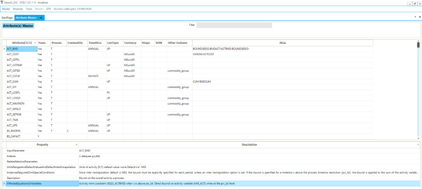

====================
TIMES Attributes
====================

* TIMES attributes (Information/TIMES attributes) presents all the TIMES model generator attributes/parameters used to build the model structure and input data.
* Shows the needed information by each attribute for each relevant index
* For the selected attribute, the description from the TIMES manual is displayed at the bottom.

