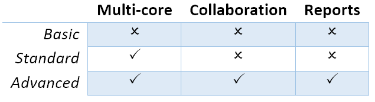

=============
Veda Versions
=============
There are three different versions of Veda2.0: Basic, Standard, and Advanced. The basic version works on a single core, but is still much faster than VEDA_FE/BE.
Standard version uses multiple cores for certain operations, like processing FI_T and DINS tags, and writing DD files. In smaller models (academic use), the difference would be imperceptible.
Advanced version has two additional features - sharing across users working on the same model on the same server, and Reports.

License are priced as per institutions as well, like before. Basic version is accessible only to academic institutions.

