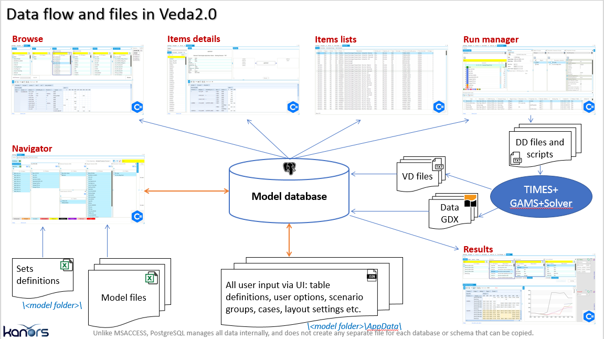

=======================
Introduction
=======================
VEDA means “Knowledge” in Sanskrit.
VEDA2.0 (front-end and back-end) it is a software interface used to facilitate TIMES model management and results analysis
It is based on a modular approach that organizes the core model data into an integrated database.
Information is visible via diagrammatic tabular browsing tools (data cubes) and network diagrams.
It is used to develop and manage model runs.
It is also used to analysis model results.
All VEDA-TIMES model input data is organized in Excel workbooks templates. VEDA-FE then integrates information from all of these workbooks into a single database to generate a TIMES model.
The models managed by VEDA-FE are stored in a specific folder (by default \\VEDA\\VEDA_Models). Within this folder, there is a sub-folder for each individual model a user is working with, including all of the VEDA-TIMES Demo Models ((\\VEDA\\VEDA_Models\\DemoS_001, etc.).
Model results are stored, for each model name, in a specific folder
Veda\\GAMS_WrkTIMES\\<model name>.

e.g. for DemoS_012 will be Veda\\GAMS_WrkTIMES\\DemoS_012

