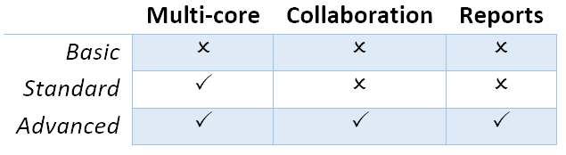

============
Introduction
============
VEDA means “Knowledge” in Sanskrit. It is a software tool to convert modeler's knowledge into input for models, and output from models into knowledge.
Veda2.0 is a data handling system for The Integrated MARKAL-EFOM System (TIMES) - a bottom-up optimization model for energy-environment systems. It uses C#.NET for UI and PostgreSQL as the backend.
Veda is based on a modular approach that organizes the model input data, and results, into an integrated database.
Information is visible via tabular browsing (data cubes) and network diagrams.
It is used to develop and manage model runs and to analyse model results.

Veda is a proprietary commercial software designed and developed by KanORS-EMR. It has been supported by ETSAP since 2000. ETSAP contracting parties get a small group license for free,
and others can purchase it from KanORS. Access to technical support and updates is subject to an annual maintenance fee (20% of the intial cost), after the first year.

Philosophy and core principles
------------------------------
    * Most of the data used by energy modelers is already in spreadsheets, or it can get there easily. The interface should be able to read formats that analysts find intuitive, rather than forcing them to enter information via a separate UI.
    * Assumptions should be expressed in the original form; data pre-processing should be minimal.
        * Veda can read a wide variety of layouts - timeseries, regions in columns, attributes in columns etc., to minimize structural pre-processing.
        * Veda allows rule-based manipulation of parameters and set declarations, to minimize numerical pre-processing. Massive amounts of data can be introduced or modified with very few instructions.
    * System should be modular – easy to activate/deactivate/replace sectors or regions. Different analysts should be able to work on different sectors or regions in parallel.
    * Structures and data that is common across regions should be declared only once.
    * Different layers of assumptions should coexist so that they can be activated/deactivated/permuted at run-time.

Veda lexicon
------------
Here are some keywords that have acquired their own special meanings over the last two decades.

    * **Templates**: a template is normally defined as *something that determines or serves as a pattern, a model.* In the VEDA world, this refers to all the Excel files that constitute a model.
    * **Template Folder**: The folder that contains all these files is called the *Template folder* of the model.
    * **Scenario**: the closest normal definition is *an imagined or projected sequence of events, especially any of several detailed plans or possibilities.* This is perhaps the most sticky misnomer that MARKAL/TIMES modelers have been living with. It is used with different meanings for model input and output. On the input side, this implies a bunch of input data that can be given a name. Examples: all starting year data is normally called BASE scenario; time series of CO2 Tax can be called CO2Tax scenario; assumptions on future capacity bounds on hydro and wind can be called RenewablePotential Scenario. We choose a group of such scenarios and give it a Case or Run name while submitting a run. When handling the solution with this case/run name, it is called a Scenario again. Normally, this name corresponds with the new assumptions that justified the run – tax scenario, high renewable potential scenario, for example.
    * **Transformation**: normal definition is *the operation of changing an expression into another in accordance with a mathematical rule.* Here, it is used as an adjective for tables that are used to create new data (or modify existing data) in a rule-based manner.
    * **SubRES**: this has no meaning normally; it is our original contribution to the English language! With the regular meaning of RES – Reference Energy System, this refers to a part of the overall RES of the model. Generally, this is a set of processes and commodities that can be included/excluded from the model without interrupting the core flows. Sequestration would be a good example: all the processes and auxiliary commodities created to model sequestration could be put in an independent SubRES so that they can be included/excluded in model runs freely (at the time of submitting a run) without having to change any parameter values. These are commonly used to define the new technologies for models.
    * **Base-Year**: the first period of the modeling horizon. Since TIMES allows flexible period lengths, normally this is a single year so that the values are annual rather than averages over several years.
    * **Super-Region**: it is a user-defined label that maps to one or more model regions. The mapping is declared in the SysSettings file. See the sheet RTT of this file in the DEMO model, for example; “DEMOT” maps to ROW and WEU.
    * **Dummy Imports**: to avoid infeasibilities arising from broken RES connections or too tight calibration bounds, VEDA creates a dummy source for each NRG, MAT and DEM commodity that is defined in the model. The basic idea is to have these sources supply at prices that are an order of magnitude higher than the normal prices in the model, so that the source of the potential infeasibility can be easily located. One process is created for each commodity type, and their operation cost can be controlled via the SysSettings file (or any other scenario file).
    * **SYNC**: Synchronize, is used for the operation one launches from the VEDA navigator, which reads the information for various Excel files into databases.

Architecture
------------
All input data resides in Excel workbooks. XLSX/M format is recommended for Veda2.0. Modularity is one of the core features of Veda. This is to make major reconfigurations
possible and efficient. This also makes it easier for multiple people to work on different parts of the model in parallel. This is achieved by segregating the input data into the following sections:

    * Core definitions of regions, timeslices, modeling years, and commodities
    * Technologies with existing stock
    * New technologies
    * Demands
    * Trades
    * Additional parameter definitions for technologies and commodities

There can be multiple files for each type of data, apart from the first one - the core definitions. In each model folder, these files are organized in the structure shown below.

.. image:: images/veda_folder_structure.png
    :width: 700

Files expected in these sub-folders are as under:
    * Root folder has SysSettings (core definitions), Base-year templates (existing techs), and set definitions.
    * SubRES has files with new technologies
    * SuppXLS has the scenario files (additional parameters (or modifications) for all existing and new technologies and commodities)
        * Demands has the DEM_Alloc+Series to allocate drivers to demands, and ScenDem_<scenario name> for driver scenarios.
        * Trades has ScenTrade__Trade_Links for defining trade links, and ScenTrade_<scenario name> for declaring attributes for trade processes (which can also be done in regular scenario files).

Veda2.0 is a C#.NET application that reads these Excel files into a PostgreSQL database, offers tabular and graphical views of the data as TIMES parameters, and submits the data to the TIMES
code.

.. image:: images/data_flow_and_files.PNG
    :width: 700

Versions
--------
There are three different versions of Veda2.0:
    * Basic
    * Standard
    * Advanced

The basic version works on a single core, but is still much faster than VEDA_FE/BE. Standard version uses multiple cores for certain operations, like processing FI_T
and DINS tags, and writing DD files. In smaller models (academic use), the difference would be imperceptible.
Advanced version has two additional features - Collaboration, and Reports.

Collaborative working on a server
^^^^^^^^^^^^^^^^^^^^^^^^^^^^^^^^^
Multiple users working on the same model on a server will be able to share the following:
    * Model runs
        * Runs from multiple users, even with the same name, will be usable in the Results module. “User” will be a dimension in the data, like region, scenario etc.
    * Input Data GDX
    * Results views definitions
    * Various groups and case definitions for Run Manager

Custom reports
^^^^^^^^^^^^^^
VEDA_BE and the Results functionality in Veda2.0 work well for interactive and production reporting. But I see two limitations, removing which can make this a lot more powerful and flexible.
First, the *reporting variables* are trapped in tables – we don’t have direct control over them.
Second, we cannot add dimensions to the output views – we are limited to process and commodity sets in terms of segmenting the output beyond the native indexes like attribute, region and time.
Let’s take transportation final energy (in a rich model like the JRC_EU-TIMES) as an example: I want to see energy consumption by scenario, region, fuel, mode, size, and technology.
Scenario and region are separate indexes, and fuel can be managed with commodity sets. But we have only process sets to deal with mode, size and technology.
The entirely new approach of custom reports uses an Excel template to define reporting variables in a very efficient manner, and freely add
dimensions based process/commodity names, regions and scenarios.

License are priced as per institutions as well, like before. Basic version is accessible only to academic institutions.

Licensing
---------
Veda is licensed via keys that need to be activated on each user account. A key can be activated multiple times, depending on the license size. Users who use Veda on two machines (desktop/server and
a portable computer) can get activations added to their keys, on request. If Veda is installed on a server, license will need to be activated from each user account that accesses Veda.

License administrators will get a link to a web page that shows the activation status of license keys. Organization information, which will appear on maintenance invoices, can also be updated on this page.

Licenses can be moved from one user account to another by first deactivating on the old account (Tools - License Information - Deactivate your license) and activating on the new account.

Licenses are perpetual, but major versions that are released after expiry of maintenance will not be accessible to users.
Maintenance status of the license is displayed on the main form of Veda.

.. image:: images/maintenance_status.png
   :width: 700
