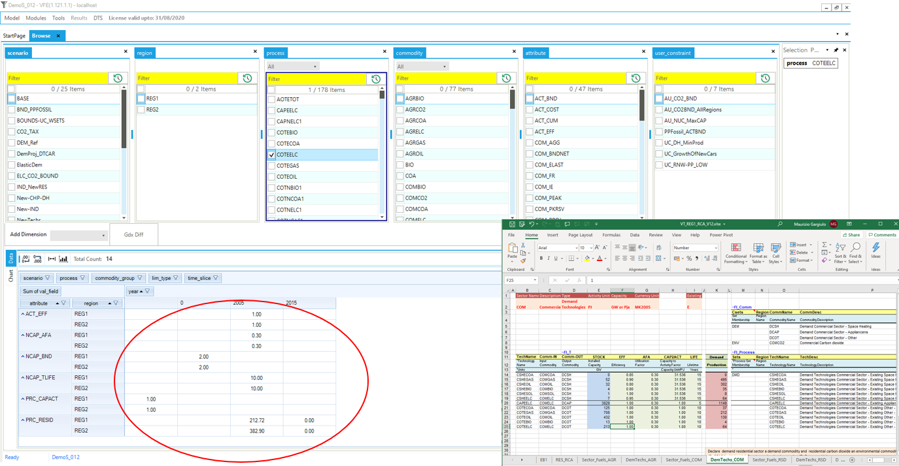

# Browse

!!! tip "Tip"

    All data declaration for Veda models is done in Excel files. But to
    *visualize* models, one MUST use the interface and NOT rely on Excel
    files. Excel should be used only for the initial and additional data
    specification. To check the parameter declarations or topology for any
    particular item, one must use Browse (or Items detail). [For
    example](https://forum.kanors-emr.org/showthread.php?tid=1326){ target="_blank" rel="noopener noreferrer" }...

**Browsing model input is necessary for two reasons:**

- You may have a syntax error and some of your declarations may have been
  ignored, or read differently from what you intended.
- The declarations for a single item may be spread across several Excel
  files, and you will see them all in one place in the interface.

Demo:

<iframe width="560" height="315" src="https://www.youtube.com/embed/sRMCd2wVqGY" title="Veda Browse overview" frameborder="0" allow="accelerometer; autoplay; clipboard-write; encrypted-media; gyroscope; picture-in-picture" allowfullscreen></iframe>

- Browse presents the actual model data and provides direct access to the
  input data.
- Clicking any input cell in the data cube (red circle) provides direct
  access to specific cells in the Excel templates for editing.

The Browser enables you to view subsets of the assembled data in a cube by
selecting the scenario(s), region(s), process(es), commodity(ies), and/or
attribute(s) of interest. You can rearrange the layout by adding or removing
dimensions (columns and rows) in the table.
