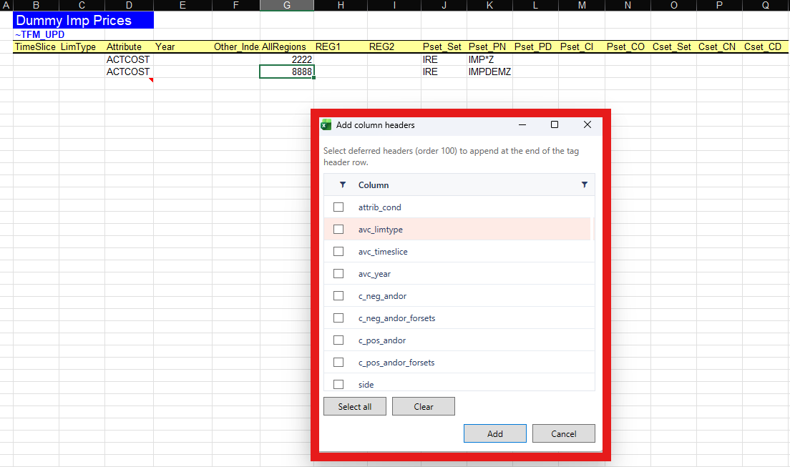

# Add Column Headers

## What it is for

Some tag columns are **deferred** (they are part of the tag definition but not always written when the table is first created). **Add Column Headers** lists missing deferred headers for the **current tag** on the sheet and lets you append them in Excel.

This is a local sheet edit. Sync is **not** required. Under an imported model the workbook must be **classified** and the active cell must be in a recognizable tag table. Files outside the model folder are also allowed; see [Files outside the model](files-outside-the-model.md).

## How to use

1. Open a classified scenario workbook and place the active cell in a tag table ([Add Tag](add-tag.md)).
2. Choose **Add Column Headers** from the **VEDA** ribbon or menu.
3. In the dialog, review the missing headers offered for the current tag.

    

4. Confirm to append them to the header row (and adjust the table as the dialog describes).

If the file is inside a model folder and not recognized, or you are not in a tag table, the command is blocked with a clear message.
