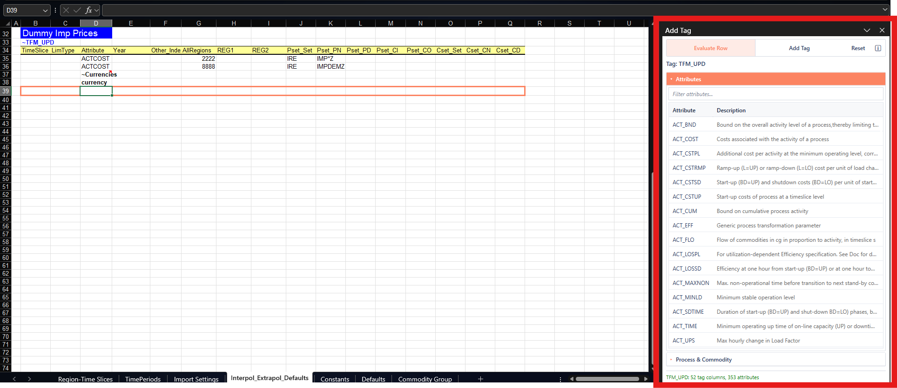

# Add Tag

## What it is for

**Add Tag** opens a task pane where you pick a tag from the catalog and insert a **tag table** on the sheet. In VEDA, tags (`~TagName`) define structured tables that drive model data. The pane also hosts **Evaluate Row** mode for working with an existing table ([Evaluate Row](evaluate-row.md)); in that mode, the add-in outlines the active **data row** in orange so you can see which row the pane is using (see [Orange outline](evaluate-row.md#orange-outline) on the Evaluate Row page).

Each open workbook gets its **own** Add Tag pane (independent state). Closing the workbook closes that pane. The pane opens at about 25% of the Excel window width (minimum about 280 pixels).

## Tag tables on the sheet

- A tag cell starts with `~` followed by the tag name (for example `~FI_T`).
- The **header row** is the row **immediately below** the `~` cell.
- Column headers are the contiguous non-empty cells on that header row, found by walking left and right from the tag column until a blank cell.
- A title in another column on another row (for example a section title beside the tag) does not shrink or shift that header range.
- If the active cell sits in **more than one** overlapping tag table, you get a **Tag In Tag** error. Separate or adjust tables so only one applies.

## How to use — insert a tag

1. Connect to VEDA. For a classified scenario workbook see [Workbook recognition](workbook-recognition.md); for a file outside the model folder see [Files outside the model](files-outside-the-model.md).
2. Choose **Add Tag** from the **VEDA** ribbon or right-click menu (or use the **Add Tag** mode button in the pane).
3. In the tag list, pick a tag.
    - Under an imported model: synced files show tags for this workbook; classified-only files show tags for that file type; unrecognized names show an empty list.
    - Outside the model: a scenario-like file name shows tags for that type; any other name shows all tags with columns.
    - A few tags are left off the list (they are not offered for new tables). **Evaluate Row** still works if those tags are already on the sheet.
4. The add-in writes `~TagName` and a header row at the active cell, then selects the first data cell.

    

5. Use the **Attributes** section to choose attributes. **Process & Commodity** starts collapsed after insert so you can pick attributes first; expand it when you need process/commodity tools.

Sections use accordion expanders (**Attributes**, **Process & Commodity**). **Show mapping** opens a popup of the current row’s process/commodity filter values.

## Expanded value headers

For some tags, **Add Tag** writes member names as the value headers. Those headers sit at the right of the default columns.

| Tags | What is written |
|------|-----------------|
| `tfm_ins`, `tfm_dins`, `tfm_upd` | Endogenous region names (no `value` column) |
| `tfm_ins-ts`, `tfm_dins-ts`, `tfm_upd-ts` | Milestone years, and one `region` column |
| `tfm_ins-tsl`, `tfm_dins-tsl` | Time-slice names, and one `region` column |

If the model has no matching members, the original header is left as-is.

Empty required dimension cells are light red. Empty value cells (including these expanded headers) are light gray. See [Fill colors](fill-colors.md).

## Typing an attribute in the sheet

In **Evaluate Row** mode (including right after Add Tag inserts a table), you can type an attribute name into an **empty** attribute-column cell and leave the cell (for example by moving to another cell):

- A known attribute (matched ignoring case) fills row defaults as if you picked it in the pane.
- An unknown value is cleared and the status line shows an error.
- Multi-cell paste is ignored; only a single-cell change is handled.
- Changing an attribute that was already filled does not re-run defaults.
