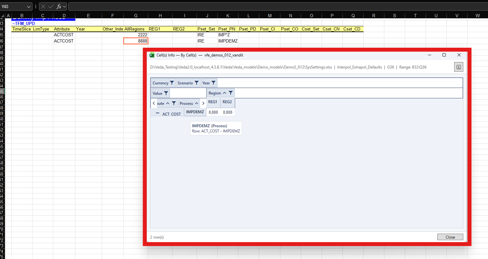

# Cell(s) Info

## What it is for

**Cell(s) Info** fetches flat-file data from the model for the cells you select in Excel and shows it in a **pivot** view. Use it to explore what lies behind values in a synced scenario workbook without leaving Excel.

The workbook must be **classified** and **synced**. Unsynced or unrecognized files are blocked before any request. See [Workbook recognition](workbook-recognition.md).

## Modes

| Mode | Menu / ribbon | What is fetched |
|------|---------------|-----------------|
| By cell(s) | **Cell(s) Info** | Every cell in the current selection (one cell, a contiguous block, or multiple non-contiguous areas) |
| By Row | **By Row** / Cell Info By Row | All cells in the selected row within the current table region |
| By Column | **By Column** / Cell Info By Column | All cells in the selected column within the current table region |

## How to use

1. Open a synced scenario workbook under an imported model ([How models are linked](how-models-are-linked.md)).
2. Confirm VEDA is connected ([How we connect](how-we-connect.md)).
3. Select the cell(s), or place the active cell in the row or column you care about.
4. On the **VEDA** ribbon or right-click **VEDA** menu, choose **Cell(s) Info**, **By Row**, or **By Column**.
5. Review the pivot. Close the window when finished.

    

While the window is open, Excel outlines the target range with a **thick bright orange border**. The outline is removed when you close the form, open another Cell Info, change sheet, or another feature replaces the outline.

## Pivot layout (overview)

Fields are placed automatically from the data:

- **Value** — summed in the values area
- **Year** — usually columns
- **Region** — columns when there is a single year and multiple regions; otherwise rows or filter
- **Other fields** — rows if they have more than one distinct value; filters if they have exactly one
- Internal or metadata columns are hidden

You can rearrange fields by dragging the inline field boxes, or use right-click **Show Field List** for the field chooser. Subtotals and grand totals are hidden. Row dimensions use a tabular layout (each dimension in its own column). Field names appear in title case (for example `commodity_gr` as *Commodity Group*).
