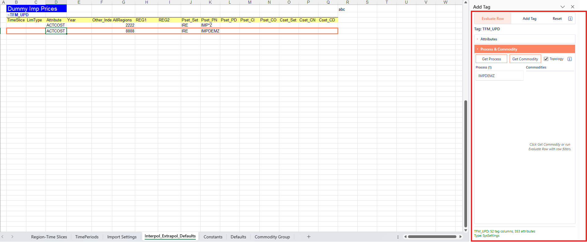

# Evaluate Row

## What it is for

**Evaluate Row** reads the active cell’s tag table and the **current data row**, then shows context in the Add Tag task pane: which tag you are in, available attributes, and which **processes** and **commodities** match the filter values in that row’s process- and commodity-type columns. It works on tags already on the sheet even when those tags are not in the Add Tag list.

Those filters define the scope for which flat-file data is associated with that tag row in the model. Use **Get Process** and **Get Commodity** to refresh the matching lists; use **Show mapping** to see the filter values collected from the row.

## When it is allowed

| Workbook state | Behavior |
|----------------|----------|
| Classified and synced | Full evaluate on tag tables |
| Classified, not synced | Allowed; status may show `Local file (not synced)` |
| Not classified (inside the model folder) | Blocked |
| Outside the imported model | Allowed; members come from the model open in VEDA. See [Files outside the model](files-outside-the-model.md). |

See [Workbook recognition](workbook-recognition.md).

## How to use

1. Place the active cell inside a tag table (data area or a cell that belongs to that tag’s block). See [Add Tag](add-tag.md) for how tag tables are recognized.
2. Choose **Evaluate Row** from the **VEDA** ribbon or right-click menu (or the **Evaluate Row** mode button in the pane).
3. Confirm the pane shows the correct tag. After evaluate, **Attributes** starts collapsed and **Process & Commodity** starts expanded; lists fill when applicable.
4. Review process and commodity grids. Use **Get Process** / **Get Commodity** to fetch again. If the row has no values on that side (or the request fails), the grid is cleared so you do not see stale rows.

    

5. Optionally open **Show mapping** for the current row’s filter values.

The context menu exposes **Evaluate Row** only; Get Process and Get Commodity are buttons inside the pane.

## Topology

The **Topology** checkbox sits in **Process & Commodity**, beside **Get Process** and **Get Commodity**. It is on by default. Resetting the pane turns it back on.

| Topology | What Get Process / Get Commodity do |
|----------|-------------------------------------|
| On | Use this row’s `top_check` or `top_chk`, and only when the other side of the row also has a value |
| Off | Process and commodity filters stay independent |

With the checkbox on:

| Cell | Effect |
|------|--------|
| Column missing | **all** (input or output links) |
| **in** | Input links only |
| **out** | Output links only |
| **all** | Either |
| Empty or **No** | No topology filter |

## Orange outline

**Evaluate Row**, **Get Process**, and **Get Commodity** outline the active **data row** of the resolved tag table in orange (full width of the header row). Closing or hiding the pane, switching mode, resetting the pane, or changing sheet clears the outline. Only one orange outline exists at a time; opening **Cell(s) Info** replaces it with that feature’s own range outline.
