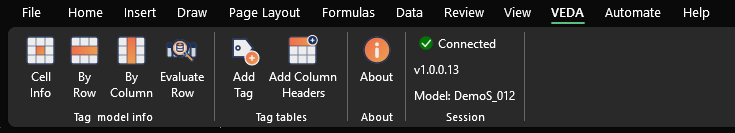
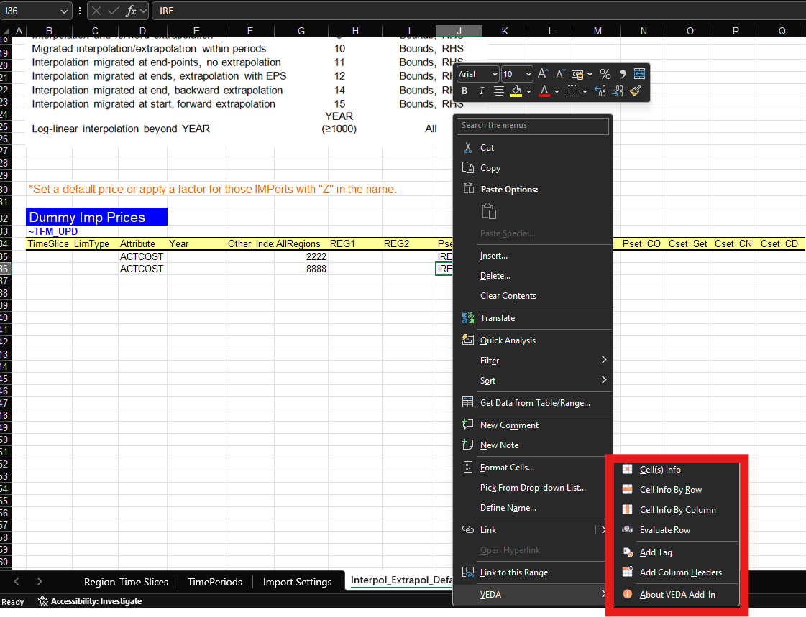

# Introduction

The **VEDA Excel Add-In** connects Microsoft Excel to a running **VEDA 2.0** desktop session. From Excel you can explore model data behind cells, work with tag tables (`~` tags), and check which processes and commodities a row’s filters match.

Commands appear in two places and do the same things:

- The **VEDA** tab on the Excel ribbon
- The **VEDA** submenu on the cell right-click menu

## Prerequisites

- Microsoft Excel 2016 or later
- VEDA Excel Add-In installed and loaded ([Installation](installation.md) — from `VedaExcelAddIn_<version>.zip` on the VEDA 2.0 release)
- **VEDA 2.0** running on the same machine, with your model imported

You do not use the add-in without VEDA 2.0. Connection details are in [How we connect](how-we-connect.md). How the open workbook is tied to a model is in [How models are linked](how-models-are-linked.md). You can also insert and evaluate tag tables on a file that is **not** under a model folder; see [Files outside the model](files-outside-the-model.md).

## Ribbon layout

The **VEDA** tab is organized into six groups:

1. **Cell Info**
    - **Cell(s) Info** — explore flat-file data for the selection in a pivot view
    - **By Row** / **By Column** — same pivot view for an entire row or column within the current table region
2. **Evaluate Row** — check which processes and commodities match the filter values in the active tag row
3. **Tag tables**
    - **Add Tag** — insert tag tables on the sheet
    - **Add Column Headers** — add missing column headers
    - **Add Process Set** / **Add Commodity Set** — append sets to `pset_set` or `cset_set` on the active tag row ([Add Process / Commodity Set](add-set.md))
4. **About** — who provides the add-in and basic requirements
5. **Session** ([How we connect](how-we-connect.md))
    - Connection — **Connected** or **Not Connected**, and **Model: …**
    - **Version** — a separate line for compatibility (ok, or upgrade the add-in or VEDA)
6. **Fill colors** — key for empty required cells (light red) and empty value cells (light gray) ([Fill colors](fill-colors.md))
