# Reports

The Advanced license of Veda2.0 offers a powerful, efficient way to
create reports. VEDA_BE and the Results functionality in Veda2.0 work
well for interactive and even production reporting, but they have two
limitations that the Reports feature removes. First, reporting variables
are trapped inside tables — they cannot be controlled directly. Second,
output views cannot grow new dimensions; segmentation is limited to
process and commodity sets on top of the native indexes (attribute,
region, time).

Take transportation final energy in a rich model like JRC_EU-TIMES: you
may want to see energy consumption by scenario, region, fuel, mode,
size, and technology. Scenario and region are separate indexes, and fuel
can be managed with commodity sets — but mode, size and technology have
to be expressed through process sets, which means three separate views
in the table-driven approach. Reports replaces that with an Excel
template in which reporting variables are defined explicitly, and any
number of dimensions can be derived from process names, commodity names,
regions and scenarios. The same mechanism can pull in exogenous data —
historical energy balances for trend/calibration views, or population
and GDP for per-capita and per-GDP metrics.

!!! note "Note"

    Examples in this section are based on the [JRC_EU-TIMES
    model](https://github.com/KanORS-E4SMA/EU_TIMES_Veda2.0){ target="_blank" rel="noopener noreferrer" }. Further
    examples are in the file LMADefs-EU_TIMES.xlsm. The Reports feature
    is active in Trial licenses.

## Core mechanics of Report creation

- The Reports menu can be used to select scenarios across models and
    users.

- Reports are defined in one or more Excel files (analogous to the Set
    definitions file).

- The Excel files contain *tagged tables* — each table begins with a
    tag like `~TS_Defs` or `~Process_Map` and is followed by a header
    row and data rows.

- **There are two main steps in building a report:**

    1. **Define variables** (`~TS_Defs`, `~TS_Ratios`,
       `~ATS_final`). Each row produces one or more numbers,
       indexed by attribute, region, year, scenario, and optionally
       process/commodity/timeslice/user-constraint/vintage.
    2. **Classify them with overlapping dimensions** using the
       `_Map` tags (`~Varbl_Map`, `~Process_Map`, `~Commodity_Map`,
       `~Region_Map`, `~Timeslice_Map`). Every `dimension` listed
       in a `_Map` table becomes a new column on the report fact
       table, which Excel / CSV / VO / LMA can pivot, filter and
       slice on. The same process or commodity can carry multiple
       overlapping classifications (e.g. a single solar PV plant is
       simultaneously *Tech = Solar*, *Sector = Power*, *Tech_Agg
       = Renewables*).

- All processing is region-aware: region is preserved by default in
    every output, and ratios computed via `~TS_Ratios` group by region
    implicitly. Region can be aggregated explicitly via `~Region_Map`.

### Pipeline order

The order in which Veda processes tags matters when you reason about
which substitutions happen first. The simplified order is:

1.  Parse all `~TS_Defs` rows.
2.  For each scenario, join the model output (`.vd` file) with the
    parsed variable definitions. Apply `show_me` per-row retention
    (dimensions not listed are aggregated away). Substitute `<c>` /
    `<pa>` / `<pc>` unit placeholders. Apply `WAttribute` weighted
    averages.
3.  Build trade-flow variables from `~Geolocation` (and electricity-grid
    trade flows from `~tradeflow_imp` / `~tradeflow_exp`).
4.  Apply unit conversion from `~UnitConv` so `~TS_Ratios` sees
    converted units.
5.  Process `~TS_Ratios` rows (numerator/denominator weighted averaging,
    ratio or product, parent-region roll-up).
6.  Apply dimension classifications (`~Varbl_Map`, `~Process_Map`,
    `~Commodity_Map`, `~Region_Map`, `~Timeslice_Map`). Each `dimension`
    produces a new column on the fact table. `ignore` on the `~TS_Defs`
    row suppresses `_Map` processing for the listed dimensions.
7.  Move per-scenario tables into the main `lma_dts` reporting table.
8.  `~ATS_final` direct injection.
9.  System-wide `~UnitConversion` (from `SysSettings`).
10. `~Language` processing (translations of names/labels).

## Defining variables (`~TS_Defs`)

The `~TS_Defs` tag is the core of Reports. Each row defines one output
variable from a combination of attribute, process and commodity filters,
plus optional timeslice and user-constraint qualifiers. The standard
pattern is **one variable per row, with a fixed `Name`** — the
classifications and aggregations that the report consumer cares about
are added downstream by the `_Map` tags (see the next section). Trying
to encode classifications in the variable name itself is a legacy
approach and is not recommended for new work; see
[the legacy section below](#legacy-name-embedding-via-sets).

### Column reference (`~TS_Defs`)

| **Column**                                                                    | **Recognised aliases**                                          | **Meaning**                                                                                                                                                                                                                                                                                                                                                                                    |
| --- | --- | --- |
| `Attribute`                                                                   | `attribute`                                                     | The TIMES output attribute the variable is built on (e.g. `VAR_FIN`, `VAR_FOUT`, `VAR_ACT`, `VAR_CAP`, `VAR_NCAP`, `Cost_INV`, `Val_Flo`). A row may also reference a User Constraint value with `Attribute = User_con` — see "User-constraint reporting variables" below.                                                                                                                     |
| `WAttribute`                                                                  | `wattribute`                                                    | Weighting attribute for dynamic weighted averages. When set, the variable's value is multiplied by this attribute's value and the attribute's value is stored as `val~den`, so the result aggregates correctly as a weighted average.                                                                                                                                                          |
| `Region`                                                                      | `region`                                                        | Comma-separated list of regions this variable applies to. Empty = all regions.                                                                                                                                                                                                                                                                                                                 |
| `Period`                                                                      | `period`                                                        | Comma-separated list of periods (milestone years). Empty = all periods.                                                                                                                                                                                                                                                                                                                        |
| `Vintage`                                                                     | `vintage`                                                       | Comma-separated list of vintages. Empty = all vintages.                                                                                                                                                                                                                                                                                                                                        |
| `PSET_Set` / `PSET_PN` / `PSET_PD` / `PSET_CI` / `PSET_CO`                    | aliases include `pset:set`, `process`, `techname`, `pset:pd`, … | Process filter columns (set, name, description, commodity-in, commodity-out). Same semantics as in Veda's process filtering. Wildcards (`*`, `?`) and exclusions (`-pattern`) are supported.                                                                                                                                                                                                   |
| `CSET_Set` / `CSET_CN` / `CSET_CD`                                            | aliases include `cset:set`, `commodity`, `commname`             | Commodity filter columns (set, name, description). Wildcards and exclusions supported.                                                                                                                                                                                                                                                                                                         |
| `Unit`                                                                        | `unit`                                                          | Output unit. May contain placeholders `<c>` (commodity unit), `<pa>` (process activity unit), `<pc>` (process capacity unit) — these are substituted per-row from the model's process/commodity definitions.                                                                                                                                                                                   |
| `TS`                                                                          | `timeslice`, `time_slice`                                       | Comma-separated timeslice list. Empty / `-` = aggregated across timeslices.                                                                                                                                                                                                                                                                                                                    |
| `UC_N`                                                                        | `uc_n`, `user_constraint`                                       | Comma-separated user-constraint list. Also carries the `Snk_attr=<group_name>` directive that classifies a row into a Sankey group (see Sankey section).                                                                                                                                                                                                                                       |
| `Name`                                                                        | `name`                                                          | Output variable name. For Sankey-specific naming with placeholders like `<region>` and `<gen_pname>` / `<gen_cname>`, see the Sankey section. (Legacy: `<Pset>`, `<Cset>`, `<PName>`, `<CName>` — see [the legacy section below](#legacy-name-embedding-via-sets).)                                                                                                                                                                |
| `Desc` / `Ldesc`                                                              | `desc`, `ldesc`                                                 | Short and long descriptions of the variable.                                                                                                                                                                                                                                                                                                                                                   |
| `show_me`                                                                     | `group_by`                                                      | Dimensions to **retain** in the output. Any combination of `p` (process), `c` (commodity), `t` (timeslice), `u` (user constraint), `v` (vintage). Empty = aggregate them all away.                                                                                                                                                                                                             |
| `ignore`                                                                      | `discard`, `agg_across`                                         | Dimensions whose `_Map` classifications should **not** be applied to this variable. Any combination of `p` (suppress `~Process_Map`), `c` (suppress `~Commodity_Map`), `r` (suppress `~Region_Map`), `t` (suppress `~Timeslice_Map`). The dimensions on `ignore` are exactly the four that have a corresponding `_Map` tag. This is distinct from `show_me` — see "show_me vs. ignore" below. |
| `top_check`                                                                   | `top_chk`                                                       | Restrict the variable to topology-valid (process, commodity) pairs. `i` (or `in`) keeps only commodity-in flows; `o` (or `out`) keeps only commodity-out flows; empty disables the check.                                                                                                                                                                                                      |
| `t_pos_andor` / `t_neg_andor` / `t_pos_andor_forsets` / `t_neg_andor_forsets` | aliases `p_pos_andor`, …                                        | Connector words (`AND` / `OR`) for the positive and negative process-filter expressions. Default is `AND`; `OR` makes the comma-separated list behave as alternatives. `_forsets` variants apply the connector when the filter is a set rather than a name.                                                                                                                                    |
| `c_pos_andor` / `c_neg_andor` / `c_pos_andor_forsets` / `c_neg_andor_forsets` |                                                                 | Same as above, for commodity filters.                                                                                                                                                                                                                                                                                                                                                          |

### show_me vs. ignore — two different controls

These two columns are often confused, but they control different things
and operate on different dimension sets.

- `show_me` (alias `group_by`) controls **per-row retention of the raw
    model dimensions**. Codes: `p` (process), `c` (commodity), `t`
    (timeslice), `u` (user constraint), `v` (vintage). If a code is
    present, that dimension appears on each row of the output; if not,
    the variable is aggregated across that dimension. Leaving `show_me`
    empty means the variable is fully aggregated — one row per (region,
    year, scenario).
- `ignore` (alias `discard` / `agg_across`) is **not** another
    aggregation control — `show_me` already does that. `ignore` is a
    separate setting that tells the pipeline to **suppress `_Map`
    classification** for the listed dimensions on this variable. Codes:
    `p`, `c`, `r`, `t` — exactly the four dimensions that have a
    corresponding `_Map` tag. Use `ignore` when a variable doesn't make
    sense to classify on a particular dimension.

When to reach for each:

- **Want a variable with no per-process detail?** Leave `show_me`
    empty (the default). Don't touch `ignore`.
- **Want a variable to show per-process detail?** Put `p` in
    `show_me`.
- **Want a variable to skip the `Fuel` / `Fuel_Agg`
    classifications produced by `~Commodity_Map`?** Put `c` in
    `ignore`. (Common for variables that are inherently fuel-aggregated
    already, where carrying per-commodity classification would be
    misleading.)
- **Want a variable to skip the `Region_WEO` etc.
    classifications from `~Region_Map`?** Put `r` in `ignore`.
    (Common for variables that already aggregate across regions, or for
    global totals.)

The two columns are independent — they can be empty, set together, or
set to different combinations.

### Dynamic weighted averages with `WAttribute`

`WAttribute` turns a variable into a weighted average that aggregates
correctly across processes, commodities, regions and scenarios. For each
row that has a non-empty `WAttribute`, Veda also reads the weighting
attribute's values, multiplies the main attribute's value by the weight,
stores the weight in `val~den`, and drops rows where the weight is null
or zero.

This is the recommended way to build utilization factors, efficiencies,
prices and emission intensities — anything that needs to behave
correctly under aggregation. A worked example ships with the [Veda Adv
Demo model](https://github.com/kanors-emr/Model_Demo_Adv_Veda.git){ target="_blank" rel="noopener noreferrer" }.

!!! note "Note"

    Earlier versions of Veda computed certain ratios (CO2
    intensity by DEM, capacity factor, efficiency by DEM) automatically
    based on naming conventions in the output variables. That mechanism has
    been deprecated and is no longer active in the report pipeline. Use
    `WAttribute` for any new weighted-ratio variable.

### User-constraint reporting variables

Setting `Attribute = User_con` on a `~TS_Defs` row turns the
user-constraint values themselves into a report variable. This is the
standard pattern for reporting drivers that the model carries as user
constraints — population, GDP, demand projections, sectoral indicators —
and is used heavily in production models. A typical pattern:

| **Attribute** | **Unit** | **Name** |
| --- | --- | --- |
| User_con | b$ | rep_GDP |
| User_con | b$ | rep_GDPIND |
| User_con | b$ | rep_GDPSER |
| User_con | million | rep_POP |

### Legacy: name embedding via sets

Older report definitions encoded classifications directly into the
variable name using the placeholders `<Pset>`, `<Cset>`, `<PName>`,
`<CName>`, paired with the lookup tables `~PSet_Map`, `~CSet_Map`,
`~PName_Map`, `~CName_Map`:

| **~TS_Defs** | | |
| --- | --- | --- |
| **Attribute** | **PSET_Set** | **Name** |
| VAR_FOUT | E_Coal | EProd_<Pset> |
| VAR_FOUT | E_Gas | EProd_<Pset> |

| **~PSet_Map** | | |
| --- | --- | --- |
| **Pset** | **Desc** | **Ldesc** |
| E_Coal | Coal | Coal |
| E_Gas | Gas | Gas |

The row with `PSET_Set = E_Coal` produced the variable `EProd_Coal`, the
row with `E_Gas` produced `EProd_Gas`, and so on.

**This mechanism has been completely superseded by the `_Map`
aggregation tables.** The `_Map` approach is more expressive (the same
process can participate in multiple overlapping classifications), keeps
variable names stable, and lets downstream tools pivot on
classifications cleanly. The placeholder mechanism is still parsed for
backward compatibility, but should not be used for new work.

## Aggregations and classifications (the `_Map` tags)

This is where Reports gets most of its expressive power. The five `_Map`
tags — `~Varbl_Map`, `~Process_Map`, `~Commodity_Map`, `~Region_Map`,
`~Timeslice_Map` — attach named classifications to processes,
commodities, regions, variables and timeslices. Every `dimension` listed
in a `_Map` table becomes a new column on the report fact table.

### The overlapping-subsets pattern

The single most important property of the `_Map` tags is that
classifications can overlap freely. Unlike the legacy set-membership
approach (where a process belongs to exactly one `PSET_Set` per slot),
`_Map` tables let the same process / commodity / region appear in any
number of classifications simultaneously, on different dimensions.

For example, a coal-fired power plant can be classified as all of these
at once:

- `Sector = Power-util`
- `Tech = Coal`
- `Tech_Agg = Thermal`
- `Tech_CCS_flag = Without CCS`
- `Region_WEO = North America`

A natural-gas combined-cycle plant might share four of those five
values, differing only on `Tech = Gas`. A coal-with-CCS plant might
share four of five, differing only on `Tech_CCS_flag = With CCS`. Each
report consumer can pivot or filter on whichever dimension they need
without the others getting in the way.

Within a single dimension (e.g. `Tech`), the standard override rule
applies — later declarations win, so a broad pattern can be listed first
and then specialised below.

### How a `_Map` row works

Every `_Map` table has the same core columns plus a tag-specific set of
filter columns:

| **Core column** | **Meaning**                                                                                                                                                                                                                                                                                                                              |
| --- | --- |
| `dimension`     | The name of the classification this row contributes to. Becomes a column on the output fact table. Multiple rows with the same `dimension` together form one classification; multiple `dimension` values in one `_Map` table create multiple parallel classifications.                                                                   |
| `name`          | A name pattern (with wildcards `*`, `?` and exclusion prefix `-`) that selects which entities this classification applies to. For `~Process_Map` this matches the process name; for `~Commodity_Map` the commodity name; for `~Region_Map` the region name; for `~Timeslice_Map` the timeslice name; for `~Varbl_Map` the variable name. |
| `description`   | The classification value placed in the dimension column. (E.g. for a row with `dimension = Tech, name = *SPV*, description = Solar` — every process matching `*SPV*` gets `Tech = Solar` on the output.)                                                                                                                                 |
| `ldesc`         | Long description, for localisation / UI labelling.                                                                                                                                                                                                                                                                                       |

The process- and commodity-specific `_Map` tags also accept the full set
of process / commodity filter columns that `~TS_Defs` accepts
(`pset_set`, `pset_pn`, `pset_pd`, `pset_ci`, `pset_co`, plus the `c_*`
and `t_*` variants and the `_andor` connectors). This lets the
classification be defined by set membership, by commodity flows
(in/out), or by any combination — and is what makes overlapping
classifications easy.

### `~Process_Map`

Classifies processes. Supports all process filter columns.

**Typical dimensions:** `Tech`, `Tech_Agg`, `Sector`, `sub_sector`,
`sector_weo`, `Supply_route`, `country`, `En_service`.

A real example from a production model — the `Tech` dimension for
power-generation technologies, combining process set membership with
commodity flows to pick out the right subsets:

| **~Process_Map** | | | | | |
| --- | --- | --- | --- | --- | --- |
| **dimension** | **name** | **description** | **pset_set** | **pset_ci** | **pset_co** |
| Tech | | Bio | ELE,CHP | ???BSL,???BIO | `-CO2Captured*` |
| Tech | | Coal | ELE,CHP | ???COA | `-CO2Captured*` |
| Tech | | Gas | ELE,CHP | ???NGA | `-CO2Captured*` |
| Tech | | Geothermal | ELE,CHP | ???GEO | |
| Tech | | Nuclear | ELE,CHP | ???NUC | |
| Tech | | Solar | ELE,CHP | ???SPV,???STH,ELC_spv_* | |
| Tech | `*WON*,*WINONS*` | Wind-Onshore | ELE,CHP | ???WIN,ELC_Won_* | |
| Tech | `*WOF*,*WINOFS*` | Wind-Offshore | ELE,CHP | ???WIN,ELC_Wof_* | |
| Tech | | Bio (CCS) | ELE,CHP | ???BSL,???BIO | `CO2Captured*` |
| Tech | | Coal (CCS) | ELE,CHP | ???COA | `CO2Captured*` |
| Tech | | Gas (CCS) | ELE,CHP | ???NGA | `CO2Captured*` |

Three things to notice:

- `pset_set = ELE,CHP` restricts the classification to electricity and
    CHP processes.
- `pset_ci` (commodity-in) narrows further by the fuel a process
    consumes — `???COA` matches any 3-character region prefix + `COA`.
- The CCS rows reuse the same `pset_ci` filter and add `pset_co =
    CO2Captured*` (CO2-out is captured), distinguishing them
    from the non-CCS rows with `pset_co = -CO2Captured*`.

The same physical process is classified once via this single dimension.
A second `~Process_Map` block can give it an orthogonal classification —
for example, a coarser `Tech_Agg` dimension that groups Bio + Coal + Gas
+ Bio(CCS) + Coal(CCS) + Gas(CCS) under `Thermal`, Wind + Solar + Hydro
under `Renewable`, and so on:

| **~Process_Map** | | | |
| --- | --- | --- | --- |
| **dimension** | **description** | **pset_set** | **pset_ci** |
| Tech_Agg | Thermal | ELE,CHP | ???COA,???NGA,???BSL,???BIO,???OIL |
| Tech_Agg | Renewable | ELE,CHP | ???SPV,???STH,???WIN,???HYD,???GEO,???TDL |
| Tech_Agg | Nuclear | ELE,CHP | ???NUC |
| Tech_Agg | Hydrogen | ELE,CHP | ???H2* |
| Tech_Agg | Trade | IRE | |
| Tech_Agg | Storage | STG | |

Both dimensions land as separate columns on every output row. A pivot
can show electricity production by `Tech`, or roll it up by `Tech_Agg`,
or cross-tab both.

A third `~Process_Map` block can extract a `sector_weo` dimension purely
from process-set membership, which is typically used for WEO-style
sector aggregations:

| **~Process_Map** | | |
| --- | --- | --- |
| **dimension** | **description** | **pset_set** |
| sector_weo | PriSup | s_Imports |
| sector_weo | PriSup | s_Mining |
| sector_weo | Power | s_Utility |
| sector_weo | Power | s_Autoprod |
| sector_weo | Industry | s_Industry |
| sector_weo | Transport | s_Transport |
| sector_weo | Buildings | s_Commercial |
| sector_weo | Buildings | s_Residential |
| sector_weo | Hydrogen | s_Hydrogen |
| sector_weo | Non-Energy | s_Industry_NE |

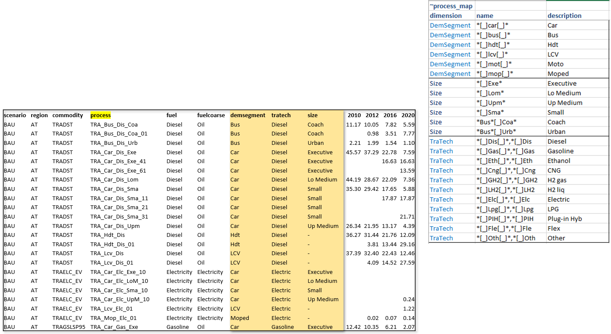

### `~Commodity_Map`

Classifies commodities. Supports all commodity filter columns. **Typical
dimensions:** `Fuel`, `Fuel_Agg`, `en_type`, `commtype`, `sector_c`.

The `Fuel` / `Fuel_Agg` pair is the canonical example of overlapping
classifications on commodities — a fine-grained dimension and a coarser
one, both present on every output row:

| **~Commodity_Map** | | | |
| --- | --- | --- | --- |
| **dimension** | **name** | **description** | **cset_set** |
| Fuel | `*ELC*` | Electricity | |
| Fuel | ELCCurt | Int. Elec | |
| Fuel | `*H2*,-[_]*` | Hydrogen | |
| Fuel | `*HET*` | Heat | |
| Fuel | `*OIL*,???RPP,???RFG` | Oil | |
| Fuel | `*GAS*,*NGA*` | Gas | |
| Fuel | `*COA*` | Coal | |
| Fuel | ???DST | Diesel | |
| Fuel | ???GSL | Gasoline | |
| Fuel | ???LNG | LNG | |
| Fuel | | Biomass | ALLBIO |
| Fuel_Agg | | Solar | ALLSOL |
| Fuel_Agg | | Wind | ALLWIN |
| Fuel_Agg | | Hydro | ALLHYD |
| Fuel_Agg | | Biomass | ALLBIO |
| Fuel_Agg | | Nuclear | ALLNUC |
| Fuel_Agg | | Grid Elec | ALLELC |
| Fuel_Agg | | Gas | ALLGAS |
| Fuel_Agg | | Coal | ALLCOAL |
| Fuel_Agg | | Heat | ALLHEAT |
| Fuel_Agg | | Oil crude+NGL | ALLOILCrd |
| Fuel_Agg | | Oil prod. | ALLOILprd |
| Fuel_Agg | `-[_]*` | Hydrogen | ALLH2 |

Note how `Fuel` uses name-pattern matching (`*ELC*`, `???DST`, `*OIL*`)
while `Fuel_Agg` uses set membership (`cset_set = ALLSOL` etc.). Both
yield independent classification columns on every output row.

!!! tip "Tip"

    As with INS tables in Veda, later declarations override earlier ones
    **within the same dimension**. Declarations on different dimensions are
    independent and do not override each other. To list a broad pattern and
    then specialise within a dimension: write the broad pattern first and
    the specific ones below. Example: `OIL* | Oil other; OILDST | Diesel;
    OILGSL | Gasoline`.

### `~Varbl_Map`

Classifies output variables. **Typical dimensions:** `attribute` (a
high-level grouping shown at the top of the report viewer),
`source/use`, `CostType`, `Emi/Cap`.

| **~Varbl_Map** | | |
| --- | --- | --- |
| **dimension** | **name** | **description** |
| attribute | `*GDP*,*popu*,*percap*,*househo*,-rep*` | Macro Indices |
| attribute | `TFC[_]*,*[_]FE[_]*,Fin E[_]*,-*[_]IND[_]*,-*[_]Fuels[_]*,...` | Final energy |
| attribute | `Pri_Prod*,Pri_Imp*,Pri_Exp*,PE[_]*,PriE*,Pri E*` | Primary En and Trade |
| attribute | `Elec*_Prod` | Elec Generation |
| attribute | `Fuel_con*` | Fuel Consumption |
| attribute | `Capacity*` | Capacity |
| attribute | `CO2_emi*,CO2_cap*` | Emissions |
| attribute | `Power*` | Power |
| attribute | Prices | Prices |
| attribute | `Cost*` | Sector Costs |
| source/use | `*[_]Agri` | Agri |
| source/use | `*[_]Commercial` | Commercial |
| source/use | `*[_]Residential` | Residential |
| source/use | `*[_]Industry` | Industry |
| source/use | `*[_]Transport` | Transport |
| source/use | `*[_]Thermal Elec` | Thermal Elec |
| source/use | `*[_]Thermal CCS` | Thermal CCS |
| source/use | `*[_]Ren Elec` | Ren Elec |
| source/use | `*[_]Bio Ref` | Bio Ref |
| source/use | `*[_]Trade` | Trade |
| source/use | `*[_]Extraction` | Extraction |

### `~Region_Map`

Region → grouping. Commonly used for WEO regions, OECD vs. non-OECD,
EU-27 vs. EFTA, or any partition of model regions.

| **~Region_Map** | | |
| --- | --- | --- |
| **Dimension** | **Name** | **Description** |
| Region_WEO | Africa_North | Africa |
| Region_WEO | Africa_South | Africa |
| Region_WEO | Asia_Cen | Eurasia |
| Region_WEO | Asia_Dev | Asia Pacific |
| Region_WEO | Brazil | C&S America |
| Region_WEO | Canada | North America |

Multiple `Dimension` values give a region multiple grouping memberships
— e.g. `Region_WEO`, `Region_OECD`, `Region_Continent` can all coexist
as separate columns.

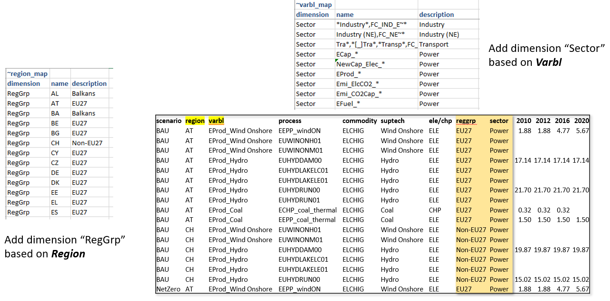

### `~Timeslice_Map`

Same shape, for timeslices: `dimension`, `name`, `description`, `ldesc`.
Used to roll up high-resolution timeslices to seasons / day-vs-night /
annual.

### Combining classifications across maps

Because every `_Map` row contributes one or more columns to the same
output fact table, the report consumer ends up with a rich, denormalised
view: one row per (scenario, region, year, variable, …) carrying all the
classification columns from every `_Map` table. Pivoting on `Tech_Agg`
and `Fuel` simultaneously is a single Excel operation.

## Ratios and derived variables (`~TS_Ratios`)

The `~TS_Ratios` tag derives new variables from existing ones by
combining a *numerator* and a *denominator* variable. By default the
operation is division (`num / den`), but setting `multiply = y` switches
it to multiplication (`num × den`). This is how shares, intensities,
per-capita metrics, fuel-blend decompositions and unit conversions
involving two variables are expressed.

Internally, Veda first computes a weighted average of both the numerator
and denominator at the grouping level required by the row, then joins
the two and applies the requested operation. Region, year, scenario and
the standard scenario keys are **always** part of the grouping — region
grouping is the default and does not need to be requested.

### Column reference (`~TS_Ratios`)

| **Column**                   | **Type**      | **Meaning**                                                                                                                                                                                                                                                                                                                                                                                            |
| --- | --- | --- |
| `scalar`                     | integer (0/1) | When `1`, the denominator is treated as a *scalar* variable (one defined at region/year level only, with `process = '-'` — typical for population, GDP, total demand). The numerator's process dimension is carried through to the output without being part of the join key. Default `0`.                                                                                                             |
| `var_num`                    | varchar       | Numerator variable name (must already exist as a `~TS_Defs` output or another report variable).                                                                                                                                                                                                                                                                                                        |
| `var_den`                    | varchar       | Denominator variable name.                                                                                                                                                                                                                                                                                                                                                                             |
| `name`                       | varchar       | Name of the derived output variable.                                                                                                                                                                                                                                                                                                                                                                   |
| `unit`                       | varchar       | Output unit. Supports `<unit_num>` and `<unit_den>` placeholders, substituted with the numerator's and denominator's units. `<unit_num>/<unit_den>` yields `PJ/Mt` when the numerator is PJ and the denominator is Mt.                                                                                                                                                                                 |
| `show_me` (alias `group_by`) | varchar       | Dimensions to retain in the weighted-average num/den groupings. Any combination of `p`, `c`, `t`, `u`, `v`. Empty = aggregate everything except the implicit region/year/scenario keys.                                                                                                                                                                                                                |
| `include_null`               | varchar       | Controls handling of regions/keys where one side has no match. `n` → `INNER JOIN` (drop rows without a match on both sides). Anything else (empty or `y`) → `LEFT JOIN`, the default, which preserves rows from the larger side and reports zero where the other side is missing. `y` is an intentional positive annotation for default behaviour and is fully equivalent to leaving the column empty. |
| `include_dim`                | varchar       | Dimensions on which to **join** numerator and denominator, and which are then preserved on the output. Combination of `p`, `c`, `t`, `u`, `v`. Without this, the join keys are only the implicit ones (scenario, region, year, sow), so the ratio collapses across processes, commodities, etc.                                                                                                        |
| `multiply`                   | varchar       | Empty (default) → divide `num / den` (with `den ≠ 0` filter). `y` → multiply `num × den` (no zero-denominator filter — the operation is well-defined when either side is zero).                                                                                                                                                                                                                        |
| `Ldesc`                      | varchar       | Long description.                                                                                                                                                                                                                                                                                                                                                                                      |

### The implicit "group by region"

Region is always part of the grouping for both numerator and
denominator. There is no column to turn this off — region is always
there. This is intentional: almost every meaningful ratio is
region-specific (fossil share, generation efficiency, emission
intensity). To produce a single aggregate across a group of regions, use
`~Region_Map`.

### Adding segments via `include_dim`

To get a ratio at a finer level than region — by commodity, by process,
by timeslice — list the dimensions in `include_dim`. The numerator and
denominator are joined on those dimensions, and they are kept as columns
in the output. `include_dim = c` produces a ratio per commodity; `pc`
per process × commodity; and so on.

`include_dim` and `show_me` are usually set to the same value — the
dimensions you want preserved are also the dimensions you want to join
on. Use different values only when you have a specific reason (e.g. you
want to weight on a dimension you don't want to join on).

### A real example — capacity factor and efficiency

From a production model:

| **~TS_Ratios** | | | | | | |
| --- | --- | --- | --- | --- | --- | --- |
| **var_num** | **var_den** | **Name** | **Unit** | **show_me** | **include_null** | **include_dim** |
| Elec_act | Capacity_Elec | Capacity_factor | Twh/GW | p | y | p |
| H2_Prod | Capacity_H2 | Capacity_factor | PJ/GW | | y | p |
| Elec_Prod | Fuel_cons_power | Efficiency | Twh/PJ | | | p |
| H2_Prod | Fuel_cons_H2 | Efficiency | % | | | p |

- `Capacity_factor` is built per process (`include_dim = p`) so each
    technology gets its own capacity factor.
- `include_null = y` is the positive form of "use the default LEFT
    join" — capacity rows are preserved even if no production exists,
    and the ratio reads as zero in that case.

### Multiplication vs division

Setting `multiply = y` flips the operation from division to
multiplication. The typical use is decomposing one variable using a
share or fraction defined as a second variable:

- `Fossil_share` × `Petrol_total` → `Petrol_fossil`
- `Efficiency` × `Capacity` → `Effective_capacity`
- `Pop_growth_factor` × `GDP_2020` → `GDP_projection`

For multiplication the `den ≠ 0` filter is dropped (`num × 0 = 0` is a
valid result). The `val~den` weight on the output is set to NULL,
because the result is no longer a ratio that needs to carry its
denominator forward for downstream weighted averaging.

### The `scalar = 1` case

To divide a process-level variable (e.g. process-by-process emissions)
by a region-level scalar (e.g. national GDP) to get per-GDP intensities
for each process: set `scalar = 1`. The scalar variable is defined with
`process = '-'` in its source. Veda then:

- does **not** join on `process` (the denominator has no process
    dimension);
- keeps `process` on the output so the per-process intensities are
    reported.

This is the standard pattern for `rep_totco2 / rep_POP → CO2 per
capita`, `rep_totco2 / rep_GDP → CO2/GDP`, and similar macro-normalised
metrics.

### Unit conversion in the output

When `unit` contains `<unit_num>` or `<unit_den>`, the placeholders are
replaced with the actual units of the numerator and denominator
variables at runtime. After `~TS_Ratios` processing, a unit-conversion
pass runs on the derived variables so `~UnitConv` rules apply to them
just as they do to `~TS_Defs` variables.

### Behaviour when one variable is defined in only some regions

A common situation: a fuel-blend share, a tax rate, or a regional
adjustment factor is defined for only a subset of regions, while the
variable it is combined with exists everywhere. Two columns govern the
output: `include_null` and the **order in which the variables appear**
in `var_num` / `var_den`.

With the default `LEFT JOIN` (`include_null` empty or `y`):

- For **division** (`num / den`), all denominator rows are preserved.
    In a region where the numerator is missing, the result is reported
    as zero.
- For **multiplication** (`multiply = y`), all numerator rows are
    preserved. In a region where the denominator is missing, the result
    is reported as zero.
- So with multiplication, if the share/ratio (defined in fewer
    regions) is placed in `var_den`, every region where the total
    quantity is reported will appear in the output — with zero for the
    regions where the share is undefined. If the share is placed in
    `var_num` instead, only the regions where the share is defined will
    appear.

With `include_null = n` the join becomes `INNER`: only region/year
combinations where both sides are present survive. Use this to drop
regions where the ratio is not meaningful, rather than to report zeros
for them.

A second option, often cleaner, is to extend the share variable's
definition to cover all regions — typically with a default of 0 (so the
decomposition leaves the residual untouched) or 1 (so the decomposition
assigns the whole quantity to one side).

## Including exogenous data (`~ATS_final`)

`~ATS_final` registers user tables that are inserted directly into the
main reporting fact table (`lma_dts`) after the rest of the report
pipeline has run. It is the standard way to bring in historical IEA
energy balances, WEO projections, calibration overlays, or any other
already-shaped data that needs to sit alongside the model output:

| **~ATS_Final** | | | | | | | | | | | |
| --- | --- | --- | --- | --- | --- | --- | --- | --- | --- | --- | --- |
| **model** | **Scenario** | **scen** | **Region** | **Varbl** | **Unit** | **year** | **val** | **fuel** | **fuel_agg** | **Sector** | **Region_WEO** |
| IEA | Hist | Hist | Africa_North | CO2_emissions | Mt CO2 | 1995 | 0.088852 | Oil | Oil crude | Industry | Africa |
| IEA | Hist | Hist | Africa_North | CO2_emissions | Mt CO2 | 2000 | 3.722594 | Diesel | Oil prod. | Transport | Africa |
| ... | | | | | | | | | | | |

Note how the source table can carry classification columns (`fuel`,
`fuel_agg`, `Sector`, `Region_WEO`) that match the `dimension` values
produced by the `_Map` tags. Those values are copied straight through to
the report, so the injected rows participate in the same pivots as the
model output.

### How it works

Each `~ATS_final` table is registered under the `ATS_final` tag in
`veda_tag_master`. At report time, Veda inspects each registered table
and the central `lma_dts` table side by side, and for every column whose
name appears in both, the value is copied across. Source-table columns
may include the canonical names — `model`, `scen` (alias `scenario`),
`region`, `varbl`, `unit`, `year` (alias `yr`), `val` — plus any other
`lma_dts` column the source chooses to populate (`process`, `commodity`,
`timeslice`, `userconstraint`, `vintage`, `sow`, `val~den`, and any
classification columns added by the `_Map` tags such as `Fuel`, `Tech`,
`sector_weo`, `Region_WEO`, etc.).

Any required `lma_dts` column missing from the source table is filled
with a default:

- `scenario`, `model`, `user`, `study` and `scen_model_framework` fall
    back to the first row of `scenario_master` (the first scenario in
    the report) — or to `-` if no scenario is registered.
- All other process/commodity/timeslice/UC/vintage columns default to
    `-`.

Because the pass runs **after** `~TS_Ratios` and `~UnitConv`, anything
in an `~ATS_final` table arrives in the report as-is and is **not**
re-aggregated, weighted or unit-converted by the standard pipeline. The
user owns the row shape and units.

!!! tip "Tip"

    Use `~ATS_final` when the data is already in its final reporting shape.
    For exogenous variables that should behave like every other report
    variable (groupings, ratios, unit conversions, weighted averages), use
    the simpler `~ATS` tag described in "Less common tags".

## Unit conversion (`~UnitConv`)

`~UnitConv` converts the unit of a variable: where the variable's unit
matches `Unit1`, multiply by `MultFact` and replace the unit with
`Unit2`. Applies to both `~TS_Defs` outputs and `~TS_Ratios`-derived
variables.

| **~UnitConv** | | | |
| --- | --- | --- | --- |
| **Model** | **Unit1** | **Unit2** | **MultFact** |
| KINESYS | kt CH4 | Mt CH4/yr | 0.001 |
| KINESYS | kt CO2 | Mt CO2/yr | 0.001 |
| KINESYS | kt CO2neg | Mt CO2/yr | -0.001 |
| KINESYS | m$ | billion $/yr | 0.001 |
| KINESYS | PJe | Twh | 0.27778 |
| KINESYS | PJ2gw | GW | 0.03171 |

The `Model` column scopes the rule (so different models can carry
different conversion factors). `Unit1` matches case-insensitively
against the variable's current unit.

## GIS trade flows (`~Geolocation`)

The `~Geolocation` tag is a simple region → (latitude, longitude) table.
Its primary role is to enable auto-generated trade-flow variables for
visualisation on maps.

| **~Geolocation** | | |
| --- | --- | --- |
| **Region** | **Lat** | **Lng** |
| UAE | 23.424076 | 53.847818 |
| LatAm | -38.416097 | -63.616672 |
| Australia | -25.274398 | 133.775136 |
| Bangladesh | 23.684994 | 90.356331 |

### Auto-generated trade-flow variables

When `~Geolocation` is present and there are inter-regional exchange
(IRE) processes, Veda automatically generates three trade variables on
top of the report:

- `trade_flows` — built from `VAR_FIN` (import side) and `VAR_FOUT`
    (export side) on IRE processes.
- `trade_flows_cap` — capacity of trade infrastructure (from `VAR_CAP`
    on IRE).
- `trade_flows_ncap` — new capacity additions of trade infrastructure
    (from `VAR_NCAP` on IRE).

Each output row carries a `region_to` column with the destination
region, alongside `region` (the source). The unit defaults to the trade
commodity's unit (or to `GW?` for `cap` / `ncap` if no capacity unit is
set).

### Electricity grid trade flows

If the report carries `~tradeflow_imp` and `~tradeflow_exp` variables
(typically defined via `~TS_Defs` rows with a `region_com` column for
the counterparty region), Veda generates `grid_flows`, `grid_flows_cap`
and `grid_flows_ncap` as a final step, with the same `region_to` shape.

## Scenarios — `~ScenMap` and `~ScenG`

`~ScenMap` and `~ScenG` provide scenario-level metadata and renaming.

`~ScenMap` renames model-internal scenario names (`Oname`) to a
presentation-friendly name (`Name`) and adds short and long
descriptions. A production model might map dozens of internal scenario
codes to readable names like `Base.SSP2`, `STEPS.SSP2`, `APS.SSP2`,
`NZE.SSP2`.

`~ScenG` (Scenario Generation) attaches a flexible set of classification
columns to each scenario. Each column name becomes a new dimension in
the output, just like the classification columns produced by the `_Map`
tags. Typical `~ScenG` columns: `Climate`, `SSP`, `Exo_price`, `NZYear`,
`C_Budget`, `CO2Price` — so a single report can be sliced by climate
scenario, SSP scenario, or any other axis the modeler chose to declare.

| **~ScenMap** | | | |
| --- | --- | --- | --- |
| **Oname** | **Name** | **Desc** | **Ldesc** |
| KS~0001 | Base.SSP2 | | |
| KS~0002 | STEPS.SSP2 | | |
| KS~0003 | APS.SSP2 | | |

| **~ScenG** | | | |
| --- | --- | --- | --- |
| **Scen** | **SSP** | **Climate** | **Exo_price** |
| Base.SSP2 | SSP2 | Base | |
| STEPS.SSP2 | SSP2 | ESTPS | |
| APS.SSP2 | SSP2 | PAS | |

## Multi-language support (`~Language`)

The `~Language` tag holds translations of variable names, dimension
values, region names — anything that appears in the report and may need
to be displayed in a non-English UI. The first column is `name` (the
canonical English label); each remaining column is an
[ISO 639-2](https://www.loc.gov/standards/iso639-2/php/code_list.php){ target="_blank" rel="noopener noreferrer" }
language code (e.g. `FRA`, `DEU`, `ESP`, `JPN`, `CHI`) with the
translated value.

| **~Language** | | | | | |
| --- | --- | --- | --- | --- | --- |
| **name** | **FRA** | **DEU** | **ESP** | **JPN** | **CHI** |
| Agriculture | Agriculture | Landwirtschaft | Agricultura | 農業 | 农业 |
| Asia Pacific | Asie-Pacifique | Asien-Pazifik | Asia Pacífico | アジア太平洋地域 | 亚太地区 |
| BF gas | Gaz BF | BF-Gas | gasolina BF | BFガス | 高炉气体 |

Veda transforms the wide table into a long mapping (one row per (name,
language) pair) and back into a pivoted lookup table, so downstream
consumers (VO, LMA) can render the report in the chosen language.

## Sankey Diagram Creation

The Reports functionality provides sophisticated capabilities for
creating Sankey diagrams that visualize energy and material flows
through the modeled system. Sankey diagrams are automatically generated
from TIMES model results by defining source-commodity-sink relationships
that VEDA processes into connected flow visualizations.

### Conceptual Approach

The key to successful Sankey creation is thinking in terms of
**source-commodity-sink triplets**. Each energy or material flow can be
conceptualized as:

**Source → Commodity → Sink**

Examples: - Coal Mining → Coal → Power Plant - Power Plant → Electricity
→ Industrial Demand - Solar Farm → Electricity → Battery Storage -
Battery Storage → Electricity → Residential Demand

VEDA automatically chains these triplets together when the sink of one
layer becomes the source of the next layer, creating seamless flow
visualizations.

### Three Types of Sankey Creation

**1. Set-Based Sankey Diagrams**

Set-based Sankey diagrams aggregate flows using process and commodity
sets, creating clean high-level visualizations with semantic naming.

**Pattern**: `<cset description>_src/snk_<pset description>`

**Configuration Example**:

**~TS_Defs: Snk_attr=SANKEY_energy_overview**

| **Attribute** | **PSET_Set**                | **PSET_PN** | **PSET_PD** | **PSET_CI** | **PSET_CO** | **CSET_Set**          | **CSET_CN** | **CSET_CD** | **Unit** | **TS** | **UC_N** | **Name**                  |
| --- | --- | --- | --- | --- | --- | --- | --- | --- | --- | --- | --- | --- |
| VAR_FIN      | "ELE,CHP"                    |              |              |              |              | "ALLSOL,ALLWIN,ALLHYD" |              |              | PJ       |        |           | `<cset>_src_<pset>` |
| VAR_FOUT     | "DMD_IND,DMD_RES,DMD_COM" |              |              |              |              | "ALLELC"               |              |              | PJ       |        |           | `<cset>_snk_<pset>` |

**Process**:

1.  Uses `PSET_Set` and `CSET_Set` columns to specify process/commodity
    sets
2.  Descriptions come from separate `~PSet_Map` and `~CSet_Map` tables
3.  Creates flows between all commodity sets × process sets combinations

**Generated Variables**:

- `Electricity_src_Renewable_Generation` (from ALLSOL,ALLWIN,ALLHYD to
    ELE,CHP)
- `Electricity_snk_Industrial_Demand` (from ALLELC to DMD_IND)
- `Electricity_snk_Residential_Demand` (from ALLELC to DMD_RES)

**Use Cases**: Sector-level energy flow analysis

**Set-Based Sankey Example: Whole Energy System Overview**

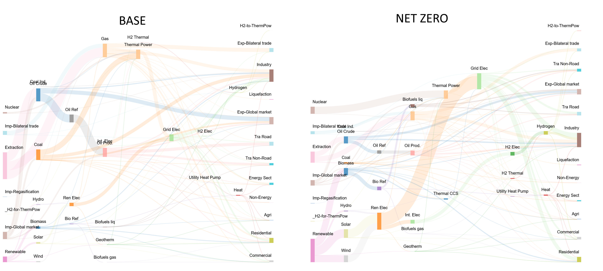

This diagram illustrates a comprehensive energy system view using
set-based aggregation, showing flows from primary energy sources through
conversion technologies to end-use sectors, with clean semantic naming
for intuitive understanding.

**2. Region-Based Sankey Diagrams**

Region-based Sankey diagrams focus on inter-regional trade flows,
particularly useful for gas pipelines, electricity transmission, and
energy security analysis.

**Pattern**: `<commodity>-<region>_Src/Snk_<process description>`

**Configuration Example**:

**~TS_Defs: Snk_attr=SANKEY_gas_trade**

| **Attribute** | **PSET_Set** | **PSET_PN** | **PSET_PD** | **PSET_CI** | **PSET_CO** | **CSET_Set** | **CSET_CN** | **CSET_CD** | **Unit** | **TS** | **UC_N** | **Name**                                  |
| --- | --- | --- | --- | --- | --- | --- | --- | --- | --- | --- | --- | --- |
| VAR_FIN      | IRE           | `*gaspip*`   |              |              |              |               | GASNGA       |              | Pjneg    |        |           | `Nat Gas-<region>_Snk_<gen_pname>` |
| VAR_FOUT     | IRE           | `*gaspip*`   |              |              |              |               | GASNGA       |              | PJ       |        |           | `Nat Gas-<region>_Src_<gen_pname>` |
| VAR_FIN      | PRE           |              |              |              | GASLNG       |               | GASNGA       |              | Pjneg    |        |           | `Nat Gas-<region>_Snk_<gen_pname>` |
| VAR_FOUT     | PRE           |              |              | GASLNG       |              |               | GASNGA       |              | PJ       |        |           | `Nat Gas-<region>_Src_<gen_pname>` |

**Process**:

1.  `<region>` placeholder gets replaced with actual region names
2.  `<gen_pname>` generates descriptive process names
3.  Pattern matching (`*gaspip*`) identifies relevant processes

**Generated Variables**:

- `Nat Gas-USA_Snk_Pipeline-to-Canada` (US gas export to Canada)
- `Nat Gas-Russia_Src_Pipeline-to-Europe` (Russian gas export to
    Europe)
- `Nat Gas-Germany_Snk_LNG-Terminal` (German LNG imports)

**Use Cases**: Gas pipeline networks, LNG trade flows, regional energy
security, cross-border electricity trade

**Region-Based Sankey Example: Natural Gas Trade Networks**

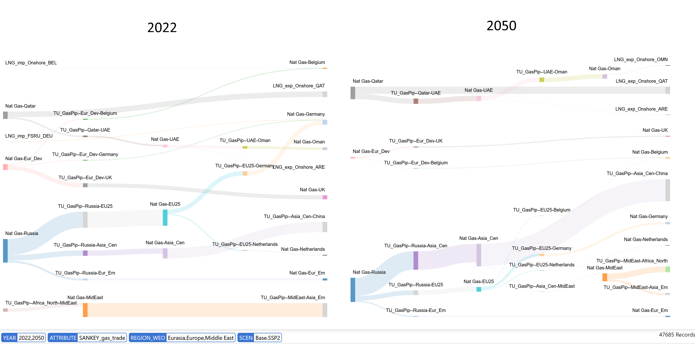

This diagram demonstrates inter-regional natural gas trade flows,
showing pipeline connections and LNG terminals with region-specific
naming that enables energy security and infrastructure analysis across
multiple countries.

**3. Granular Sankey Diagrams**

Granular Sankey diagrams preserve full model detail, showing individual
processes and commodities without aggregation.

**Pattern**: `<gen_cname>_Snk/Src_<gen_pname>`

**Configuration Example**:

**~TS_Defs: Snk_attr=SANKEY_steel_detailed**

| **Attribute** | **PSET_Set** | **PSET_PN** | **PSET_PD** | **PSET_CI** | **PSET_CO** | **CSET_Set** | **CSET_CN**         | **CSET_CD** | **Unit** | **TS** | **UC_N** | **Name**                              |
| --- | --- | --- | --- | --- | --- | --- | --- | --- | --- | --- | --- | --- |
| VAR_FIN      | "PRE,DMD"     |              |              |              |              | MAT           | `im_*,ind[_]*` |              | Mtneg    |        |           | `<gen_cname>_Snk_<gen_pname>` |
| VAR_FOUT     | "PRE,DMD"     |              |              |              |              | MAT           | `im_*,ind[_]*` |              | Mt       |        |           | `<gen_cname>_Src_<gen_pname>` |
| VAR_FIN      | IRE           |              |              |              |              | MAT           | `im_*,ind[_]*` |              | Mtneg    |        |           | <gen_cname>_Snk_Export           |
| VAR_FOUT     | IRE           |              |              |              |              | MAT           | `im_*,ind[_]*` |              | Mt       |        |           | <gen_cname>_Src_Import           |

**Process**:

1.  Each commodity and process gets its own flow variable
2.  Uses `PSET_PN` and `CSET_CN` for pattern-based selection
3.  `<gen_cname>` and `<gen_pname>` use actual model names

**Generated Variables**:

- `Iron_Ore_Snk_Blast_Furnace_Plant_01` (specific iron ore to specific
    plant)
- `Steel_Src_Electric_Arc_Furnace_02` (specific steel from specific
    EAF)
- `Crude_Oil_Snk_Refinery_Houston` (specific crude to specific
    refinery)

**Use Cases**: Detailed industrial analysis, plant-level material flows,
supply chain traceability, bottleneck identification

**Granular Sankey Example: Industrial Material Flows**

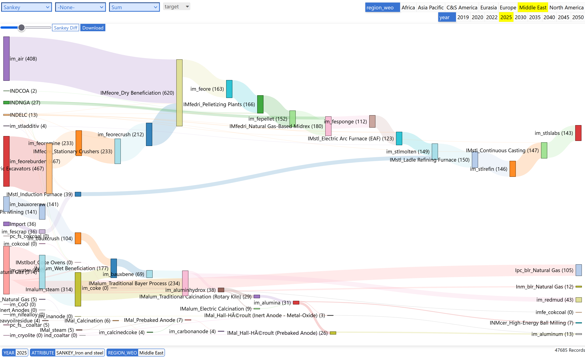

This diagram shows detailed iron and steel production flows in the
Middle East region for 2025, demonstrating how granular Sankey diagrams
can trace individual material streams through specific industrial
processes.

### Advanced Sankey Features

**Flow Direction and Units**

VEDA uses variable types and units to determine flow directions: -
**VAR_FIN** with negative units (`Pjneg`, `ktneg`) = Consumption/Sink
flows - **VAR_FOUT** with positive units (`PJ`, `kT`) =
Production/Source flows

**Pattern Matching and Exclusions**

Sophisticated filtering using wildcards and exclusions:

| **Filter Type** | **Pattern**      | **Description**                     |
| --- | --- | --- |
| PSET_PN | `*gaspip*` | Matches all gas pipeline processes |
| PSET_PN | `MinBio*` | Matches biomass mining processes |
| PSET_PN | `-EA_HH2*` | Excludes hydrogen heating processes |
| CSET_CN | `-SUP*,-COAOVC` | Excludes supply and coal processes |

**Dynamic Naming with Placeholders**

Flexible variable naming using placeholders: - `<cset>` - Replaced with
commodity set description - `<pset>` - Replaced with process set
description - `<region>` - Replaced with region name - `<gen_pname>` -
Generated process name - `<gen_cname>` - Generated commodity name

**Automatic Flow Chaining**

VEDA automatically connects flows when naming patterns match: -
`Coal_snk_Power_Plant` ←→ `Electricity_src_Power_Plant` -
`Electricity_snk_Battery` ←→ `Electricity_src_Battery`

This intelligence allows complex multi-layer Sankey diagrams to be
created with minimal configuration.

### Sankey Configuration Strategy

**Choose Set-Based When**:

- Creating executive dashboards for policy makers
- Showing technology competition (renewables vs. fossils)
- Sector-level energy flow analysis
- Clean, interpretable visualizations needed

**Choose Region-Based When**:

- Analyzing energy security and trade dependencies
- Visualizing cross-border infrastructure
- Geographic context is primary concern
- Regional integration analysis

**Choose Granular When**:

- Engineering analysis of specific facilities
- Supply chain optimization and bottleneck analysis
- Detailed validation against real-world data
- Asset-level investment decisions

**Practical Design Workflow**:

1.  Sketch the physical system on paper
2.  Identify major transformation/aggregation points
3.  Define commodity flows between each point
4.  Write source-commodity-sink triplets for each flow
5.  Configure VEDA filters to capture these triplets
6.  Let VEDA automatically chain and visualize

This approach puts energy system understanding in the user's hands while
leveraging VEDA's automation for technical implementation.

!!! info "See also"

    These Sankey capabilities have been used extensively in KiNESYS
    applications — see the Argonne NetZero World example (EU-Ukraine trade
    corridors) and KAPSARC OPEC oil & gas systems in the [KiNESYS
    Applications and
    Impact](https://kinesys-documentation.readthedocs.io/en/latest/pages/Applications_and_Impact.html){ target="_blank" rel="noopener noreferrer" }
    documentation.

## Less common tags

The following tags are supported by the report pipeline but are used
less frequently than the tags documented above. This section lists each
with a one-line description and a pointer to the underlying processing
procedure for readers who need to dig deeper.

| **Tag**                                                 | **Purpose**                                                                                                                                                                                                                                                                                                                                                                                                                                                                                |
| --- | --- |
| `~ATS`                                                  | Simpler cousin of `~ATS_final`. Single fixed-shape table (`model`, `scen`, `region`, `varbl`, `unit`, `year`, `val`); injected into the scenario fact table once at report start with all process/commodity/timeslice/UC/vintage columns forced to `-`. Use when an exogenous variable should behave like a model output (participate in `~Varbl_Map`, `~TS_Ratios`, `~UnitConv`, weighted averaging). `~ATS_final` is the right choice when the data is already in final reporting shape. |
| `~Op_Varbl`                                             | Variable-operations builder. Combines existing report variables via a configurable `op` (e.g. `+`, `-`, `*`, `/`) with predicates (`wherecond`), inner-only joins (`inneronly`), `yrforelast` smoothing, and ordering (`procord`). Used for special computations beyond what `~TS_Ratios` covers.                                                                                                                                                                                          |
| `~TS_Agg`                                               | Similar to `~Op_Varbl` but without the `procord` column. Used for timeseries-level aggregations.                                                                                                                                                                                                                                                                                                                                                                                           |
| `~PSet_Map` / `~CSet_Map` / `~PName_Map` / `~CName_Map` | Legacy lookup tables for the deprecated `<Pset>` / `<Cset>` / `<PName>` / `<CName>` name-embedding placeholders. Superseded by the `_Map` aggregation tags above. See [the legacy section below](#legacy-name-embedding-via-sets).                                                                                                                                                                                                                                                                                             |

These tags' columns are documented in
`veda_front_end.lmadefs_tags_and_columns.sql` and their processing logic
in the corresponding `usp_*` stored procedures.

## Viewing Reports

Veda2.0 ships with a basic report viewer that is sufficient for
validating the report setup and for simple visualizations. Excel export
and CSV dumps are supported, as in Results.

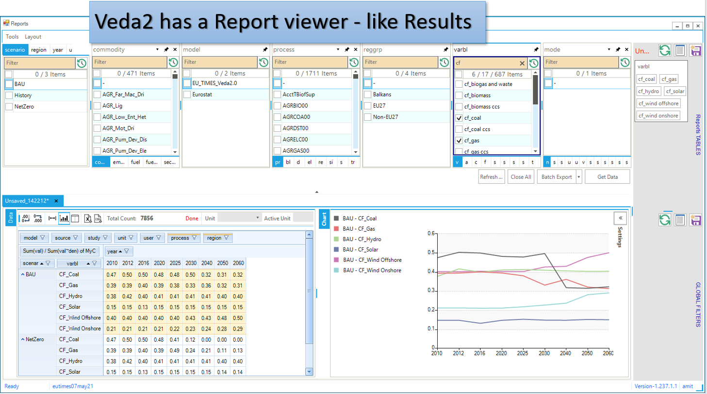

### CSV output

The CSV output can be consumed in Tableau, Power BI, LMA, and similar
tools:

## VO gets a lot more out of Reports

VO ([Veda Online](https://vedaonline.cloud/){ target="_blank" rel="noopener noreferrer" }) offers the core Veda-TIMES
functionality via Internet browsers. Veda model folders need to reside
on GitHub to be used under VO. Registered users can submit their GitHub
credentials to see a list of all model folders, along with the branches,
under their account. Any folder/branch can be selected to create a
model. Supported functionality: Synchronize, Browse, Items view, Run
manager, Results, and Reports.

!!! info "See also"

    The `_map` table capabilities and Sankey diagram creation documented
    above have been extensively used in real-world applications including
    World Bank CCDRs, corporate transition planning, and multi-model
    research. For concrete examples of how these features enable interactive
    exploration across scenarios and regions, see the [KiNESYS Applications
    and
    Impact](https://kinesys-documentation.readthedocs.io/en/latest/pages/Applications_and_Impact.html){ target="_blank" rel="noopener noreferrer" }
    documentation.

Here are some sample visualizations on the same platform that drives VO
reports.

### Sources and uses of main energy forms

<a href="https://lma.vedaviz.com/Presenter/Predex.aspx?pkp=1041&pkv=252583" target="_blank" rel="noopener noreferrer"><b>See it online </a> <i>select energy form</i></b>

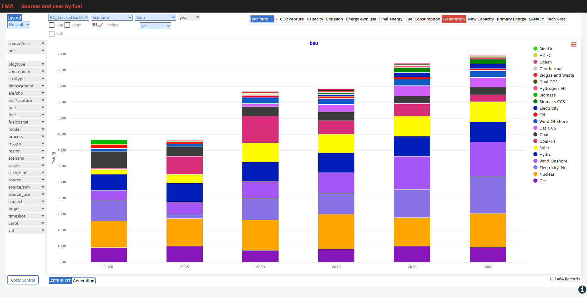

### Road transport vehicles

<a href="https://lma.vedaviz.com/Presenter/Predex.aspx?pkp=1041&pkv=252590" target="_blank" rel="noopener noreferrer"><b>See it online </a> <i>select region</i></b>

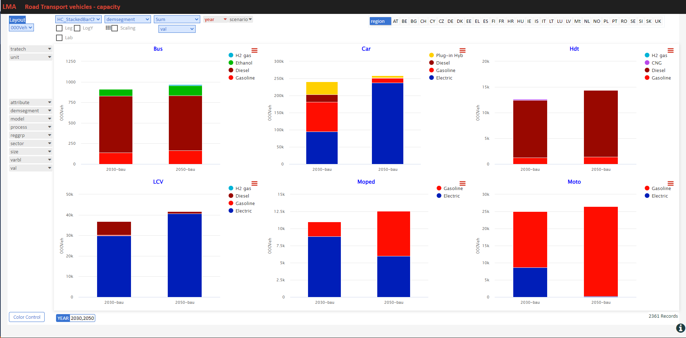

### Power generation

<a href="https://lma.vedaviz.com/Presenter/Predex.aspx?pkp=1041&pkv=252586" target="_blank" rel="noopener noreferrer"><b>See it online </a> <i>select electricity/hydrogen/heat, and region</i></b>

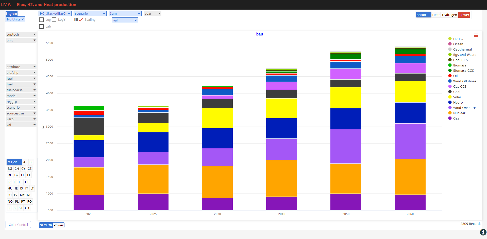

### Power generation – alternate view

<a href="https://lma.vedaviz.com/Presenter/Predex.aspx?pkp=1041&pkv=252588" target="_blank" rel="noopener noreferrer"><b>See it online </a></b>

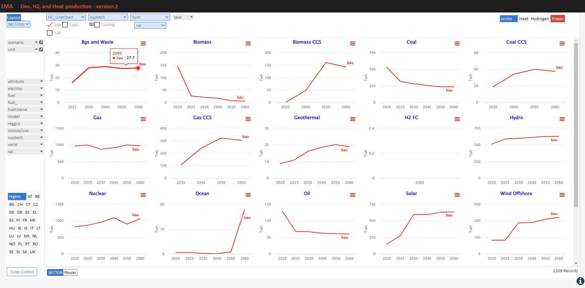

### Power generation – alternate view 2

<a href="https://lma.vedaviz.com/Presenter/Predex.aspx?pkp=1041&pkv=252589" target="_blank" rel="noopener noreferrer"><b>See it online </a></b>

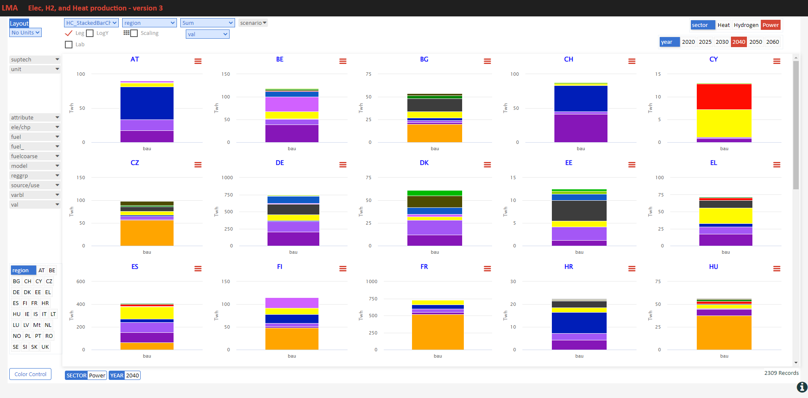
