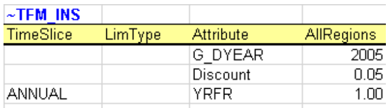
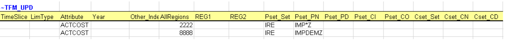

# Data tags (INS / DINS / UPD)

The data workhorses — tags that insert, update, and migrate parameter values across processes, commodities, regions, and years. Includes the plain forms, all the variants (`-AT`, `-TS`, `-TSL`), the topology-aware forms, and adjacent helpers (`~TFM_MIG`, `~TFM_FILL-R`, `~TFM_INS-txt`, `~TFM_GAMS`).

## The data workhorses

The TFM (Transformation) tags enable bulk insert or update of parameters
in a **rule-based manner** - via technology/commodity filters that are
based on set membership, shortname, description, and topology. It is
also possible to include existing parameters (and their values) as
filter criteria.

### DINS, INS, and UPD Tables

Veda supports three main transformation table types for inputting
data:**DINS (Direct Insert)**, **INS (Insert)**, and **UPD (Update)**.
Each serves a distinct purpose, with varying degrees of efficiency and
complexity depending on the dataset's structure and the modeling
requirements.

!!! important "Important"

    The **\~TFM\_DINS** tag offers the highest processing efficiency,
    followed by [\~FI\_T](#flexible-import-table-fi-t) and **\~TFM\_INS**.

    Tags **\~TFM\_UPD** and **\~TFM\_MIG** are the least efficient. Whenever
    possible, users are encouraged to use **DINS** or **INS**, provided the
    logic can be transferred.

#### 1\. \~TFM\_DINS (Transformation Direct Insert Tables)

**Purpose:** \~TFM\_DINS is the preferred table type when the dataset is
fully enumerated, meaning all fields are explicitly defined without any
wildcards or comma-separated lists.

**Key Characteristics:** - **Processes** are identified using only the
`pset_pn` column. - **Commodities** (if applicable) are defined
explicitly via the `cset_cn` column. - **No wildcards** (e.g., `?`, `*`)
or **comma-separated values** are allowed.

**Advantages:** - The most efficient tag.

**Use Case:** When all model elements are clearly defined in advance,
such as a process-specific bound (`ACT_BND`) applied to individual
processes without any <span class="title-ref">rules</span>.

#### 2\. \~TFM\_INS (Transformation Insert Tables)

**Purpose:** INS is the general-purpose table for inserting new data
into the database. It allows for greater flexibility in specifying model
elements.

**Key Characteristics:** - Supports **wildcards** (e.g., `ALL`, `*`) and
**comma-separated values** in fields like `pset_pn` and `cset_cn`. -
Inserts **absolute values** directly into the database without
referencing existing seed data.

**Advantages:** - Provides flexibility for users who work with less
granular or generic data definitions. - Easy to use for scenarios where
exact enumeration is not required.

  - **Use Case:**  
    

In this example from DemoS\_001, it is used to declare three new
attributes (G\_DYEAR, Discount, and YRFR) by row.

#### 3\. \~TFM\_UPD (Transformation Update Tables)

**Purpose:** UPD is used when data modifications depend on the presence
of existing seed values in the database.

**Key Characteristics:** - Performs **numerical transformations** on
seed values (e.g., multiplying or dividing an existing value). -
Supports **conditional insertion**, where new data is added only if a
corresponding seed value exists. - Requires prior existence of seed data
*in an alphabetically inferior scenario* in the database.

**Advantages:** - Ensures data integrity by operating conditionally on
existing entries. - Enables dynamic adjustments of seed values without
overwriting them.

  - **Use Case:**  
    

In this figure it sets default prices (ACTCOST) for the backstop dummy
processes for energy commodities (IMP\*Z - dummy IMPort processes ending
with “Z”) and demands (IMPDEMZ - a dummy IMPDEMZ process that can feed
any demand). Note that the process and attribute MUST already have been
specified for the qualifying process. Though not shown in the example
above the data specification field may also contain operators (+, \*, -,
/) there the resulting value is applied to the existing value for the
qualifying processes.

!!! note "Note"

    **UPDate and Replacing Data:** UPDate is sometimes confused with
    replacing data. Any of these tags will replace data if they exist in
    `BY_Trans` or `SubRES` trans files and data for the same indexes has
    been declared in the `BY` or `SubRES` files. Otherwise, they will simply
    create new entries in the scenario where they exist. The "replacing"
    will happen if this scenario file appears after the scenario with the
    original data in the **scenario group** selected for the case.

#### Comparison of DINS, INS, and UPD

| **Feature**                            | **DINS**                  | **INS**                  | **UPD**                   |
| -------------------------------------- | ------------------------- | ------------------------ | ------------------------- |
| **Data Enumeration**                   | Fully enumerated          | Supports wildcards/lists | Relies on existing data   |
| **Wildcards / Comma-Separated Values** | Not allowed               | Allowed                  | Allowed                   |
| **Seed Data Requirement**              | Not required              | Not required             | Required                  |
| **Primary Use Case**                   | Explicit, enumerated data | Rule-based data insertion| Conditional modifications |
| **Performance**                        | Fastest                   | Moderate                 | Slowest                   |

#### Best Practices

  - Use **DINS** wherever possible for maximum efficiency, especially
    when handling large datasets that are fully enumerated.
  - Use **INS** for flexible data insertion when working with generic
    definitions or multiple entries defined using wildcards or lists.
  - Use **UPD** sparingly, only for cases where transformations or
    conditional insertions are explicitly required, as it involves
    additional computational overhead.

By understanding the distinct roles and advantages of each table type,
users can optimize their data preparation workflows and improve overall
model performance.

!!! tip "Tip"

    By default, **DINS**, **INS**, and **UPD** tables use **regions** (or
    `Value/AllRegions`) as the data value column headers. However, there are
    scenarios where it is beneficial to organize data differently, such as:
    1. **Improving Table Readability:** Wider tables with alternative column
    headers can reduce data preprocessing and make data easier to interpret.
    2. **Enhancing Efficiency:** Minimizing the number of rows in a table
    reduces the processing overhead for rule application.

    To support these needs, Veda provides several variants of **DINS**,
    **INS**, and **UPD** tables. These variants allow the user to specify
    **attributes**, **years**, or **timeslices** as value column headers.

    \~TFM\_INS Variants The **\~TFM\_INS** variants offer flexible table
    layouts for inserting data. The following variants are available:

      - **TFM\_INS-AT:** The value fields use **attributes** as column
        headers.
      - **TFM\_INS-TS:** The value fields use **years** as column headers.
      - **TFM\_INS-TSL:** The value fields use **timeslices** as column
        headers.

    \---

    \~TFM\_DINS Variants The **\~TFM\_DINS** variants allow fully
    enumerated data to use alternative column headers. The following
    variants are supported:

      - **TFM\_DINS-AT:** The value fields use **attributes** as column
        headers.
      - **TFM\_DINS-TS:** The value fields use **years** as column headers.
      - **TFM\_DINS-TSL:** The value fields use **timeslices** as column
        headers.

    \---

    \~TFM\_UPD Variants The **\~TFM\_UPD** variants allow update
    tables to organize value fields differently. The supported variants
    include:

      - **TFM\_UPD-AT:** The value fields use **attributes** as column
        headers.
      - **TFM\_UPD-TS:** The value fields use **years** as column headers.

### Example Table Layouts

**~TFM_INS-TS Example — years as column headers**

Real example from `SubRES_H2-Production_Trans.xlsx :: misc.`:

```
~TFM_INS-TS
pset_set | pset_ci | pset_co | pset_pn | attribute | oth_ind  | commodity        | 2020 | 2022 | 2030 | 0 | limtype
         | GASNGA  | HH2     | *CCS    | FLO_EMIS  | HH2CO2Ng | CO2Captured_sup  | 0.9  |      | 0.95
         | BIOBSL  | HH2     | *CCS    | FLO_EMIS  | HH2CO2Nb | CO2Captured_ccu  | 0.9  |      | 0.95
         | ELCCurt | HH2     |         | FLO_SHAR  | ELC_gc   | ELC              | 0    |      |      | 3 | LO
```

In this example:

* The value fields use **years** (`2020`, `2022`, `2030`) as column headers.
* The special `0` column carries the *default year* value.
* `attribute` is supplied per-row (`FLO_EMIS`, `FLO_SHAR`); when every
  row uses the same attribute, it can be lifted to a header directive
  like `~TFM_INS-TS:attribute=FLO_EMIS` instead.
* `limtype` (`LO`, `UP`, `FX`) on the last row sets the limit type.

**~TFM_INS-AT Example — attributes as column headers**

Real example from `Scen_RE-Targets_EMBER.xlsx :: RE outlook`:

```
~TFM_INS-AT
pset_set | year     | PRC_AOFF | START | region
E_Coal   | 2040-EOH | 0        |       | Bangladesh,Indonesia,Malaysia,Philippines,Thailand,Vietnam
E_Coal   |          |          | 2025  | Bangladesh,Indonesia,Malaysia,Philippines,Thailand,Vietnam
```

In this example:

* The value fields use **attribute names** (`PRC_AOFF`, `START`) as
  column headers — each row can write into one or more attributes
  simultaneously.
* `pset_set = E_Coal` restricts the rows to coal-power processes; the
  comma-separated `region` list applies the row to six regions.
* The `-EOH` suffix on year `2040` means "to end of horizon."

**Table-level region declarations.** Multiple regions or region groups
(comma-separated) can be specified in table-level declarations for
`~TFM_DINS-TS`, `~TFM_INS-TS`, and `~TFM_FILL-R` tags. Example:
`~TFM_INS-TS:Region=Reg_Dev,Reg_Eme;` specifies `Reg_Dev` and
`Reg_Eme` as table-level region declarations.

### Best Practices

1.  **Choose Variants Wisely:** Select a table variant that aligns with
    the structure of your source data to minimize preprocessing.
2.  **Keep Tables Wide:** Wider tables (fewer rows) are more efficient,
    as they reduce the rule processing required for each row.
3.  **Simplify Preprocessing:** Use the variant that closely matches
    your source data layout, reducing the need for manual restructuring.
4.  **Fully Enumerate Data for DINS Variants:** Ensure all data is fully
    enumerated (no wildcards or lists) when using **DINS** variants for
    optimal performance.

By leveraging these variants, users can efficiently configure their
tables for improved readability and reduced computational overhead,
while ensuring that data aligns seamlessly with Veda's processing
structure.

### ~TFM_MIG

`~TFM_MIG` is one of the most powerful tags Veda offers. It **migrates
existing data from one coordinate to another** — copying or moving
parameter values from a source `(attribute, process, commodity, region,
year, timeslice, currency, …)` tuple to a destination tuple, optionally
rescaling the value along the way.

#### The "1 vs 2" column convention

Most filter columns come in two forms:

* **Plain name** (or `1` suffix conceptually): identifies the **source**
  rows — the existing data to migrate from. Example: `attribute`,
  `pset_pn`, `commodity`, `region`, `year`, `timeslice`, `currency`,
  `limtype`, `other_indexes`.
* **`2` suffix**: identifies the **destination** — what each axis
  becomes after migration. Example: `attribute2`, `commodity2`,
  `currency2`, `limtype2`, `other_indexes2`, `year2`, `timeslice2`,
  `sow2`, `stage2`.

Wherever you provide a `2`-suffix value, that axis is **overridden** in
the migrated row. Where no `2` value is provided, the source axis is
preserved as-is.

#### All columns at a glance

| Source filter             | Destination override         | What it migrates                        |
|---------------------------|------------------------------|-----------------------------------------|
| `attribute`               | `attribute2`                 | The TIMES parameter being rewritten     |
| `pset_set` / `pset_pn` / `pset_pd` / `pset_ci` / `pset_co` | (no `2` form — use commodity2 to redirect) | Source process filter |
| `cset_set` / `cset_cn` (alias `commodity`) / `cset_cd` | `cset_cn2` (alias `commodity2`) | Source / destination commodity |
| `region`                  | (use `region` in the destination directly via a paired row, or the `value` column) | Source region |
| `year` / `yr`             | `year2` / `yr2`              | Year migration (e.g. project base-year data forward) |
| `timeslice` / `ts`        | `timeslice2` / `ts2`         | Timeslice migration                     |
| `currency` / `curr`       | `currency2` / `curr2`        | Currency migration (e.g. with rescaling) |
| `limtype` (alias `lim_type`, `bd`) | `limtype2`           | Bound type migration (LO ↔ UP ↔ FX)     |
| `other_indexes` (aliases `other_ind`, `oth_ind`) | `other_indexes2` | Commodity group / aux index migration |
| `sow`                     | `sow2`                       | State-of-the-world migration            |
| `stage`                   | `stage2`                     | Stage (multi-stage stochastic)          |

**Filter helpers** (no destination form): `c_pos_andor`, `c_neg_andor`,
`c_pos_andor_forsets`, `c_neg_andor_forsets`, `t_pos_andor`,
`t_neg_andor`, `t_pos_andor_forsets`, `t_neg_andor_forsets`,
`top_check`, `attrib_cond`, `val_cond`, `avc_year`, `avc_timeslice`,
`avc_limtype`, `uc_n`, `side`, `sourcescen`.

**Value column** (the migrated number): `value` (aliases `valfield`,
`val_field`, `allregions`):

* A bare number replaces the source value entirely.
* A leading `*` makes it a multiplier (`*1` keeps the value, `*0.5`
  halves it, `*0.062` rescales by that factor).
* Leaving it blank keeps the source value.

**`val_cond`** filters the source by its current value — only rows whose
existing number matches the condition are migrated. Examples: `>1`,
`<.001`, `=0`.

#### What this lets you do

Some patterns this enables:

| Pattern | Source / destination columns to use |
|---|---|
| **Re-attribute** a value (write the same numbers under a different attribute) | `attribute` → `attribute2` |
| **Project a base-year value forward** to a target year | `year` (source) → `year2` (target), value can be a multiplier |
| **Shift values between regions** | `region` (source) and a paired destination row |
| **Re-classify a commodity** (move data from `COA1` to `COA2`) | `commodity` → `commodity2` |
| **Convert currency** | `currency` → `currency2` with `value = *<rate>` |
| **Switch bound type** (e.g. an LO becomes a FX) | `limtype` → `limtype2` |
| **Conditional clamp** (only act on rows whose value exceeds a threshold) | `val_cond` plus a value override |
| **Time-slice retiming** | `timeslice` → `timeslice2` |
| **Move data between scenarios in stochastic mode** | `sow` → `sow2`, `stage` → `stage2` |

#### Real example 1 — Conditional clamp

From `BY_Trans.xlsx :: Misc`. Wherever the `stock` attribute currently
exceeds 1 for processes whose commodity-in matches certain renewable /
solar-thermal / heat patterns, write that value as the year-2100 value
(unchanged: `*1`):

```
~TFM_MIG: attribute=stock
year2 | Val_Cond | value | pset_ci
2100  | >1       | *1    | ???GEO,???STH,???HET
```

The header directive `attribute=stock` lifts the source attribute out
of the column list (so every row applies to `stock`). The migration
keeps the value (`*1`) but moves it to a target year (`year2 = 2100`)
under the original commodity-in filter.

#### Real example 2 — Re-scaling and re-yearing in one row

From `BY_Trans.xlsx :: Transport`. Take the `PASTI` attribute on
trade-related transport processes (`Trd[_]*`) in any region, scale it
down by the factor 0.062, and write it to year 2019:

```
~TFM_MIG
attribute | pset_pn  | year2 | allregions
PASTI     | Trd[_]*  | 2019  | *0.0620343872322709
```

Here `allregions` is being used as the value column (one of its
aliases). The source year is unfiltered (so all source years match);
each match is multiplied by ~0.062 and written as year-2019 data.

#### When to reach for ~TFM_MIG

Because `~TFM_MIG` can change almost any axis of an existing parameter
value while preserving filters on the others, it's the right tool when:

* The same numbers need to appear under a different name, year,
  region, currency, or limit type.
* A scenario rescales a whole family of values by a multiplier.
* Conditional rewrites are needed (only act on rows whose current
  value meets a threshold).
* The cleanest expression of the change is "wherever X was true, also
  do Y" rather than enumerating Y from scratch via `~TFM_INS` /
  `~TFM_DINS`.

For a pure overwrite that doesn't depend on existing data, prefer
`~TFM_INS` / `~TFM_DINS`. For rule-driven scaling of values that does
depend on existing data, `~TFM_MIG` is the cleanest path.

#### Cell content rules

The two halves of a `~TFM_MIG` row obey different parsing conventions:

**Source filter columns** (no `2` suffix — `attribute`, `pset_*`,
`cset_*`, `region`, `year`, `timeslice`, `currency`, `limtype`,
`other_indexes`, …) accept the *full* filter grammar Veda uses in
`~TFM_INS`:

* Wildcards `*`, `?`, and `[_]` for literal underscores.
* Comma-separated lists (e.g. `pset_set = ELE,CHP`).
* Negative-match prefix `-` (e.g. `pset_pn = -ElcAgg*` to exclude).
* The `c_pos_andor` / `c_neg_andor` / `t_pos_andor` / `t_neg_andor`
  connectors (and their `_forsets` variants) for AND vs. OR semantics.
* Set-membership filters via `pset_set` / `cset_set`.
* For the `year` column only: a `<from>-<to>` range (e.g. `2020-2050`
  or `BOH-EOH`) auto-populates `year2`. **A comma in the source `year`
  disables this range parsing** — use commas only when you want a
  literal list of source years and a separate `year2` column for the
  destination.

**Destination columns** (`2` suffix — `attribute2`, `year2`,
`currency2`, `limtype2`, `other_indexes2`, `timeslice2`, `sow2`,
`stage2`) accept a much narrower vocabulary:

* **Comma-separated lists are allowed** (the cell is parsed via
  `csv_to_table`, so `attribute2 = NCAP_BND,ACT_BND` writes two
  destination attributes).
* **Wildcards are *not* expanded** — `*` or `?` in a `*2` cell are
  treated as literal characters and will fail to match. Destination
  values must be enumerated literally.
* **Set membership and the `andor` connectors do not apply** to most
  destination columns — they only filter the source side.

The one exception is **`commodity2`**: it goes through Veda's full
SNT-filter machinery, so it can accept set names, wildcards, and the
`c_*_andor` source-side connectors when resolving which destination
commodity each row writes to.

**The `value` (alias `valfield`, `val_field`, `allregions`) column**:

* A bare number replaces the source value entirely (e.g. `value = 1.5`
  writes 1.5 wherever the row matches).
* A leading `*` makes it a multiplier on the existing source value
  (e.g. `value = *0.5` halves whatever was there).
* Blank means "keep the source value unchanged" — useful in
  combination with destination overrides on year, region, attribute,
  etc., to migrate values without rescaling them.

### ~TFM_FILL-R

The "fill rules" tag is a *wide-data importer*: when source numbers
live in a separate Excel table with one column per year (or region, or
scenario), use `~TFM_FILL-R` to translate that wide layout into the
long-format rows that Veda's internal tables expect.

Two directives are placed on the tag-header line itself, separated by
`;`:

* `w=<worksheet>` — the worksheet whose columns hold the actual values
  to be filled in. Lowercase.
* `hcol=<dimension>` — the dimension that the column headers of that
  worksheet represent. Lowercase. Common values: `region`, `year`.

Real example from `SubRES_Transport_trans.xlsx :: Road transport`:

```
~TFM_FILL-R: w=RoadTra_BY; hcol=region
Scenario | Attribute | PSET_CO | AllRegions
BASE     | AF        | Trd[_]* | *1
BASE     | EFF       | Trd[_]* | *1
```

The `w=RoadTra_BY` directive points at a separate sheet whose columns
are region names; `hcol=region` tells Veda to read each column header
as a region. Each row in the rules table specifies one (attribute,
process filter, value) tuple to fill across regions.

Recent updates:

* **4.3.3.0** — Fixed an issue in `~TFM_FILL-R` processing for Regular
  vs. Parametric scenarios.
* **4.3.2.1** — Extended RegionGroup support so the column header in the
  data worksheet can be a RegionGroup name.

`~TFM_Fill` (without the `-R`) is the legacy version and should not be
used in new work.


## Topology-aware INS/DINS

These tags are filtered variants of `~TFM_INS` and `~TFM_DINS` that
restrict their effect to `(process, commodity)` combinations that
**actually appear in the model's topology** — i.e. pairs where the
process really does consume or produce the commodity.

### ~TFM_TOPINS

Topology-aware INSert. Supports the same process and commodity filter
columns as `~TFM_INS`, plus an `io` column that constrains the side
of the topology flow.

Real example from `BY_Trans.xlsx :: IND2`:

```
~TFM_TOPINS
pset_ci | pset_co | pset_pn | commodity | io
INDNGA  | INDELC  | EA*     | INDBFG    | IN
```

The `io` column takes `IN` (commodity-in side) or `OUT`
(commodity-out side), letting the rule target one side of the
process-commodity relationship.

### ~TFM_TOPINS-A

Attribute-form of `~TFM_TOPINS`. The columns are reduced to `process`,
`commodity`, `value`. Real example from
`BY_Trans.xlsx :: pumped hydro`:

```
~TFM_TOPINS-A
process | commodity   | value
EP_HPS* | AuxStoOUT   | OUT
```

### ~TFM_TOPDINS

Topology-aware Direct INSert. Like `~TFM_DINS`, the row enumerates
specific process and commodity names (`pset_pn` / `cset_cn`) rather
than using filters or sets. The topology check is still applied — rows
that name a (process, commodity) pair that isn't in the topology are
dropped silently.

!!! note
    `~TFM_TOPINS*` and `~TFM_TOPDINS` are processed after `~TFM_INS` /
    `~TFM_DINS` so they can rely on the topology those tags have
    populated. A fix in the 4.2.x line ensured topology-tag rows that
    depend on each other are processed in dependency order.

### ~TFM_INS-txt

Works exactly like the INS tag, but supports **text values** for
the following Veda attributes that can be used to override values that
come from the original process/commodity definition tables: PRC_PCG,
PRC_TSL, PRC_VINT, COM_LIM, COM_TSL, COM_TYPE.


## INS / DINS / UPD variants

Plain `~TFM_INS`, `~TFM_DINS`, and `~TFM_UPD` cover the most common
cases: parameter values row-by-row, with optional process/commodity
filters and year/timeslice column headers. The suffixed variants
handle data layouts the plain forms can't express compactly.

The suffix conventions, derived from real model usage:

| Suffix | Meaning                                                                                                                          |
|--------|----------------------------------------------------------------------------------------------------------------------------------|
| `-AT`  | "Attributes as columns" — each column header is itself an attribute name; one row touches multiple attributes at once.            |
| `-TS`  | "Time-series columns" — year values are column headers (e.g. `2020`, `2025`, `2030`); each row supplies a time series.            |
| `-TSL` | "Time-slice columns" — timeslice values are column headers; each row supplies one value per timeslice.                            |

Many variants use the same header-directive syntax as `~TFM_FILL-R`:
`~TFM_INS-TS:attribute=FLO_MARK`, `~TFM_DINS-TS:attribute=COM_BNDPRD;LimType=LO`.

### ~TFM_INS-TS

INS with a time-series column layout. A header directive can fix the
`attribute` for the whole table.

Real example from `SubRES_H2-Production_Trans.xlsx :: misc.`:

```
~TFM_INS-TS
pset_set | pset_ci | pset_co | pset_pn | attribute | oth_ind          | commodity        | 2020 | 2022 | 2030 | 0 | limtype
         | GASNGA  | HH2     | *CCS    | FLO_EMIS  | HH2CO2Ng         | CO2Captured_sup  | 0.9  |      | 0.95
         | BIOBSL  | HH2     | *CCS    | FLO_EMIS  | HH2CO2Nb         | CO2Captured_ccu  | 0.9  |      | 0.95
         | ELCCurt | HH2     |         | FLO_SHAR  | ELC_gc           | ELC              | 0    |      |      | 3 | LO
```

Years are columns; the special `0` column carries the *default year*
value. `limtype` (LO/UP/FX) is the limit type for the row. The same
table can mix multiple attributes — supplied per-row in the
`attribute` column — or be locked to one attribute via the header
directive.

### ~TFM_INS-AT

INS with **attributes as column headers**. Each row identifies a
filtered set of processes/commodities, and writes one value into each
attribute column.

Real example from `Scen_RE-Targets_EMBER.xlsx :: RE outlook`:

```
~TFM_INS-AT
pset_set | year     | PRC_AOFF | START | region
E_Coal   | 2040-EOH | 0        |       | Bangladesh,Indonesia,Malaysia,Philippines,Thailand,Vietnam
E_Coal   |          |          | 2025  | Bangladesh,Indonesia,Malaysia,Philippines,Thailand,Vietnam
```

Here `PRC_AOFF` and `START` are both column headers (i.e. attributes
to be written), and the row writes a value into one or both for the
matched processes. The `year` column applies a temporal range; the
`region` column is a CSV list. The `-EOH` suffix on `2040` means "to
end of horizon."

### ~TFM_INS-TSL

INS with a time-slice column layout. Each column header is a timeslice;
the row writes the same attribute across all listed timeslices.

### ~TFM_DINS-TS

Fully-enumerated INS-TS — the row identifies a specific (process,
commodity) pair directly rather than via filters.

Real example from `Scen_Base-Industry.xlsx :: com_bndprd`, with the
attribute and limit type fixed in the header:

```
~TFM_DINS-TS:attribute=COM_BNDPRD;LimType=LO
Commodity | Region    | 2019  | 2020  | 2021  | … | 2030 | 0
pc_2eh    | Asia_Dev  | 0.374 | 0.293 | 0.281 | … | 0.311| 5
pc_2eh    | Asia_Em   | 0.037 | 0.033 | 0.035 | … | 0.048| 5
pc_2eh    | Belgium   | 0.041 | 0.037 | 0.037 | … | 0.054| 5
```

The `0` column again carries the default-year value; the header
directive locks the whole table to `COM_BNDPRD` as a lower bound.

### ~TFM_DINS-AT

DINS with an attribute-as-columns layout. Each row enumerates one
(process, commodity) pair and writes values into one or more
attribute columns.

### ~TFM_DINS-TSL

DINS with a time-slice column layout. Fully-enumerated equivalent of
`~TFM_INS-TSL`.

### ~TFM_UPD-T

UPD with a time-series column layout — applies updates to existing
values for the years declared as column headers.

### ~TFM_UPD-TS

UPD with a year-series layout, supporting per-year overrides on
existing data (versus `-T`, which targets specific points).

### ~TFM_UPD-AT

UPD with attributes-as-columns. Updates multiple attributes for the
same matched processes in a single row.


## GAMS code injection

### ~TFM_GAMS

Lets the user inject custom GAMS code into the generated TIMES run.
The row holds the snippet to be written; Veda copies it through to
the run file at the appropriate point. Accepted in BY_Trans,
SR_Trans, SysSettings, RegScen, TradeScen, SubParScen, and
NoSeedValueScenario.

!!! note "Largely superseded"
    For most cases that previously required `~TFM_GAMS`, the
    **RFCmd** family of attributes now provides a structured
    alternative that does not require hand-written GAMS. Prefer RFCmd
    attributes for new work.

