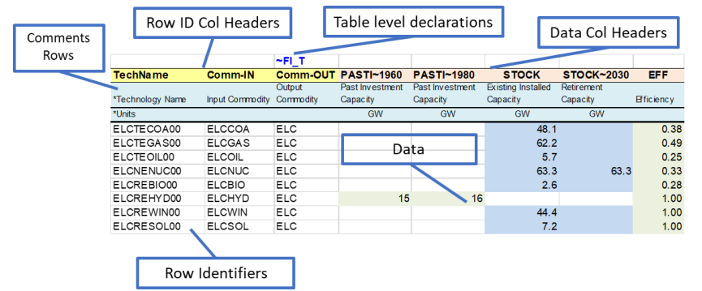

# RES templates

These tags declare the building blocks of the Reference Energy System: commodities, technologies, and the parameter values that connect them.

## Getting started with the RES

These tags define the key elements - processes, commodities, topology,
and core parameters. **These tags don't support wild cards**.

### Commodity Definition Table (\~FI\_COMM)

The **Commodity Definition Table (\~FI\_COMM)** is used to declare the
non-numerical characteristics of commodities in the model. Each
commodity must be declared only once within these tables to avoid
conflicts, such as inconsistent attributes (e.g., different time slice
levels).

The **\~FI\_COMM** table is supported in B-Y templates, SubRES files,
and the SysSettings template. For large and complex models, a best
practice is to centralize all commodity declarations in a single
template, such as the SysSettings template, to maintain consistency and
avoid duplication.

Valid column headers for the **\~FI\_COMM** table are described in Table
1 below. Their order in the table can be changed.

**Best Practice:** Declare commodities only once in a single template
location to prevent errors or conflicting definitions.

!!! warning "Warning"

    **Critical: Multiple duplicate declarations**

    **Avoid declaring the same Commodity or Process with conflicting
    attributes across multiple tables or scenarios.**

    When you run the model with different scenario combinations, the same
    commodity (e.g., ELC) or process may have
    different attributes in each run if it is declared with conflicting
    attributes—such as different Time Slice Levels (**TSLVL**) in the
    \~FI\_Comm or
    \~FI\_Process tags—across multiple
    scenarios. This makes debugging and interpreting the output of GAMS runs
    difficult.

    **Best Practice:**

    Always declare each commodity and process exactly once with consistent
    attributes across all templates and scenarios. This ensures that all
    GAMS runs use the same fundamental parameter definitions, allowing you
    to confidently analyze and compare results across different scenario
    combinations.

#### Table Layout and Usage

The **\~FI\_COMM** table is used to declare commodities with their
associated attributes and properties. Each commodity is declared once
with its characteristics.

#### Valid Column Headers

The valid column headers for a **\~FI\_COMM** table are listed below
(see the Example Table section for a complete example):

<table>
<thead>
<tr class="header">
<th><strong>Header</strong></th>
<th><strong>Description</strong></th>
</tr>
</thead>
<tbody>
<tr class="odd">
<td><strong>Csets</strong></td>
<td>The sets to which commodities belong. Valid entries are:
<ul>
<li><code>NRG</code> (energy)</li>
<li><code>MAT</code> (material)</li>
<li><code>DEM</code> (demand service)</li>
<li><code>ENV</code> (emissions)</li>
</ul>
- <code>FIN</code> (financial) <em>Note:</em> These declarations are inherited until the next entry is encountered.</td>
</tr>
<tr class="even">
<td><strong>Region</strong></td>
<td>Specifies the region. By default, it applies to all regions unless explicitly declared. <em>Note:</em> This column is used only in B-Y templates and is not allowed in SubRES files.</td>
</tr>
<tr class="odd">
<td><strong>CommName</strong></td>
<td>The name of the commodity (e.g., <code>COA</code> for coal).</td>
</tr>
<tr class="even">
<td><strong>CommDesc</strong></td>
<td>A description of the commodity (e.g., "Solid Fuels").</td>
</tr>
<tr class="odd">
<td><strong>Unit</strong></td>
<td>The unit associated with the commodity throughout the model (e.g., <code>PJ</code>). <em>User Responsibility:</em> Ensure unit consistency throughout the model.</td>
</tr>
<tr class="even">
<td><strong>LimType</strong></td>
<td>Defines the sense of the balance equation for the commodity. Valid entries:
<ul>
<li><code>LO</code> (Production &gt;= Consumption, default for all but MAT commodities)</li>
<li><code>FX</code> (Production = Consumption, default for MAT commodities)</li>
<li><code>UP</code> (Production &lt;= Consumption)</li>
</ul></td>
</tr>
<tr class="odd">
<td><strong>CTSLvl</strong></td>
<td>Specifies the commodity time-slice tracking level. Valid entries:
<ul>
<li><code>ANNUAL</code> (default)</li>
<li><code>SEASON</code></li>
<li><code>WEEKLY</code></li>
<li><code>DAYNITE</code></li>
</ul></td>
</tr>
<tr class="even">
<td><strong>PeakTS</strong></td>
<td>Defines peak time slice monitoring. Valid entries:
<ul>
<li><code>ANNUAL</code> (default)</li>
<li>Specific time slices defined in the SysSettings file (comma-separated).</li>
</ul></td>
</tr>
<tr class="odd">
<td><strong>CType</strong></td>
<td>Indicates electricity and heat commodities. Valid entries:
<ul>
<li><code>ELC</code> (electricity)</li>
<li><code>HTHEAT</code> (high-temperature heat)</li>
<li><code>LTHEAT</code> (low-temperature heat)</li>
</ul></td>
</tr>
</tbody>
</table>

*Note:* Comma-separated elements are allowed in fields like **Csets**
and **PeakTS**.

#### Example Table

Below is an example of a **\~FI\_COMM** table for commodity definitions:

| **\~FI\_COMM** | **CommName** | **CommDesc** | **Csets** | **Unit** | **LimType** | **CTSLvl** |
| -------------- | ------------ | ------------ | --------- | -------- | ----------- | ---------- |
|                | COA          | Solid Fuels  | NRG       | PJ       | LO          | ANNUAL     |
|                | ELEC         | Electricity  | NRG       | PJ       | FX          | SEASON     |

In this example: - `COA` is defined as a solid fuel energy commodity,
measured in petajoules (PJ), with a default limit type of `LO` and
time-slice tracking at the `ANNUAL` level. - `ELEC` is defined as an
electricity commodity with a balance equation of `FX` and time-slice
tracking at the `SEASON` level.

#### Best Practices

1.  Declare each commodity only once to prevent conflicts. *Tip:*
    Centralize declarations in the SysSettings template for large
    models.
2.  Ensure consistent use of units across the model for all commodities.
3.  Verify attributes such as **LimType** and **CTSLvl** for
    correctness, particularly when working with complex time-slice
    structures.
4.  Use comma-separated entries cautiously and only where appropriate,
    such as for time-slice monitoring (**PeakTS**).

By adhering to these practices, users can efficiently manage commodity
definitions and avoid potential modeling errors.

!!! note "Note"

    The following commodities (climate module) can be used without being
    defined:
    BEOHMOD,CH4-ATM,CH4-GTC,CH4-LO,CH4-MT,CH4-PPB,CH4-PPM,CH4-PREIND,CH4-UP,CO2-ATM,CO2-GTC,CO2-LO,CO2-PPM,CO2-PREIND,CO2-UP,CS,DELTA-ATM,
    DELTA-LO,EXT-EOH,FORCING,GAMMA,LAMBDA,N2O-ATM,N2O-GTC,N2O-LO,N2O-MT,N2O-PPB,N2O-PPM,N2O-PREIND,N2O-UP,PHI-AT-UP,PHI-CH4,PHI-LO-UP,PHI-N2O,PHI-UP-AT,PHI-UP-LO,
    SIGMA1,SIGMA2,SIGMA3,TOTCH4,TOTN2O.

### Process Definition Table (\~FI\_PROCESS)

The **Process Definition Table (\~FI\_PROCESS)** is used to declare the
**non-numerical characteristics** of processes in Veda. Each process
must be defined only once in this table, and it serves as the
foundational structure for assigning essential attributes like process
name, description, activity unit, capacity unit, and more. These tables
are supported in both Base-Year (B-Y) Templates and SubRES files.

!!! note "Note"

    The **\~FI\_PROCESS** table provides a flexible layout: the column order
    can be changed, and valid entries for each header are well-defined.

!!! warning "Warning"

    **Each process must be declared exactly once** with consistent
    attributes across all templates. Like FI\_COMM tags, FI\_PROCESS tags
    are processed in parallel, which can cause non-deterministic results if
    duplicate or inconsistent declarations exist. See the parallel
    processing warning in the FI\_COMM section above for details.

#### Key Features

1.  **Process Declaration**
      - Each process is declared only once using its name, description,
        and associated attributes.
      - Supported in B-Y Templates and SubRES files. However, region
        declarations are only valid in B-Y templates.
2.  **Non-Numerical Attributes**
      - This table focuses on defining process characteristics rather
        than numerical data.
3.  **Flexible Layout**
      - The order of columns is user-defined, as long as valid headers
        are used.
4.  **Region-Specific Data**
      - Region declarations can be used in B-Y Templates but are not
        allowed in SubRES files.

#### Valid Column Headers

The following are valid column headers for the **\~FI\_PROCESS** table:

<table>
<thead>
<tr class="header">
<th><strong>Header</strong></th>
<th><strong>Description</strong></th>
</tr>
</thead>
<tbody>
<tr class="odd">
<td><strong>Sets</strong></td>
<td>Sets to which processes belong, indicating the process type. Valid entries include:
<ul>
<li><code>ELE</code>: Thermal or other power plant</li>
<li><code>CHP</code>: Combined heat and power</li>
<li><code>PRE</code>: Generic process</li>
<li><code>DMD</code>: Demand device</li>
<li><code>IMP</code>: Import process</li>
<li><code>EXP</code>: Export process</li>
<li><code>MIN</code>: Mining process</li>
<li><code>HPL</code>: Heating plant</li>
<li><code>IPS</code>: Inter-period storage</li>
<li><code>NST</code>: Night storage device</li>
<li><code>STG</code>: General timeslice storage</li>
<li><code>STS</code>: Simultaneous DayNite/Weekly/Seasonal storage</li>
<li><code>STK</code>: Combined DayNite/Weekly/Seasonal and inter-period storage.</li>
</ul></td>
</tr>
<tr class="even">
<td><strong>Region</strong></td>
<td>Specifies the region(s) where the process exists (comma-separated entries allowed).
<ul>
<li>Default: Applied to all regions if not specified.</li>
<li>Valid only in B-Y templates (regional data for SubRES processes must be provided in <code>SubRES_&lt;sector&gt;_Trans</code> files).</li>
</ul></td>
</tr>
<tr class="odd">
<td><strong>TechName</strong></td>
<td>The name of the process (e.g., <code>MINCOA1</code>), up to 32 characters.
<ul>
<li>Recommendation: Limit to 27 characters to account for potential VEDA2.0 additions (e.g., for vintaging or dummy imports).</li>
</ul></td>
</tr>
<tr class="even">
<td><strong>ProcessDesc</strong></td>
<td>A descriptive name for the process (e.g., <code>Domestic supply of Solid Fuels Step 1</code>), up to 255 characters.</td>
</tr>
<tr class="odd">
<td><strong>Tact</strong></td>
<td>The activity unit of the process (e.g., <code>PJ</code>). Users must ensure unit consistency.</td>
</tr>
<tr class="even">
<td><strong>Tcap</strong></td>
<td>The capacity unit of the process. Users must ensure unit consistency.</td>
</tr>
<tr class="odd">
<td>
<strong>Tslvl</strong>
</td>
<td>
The operational time-slice level of the process. Valid entries:

<ul>
<li><code>ANNUAL</code></li>
<li><code>SEASON</code></li>
<li><code>WEEKLY</code></li>
<li><code>DAYNITE</code></li>
</ul>

Default behavior:

<ul>
<li><code>DAYNITE</code> for <code>ELE</code>, <code>STGTSS</code>, and <code>STGIPS</code> processes.</li>
<li><code>SEASON</code> for <code>CHP</code> and <code>HPL</code> processes.</li>
<li><code>ANNUAL</code> for all other process types.</li>
</ul></td>
</tr>
<tr class="even">
<td><strong>PrimaryCG</strong></td>
<td>The Primary Commodity Group (PCG) of the process.
<ul>
<li>Normally, this is left unspecified as VEDA assigns a default PCG.</li>
<li>Specify only if overriding the default or creating a new PCG.</li>
</ul></td>
</tr>
<tr class="odd">
<td><strong>Vintage</strong></td>
<td>Indicates whether the process uses vintage tracking. Valid entries:
<ul>
<li><code>YES</code>: Vintage tracking enabled.</li>
<li><code>NO</code> (default): Vintage tracking disabled.</li>
</ul></td>
</tr>
</tbody>
</table>

!!! note "Note"

    Comma-separated entries are allowed for applicable columns (e.g.,
    `Region`, `Sets`).

#### Example Layout

Below is an example of a **\~FI\_PROCESS** table:

| **\~FI\_PROCESS** | **Region** | **TechName** | **ProcessDesc**         | **Tact** | **Tcap** | **Tslvl** |
| ----------------- | ---------- | ------------ | ----------------------- | -------- | -------- | --------- |
|                   | US         | MINCOA1      | Domestic supply of coal | PJ       | MW       | ANNUAL    |
|                   | US         | EXPCOA1      | Export process for coal | PJ       | MW       | DAYNITE   |

#### Best Practices

  - **Consistency:** Ensure consistency in units for activity (`Tact`)
    and capacity (`Tcap`).
  - **Region-Specific Data:** Use the `Region` column only in B-Y
    templates, and provide SubRES process regional data in appropriate
    SubRES transaction files.
  - **Naming:** Keep process names concise (maximum 27 characters
    recommended) to avoid issues with internal naming extensions in
    VEDA2.0.
  - **Default Values:** Allow defaults (e.g., `Tslvl`, `PrimaryCG`,
    `Vintage`) unless specific customizations are required.

By defining processes in the **\~FI\_PROCESS** table, users create a
robust framework for modeling non-numerical characteristics, ensuring
clarity and consistency across the energy system model.

### Flexible Import Table (\~FI\_T)

Preparing input data for models usually imposes a significant data
processing burden on the modeler because the input is expected in a
particular format, which is different from the format that is used to
maintain the data.

The **Flexible Import Table (\~FI\_T)** is a versatile table used
primarily to create the model topology, defining process inputs,
outputs, and parameters in Base-Year (B-Y) templates and SubRES files.
Its flexible structure allows users to specify parameters and their
numerical values with minimal intervention. Data is imported as
provided, without modification during the import process.

#### Key Features

1.    - **Flexible Structure**
        
          - The table layout can be adapted to match source data,
            minimizing preprocessing efforts.
          - Indexes for attributes such as region, year, and timeslice
            can be specified as either row identifiers or column
            headers.

2.    - **Direct Data Import**
        
          - Data is not altered or expanded during import.
          - This behavior is consistent with the **UC** tables (see
            Section 2.4.7), making it ideal for precise, user-defined
            parameter definitions.

3.    - **Row and Column Organization**
        
          - Row identifiers and column headers define the dimensions for
            data rows.
          - Numerical data is input directly into the corresponding
            cells.

#### Layout and Regions

  - The **\~FI\_T** table consists of six distinct regions:  
    

  - 1\. **Row ID Column Headers**  
    These columns define the dimensions for data rows. Valid headers are
    listed below (see Table 3 for details):
    
      - **Region**: Declares the region.
      - **TechName**: Declares the technology name.
      - **Comm-IN / Comm-IN-A**: Input commodities / Auxiliary input
        commodities.
      - **Comm-OUT / Comm-OUT-A**: Output commodities / Auxiliary output
        commodities.
      - **Attribute**: Defines the attribute (e.g., `DEMAND`,
        `ACT_BND`).
      - **Year**: Specifies the year(s); comma-separated values are
        allowed.
      - **TimeSlice**: Specifies time slices; comma-separated values are
        allowed.
      - **LimType**: Specifies limit types (`UP`, `LO`, `FX`, `N`).
      - **CommGrp**: User-defined commodity group.
      - **Curr**: Currency declaration.
      - **Stage / SOW**: Multi-stage decision points and states of the
        world for stochastic models.
      - **Other\_Indexes**: Special dimensions required by certain
        attributes (e.g., `EnvLimit` attributes).
    
    *Note: Comma-separated elements are allowed in these headers.*

  - 2\. **Row Identifiers**  
    The specific elements for the dimensions defined in the row ID
    column headers.

  - 3\. **Data Area Column Headers**  
    Columns define additional dimensions for the data. These can
    include:
    
      - Attribute
      - Year
      - TimeSlice
      - LimType
      - Commodity
      - CommGrp (internal VEDA groups only: `DEMO`, `DEMI`, `NRGO`,
        etc.)
      - Region
      - Currency
    
    *Multiple dimensions can be combined in column headers, separated by
    a \`\`\~\`\`.*

  - 4\. **Data**  
    Numerical values that correspond to the row and column dimensions.

  - 5\. **Table-Level Declarations**  
    Global declarations in the table header (following a colon `:`)
    apply to all data without an explicit index value. Example: `~FI_T:
    DEMAND` assigns `DEMAND` as the attribute for all rows lacking a
    specific attribute.

  - 6\. **Comments**  
    Comment rows can be identified by:
    
      - A `*` character at the beginning of any cell in the row.
      - A `\I:` prefix, which is safer and avoids confusion with
        wildcard or operation symbols.

#### Example Layout

| **\~FI\_T** | **Region** | **TechName** | **Comm-IN** | **Attribute** | **2020\~UP** |
| ----------- | ---------- | ------------ | ----------- | ------------- | ------------ |
|             | US         | PowerPlant1  | Coal        | ACT\_BND      | 500          |
|             | US         | PowerPlant1  | NaturalGas  | ACT\_BND      | 200          |

In this example: - The table defines activity bounds (`ACT_BND`) for the
`PowerPlant1` process in the `US` region for the year 2020. - Coal has
an upper bound of 500, and Natural Gas has an upper bound of 200.

#### Best Practices

  - Ensure row and column dimensions are clearly defined and consistent.
  - Use the `~FI_T` placement correctly, preceding the first data column
    to allow for flexible row identifiers.
  - Use table-level declarations to simplify repetitive data entries.
  - Avoid using `*` for comments when it might conflict with wildcard
    usage; prefer `\I:` for clarity.

By leveraging the flexibility of the **\~FI\_T** table, users can
efficiently configure process inputs, outputs, and parameters, aligning
the model structure with source data seamlessly.

