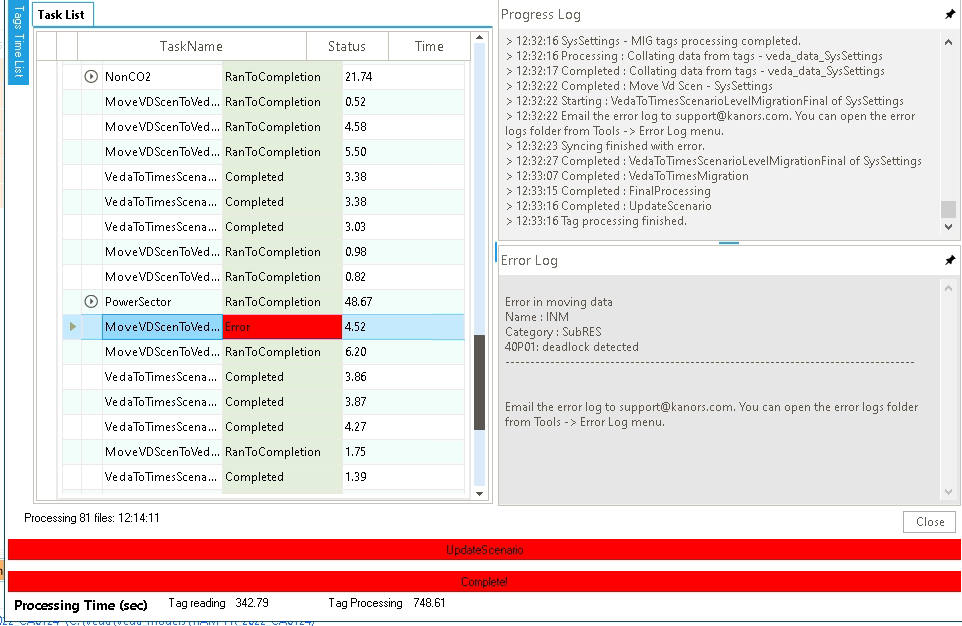

# Deadlock Detected

!!! note "Note"

    **This has been resolved in version 2.005.1.1**

**Issue**: Deadlock Detected

- The error occurs when mulitple SubRES files are imported together:

    

**Workaround**: Go to Tools -\> User Optons -\> Syncing Options -\> Set
Threads Count to 1 and press update button.

After sync is completed, reset the Threads count to -1 or previous
value.

!!! note "Note"

    Do this only when you want to sync multiple SubRES files together
