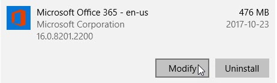
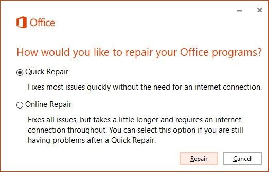
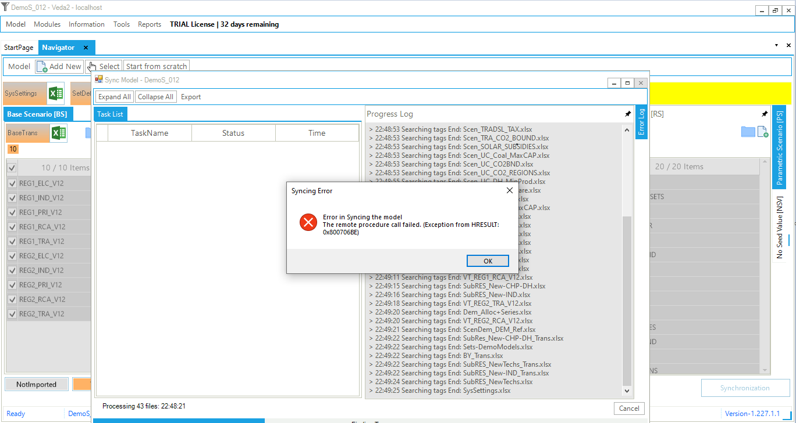

# Excel Exceptions

## Error loading type library/DLL. (Exception from HRESULT: 0x80029C4A)

**Issue**: Unable to cast COM object of type
'Microsoft.Office.Interop.Excel.ApplicationClass' to interface type
'Microsoft.Office.Interop.Excel.\_Application'. This operation failed
because the Query Interface call on the COM component for the interface
with IID '{000208D5-0000-0000-C000-000000000046}' failed due to the
following error: **Error loading type library/DLL. (Exception from
HRESULT: 0x80029C4A (TYPE\_E\_CANTLOADLIBRARY)**).

  - **Solution 1**: "Repair" Office Installation from the Add/Remove
    programs in Control Panel
    
      - Right Click on Start Menu
    
      - Click Apps and Features
    
      - Search Microsoft Office (either Office 2007, Office 2010, Office
        2013, Office 2016 or Office 365 and so on...)
    
      - Click Microsoft Office
    
      - Click Modify  
            
    
      - Click Repair  
            

  - **Solution 2**: "Uninstall" Office Automatically
    
    

    
    

    
    Note
    
    

    
    Do this only if the **Solution 1** fails
    
    

    
      - [Download]() the automated tool.
      - Run the **SetupProd\_OffScrub.exe** file.
      - Select the version you want to uninstall, and then select Next.
      - Follow through the remaining screens and when prompted, restart
        your computer.
      - After you restart your computer, the uninstall tool
        automatically re-opens to complete the final step of the
        uninstall process. Follow the remaining prompts.
      - If you need to reinstall Office, select the version you want to
        install and follow those steps: [Microsoft 365](), [Office
        2019](), [Office 2016](), [Office 2013](), [Office 2010](), or
        [Office 2007]().

## The remote procedure call failed. (Exception from HRESULT: 0x800706BE)

**Issue**: Error in Syncing the model. **The remote procedure call
failed. (Exception from HRESULT: 0x800706BE)**.

> 

**Reason**: The problem was caused by third-party Excel COM plug-ins.

**Solution**: How to disable the plugin: Excel \> File \> Options \>
Add-ins \> Manage, then choose "COM add-ins" \> Go. And then uncheck the
problematic plugin.

## Element not found. (Exception from HRESULT: 0x8002802B)

**Issue**: Unable to cast COM object of type
'Microsoft.Office.Interop.Excel.ApplicationClass' to interface type
'Microsoft.Office.Interop.Excel.\_Application'. This operation failed
because the QueryInterface call on the COM component for the interface
with IID '{000208D5-0000-0000-C000-000000000046}' failed due to the
following error: **Element not found. (Exception from HRESULT:
0x8002802B (TYPE\_E\_ELEMENTNOTFOUND)**).

  - **Solution**: "Repair" Office Installation from the Add/Remove
    programs in Control Panel
    
    

    
    

    
    Note
    
    

    
    Follow the steps of **Solution 1**
    
    

