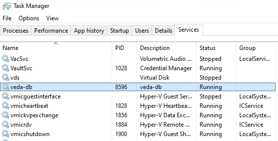
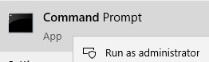
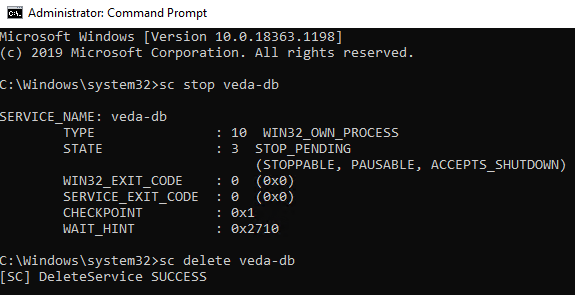
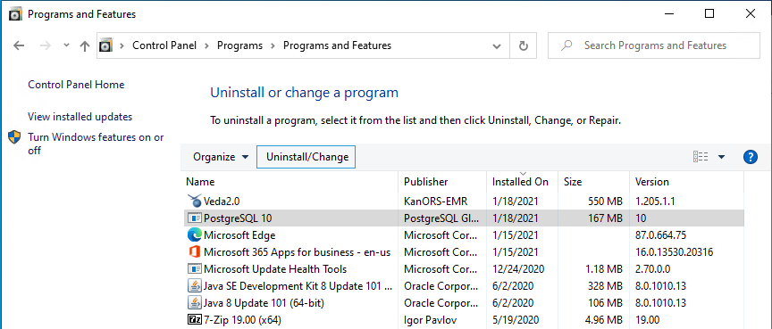
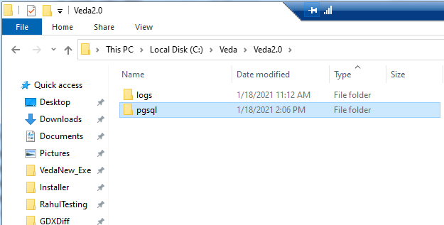
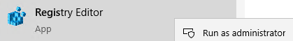
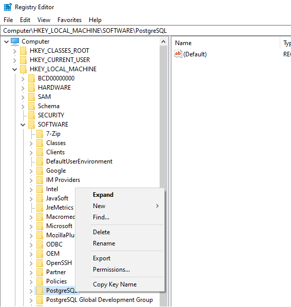

# Uninstalling Postgres

!!! note "Note"

    - Make sure you have permission to uninstall programs from your
        computer. Contact your IT administrator if you do not have permissions.
    - In case your anti- virus is preventing you from uninstalling it. Stop
        or pause your anti- virus.

- **Steps:**

    - **Stop\Delete "veda-db" service:**

        - Open Task manager
        - Look for a service called "veda-db".

            

        - **Delete "veda-db" service:**

            1. Open command prompt as an administrator

                

            2. **Run the following commands:**

                - SC STOP veda-db (skip if the service is
                  already stopped)
                - SC DELETE veda-db

                    

    - After getting success message, you can go ahead and uninstall
        Postgres:

        

    - If the pgsql folder in Veda2.0 directory is empty then it is
        safe to delete it.
    - It is safe to delete the Veda2.0 directory as well, if it does
        not contain any user's model folders.

        

    - **Delete Postgres from Registry:**

        - Open Registry editor as an administrator

            

        - **From the list, right-click and delete the following folders:**

            1. PostgreSQL

            2. PostgreSQL Global Development Group

                
